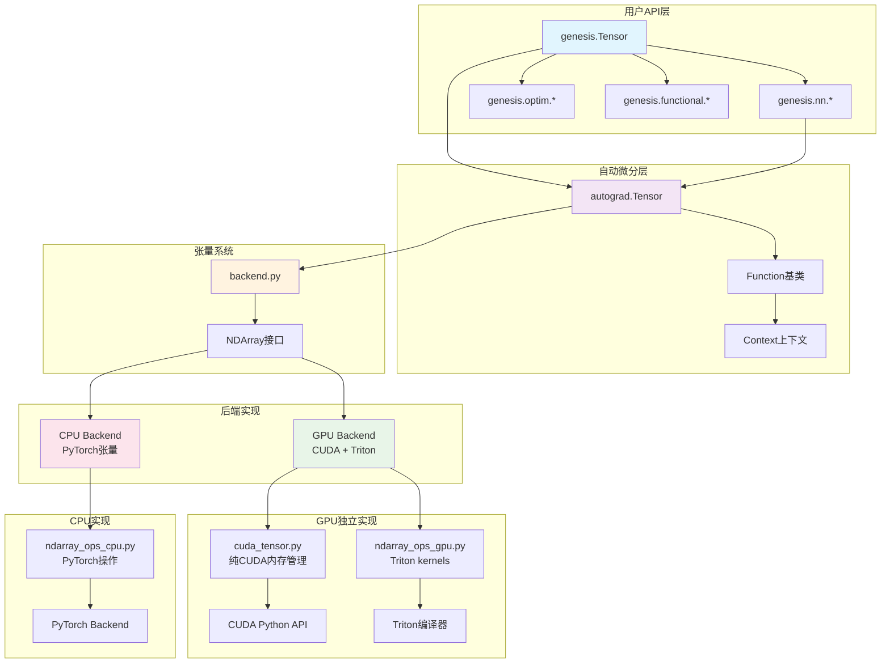

# 架构概述

Genesis深度学习框架采用分层的模块化架构设计，既保持了代码的清晰性，又实现了高性能的计算能力。

## 🏗️ 总体架构



## 🔑 核心设计理念

### 1. 双后端架构

Genesis采用了创新的双后端设计：

- **CPU后端**：利用PyTorch成熟的CPU张量实现，确保稳定性和兼容性
- **GPU后端**：完全独立的CUDA实现，展示了从零构建GPU计算栈的完整过程

### 2. 教育与性能并重

- **代码可读性**：每个模块都有清晰的职责分工和详细的文档
- **性能优化**：GPU后端使用Triton实现高性能kernels
- **渐进式学习**：从简单的CPU实现到复杂的GPU优化

### 3. 模块化设计

每个组件都可以独立理解和扩展：
- 自动微分系统独立于具体的张量实现
- 神经网络模块基于通用的张量操作
- 后端抽象允许轻松切换不同的实现

## 📊 主要组件详解

### 自动微分系统 (`autograd.py`)

```python
# 核心类结构
class Tensor:
    data: NDArray          # 底层数据存储
    requires_grad: bool    # 是否需要梯度
    creator: Function      # 创建此张量的操作
    grad: Tensor          # 梯度张量
    
class Function:
    @staticmethod
    def forward(ctx, *args)    # 前向传播
    @staticmethod 
    def backward(ctx, grad)    # 反向传播
```

**关键特性**：
- 支持混合精度训练的自动类型转换
- 灵活的计算图构建和遍历
- 内置的梯度累积和清零机制

### 张量后端系统

#### CPU后端 (`ndarray_ops_cpu.py`)
```python
# 直接使用PyTorch操作
def add(x, y):
    return x + y

def matmul(x, y):
    return torch.matmul(x, y)
```

#### GPU后端 (`ndarray_ops_gpu.py`)
```python
# 使用Triton实现的GPU kernels
@triton.jit
def add_kernel(x_ptr, y_ptr, output_ptr, n_elements, BLOCK_SIZE: tl.constexpr):
    pid = tl.program_id(axis=0)
    block_start = pid * BLOCK_SIZE
    offsets = block_start + tl.arange(0, BLOCK_SIZE)
    mask = offsets < n_elements
    x = tl.load(x_ptr + offsets, mask=mask)
    y = tl.load(y_ptr + offsets, mask=mask)
    output = x + y
    tl.store(output_ptr + offsets, output, mask=mask)
```

#### CUDA内存管理 (`cuda_tensor.py`)
```python
class CUDATensor:
    """纯CUDA实现的张量，不依赖PyTorch"""
    def __init__(self, shape, dtype):
        self._cuda_device, self._cuda_context = _ensure_cuda_initialized()
        self._allocate_memory(shape, dtype)
        
    def _allocate_memory(self, shape, dtype):
        # 使用CUDA Python API直接分配GPU内存
        size_bytes = prod(shape) * dtype.itemsize
        result = cuda.cuMemAlloc(size_bytes)
        self._data_ptr = check_cuda_error(result)
```

### 神经网络模块 (`nn/modules.py`)

```python
class Module:
    """神经网络模块基类"""
    def parameters(self) -> List[Tensor]:
        # 递归收集所有参数
        return _unpack_params(self.__dict__)
    
    def forward(self, *args, **kwargs):
        # 子类实现具体的前向传播逻辑
        raise NotImplementedError

class Linear(Module):
    """全连接层实现"""
    def __init__(self, in_features, out_features):
        self.weight = Parameter(genesis.randn(out_features, in_features))
        self.bias = Parameter(genesis.zeros(out_features))
```

## 🔧 关键技术实现

### 1. 内存管理策略

**CPU内存管理**：
- 依赖PyTorch的内存池和垃圾回收
- 自动处理内存对齐和缓存优化

**GPU内存管理**：
```python
class CUDATensor:
    def __init__(self, shape, dtype, base=None):
        if base is not None:
            # 视图张量：共享内存但保持对原张量的引用
            self.base = base
            self._data_ptr = base._data_ptr + offset
        else:
            # 新张量：分配独立内存
            self.base = None
            self._data_ptr = cuda.cuMemAlloc(size_bytes)
    
    def __del__(self):
        # 只有基础张量才释放内存
        if self.base is None and self._data_ptr:
            cuda.cuMemFree(self._data_ptr)
```

### 2. 设备抽象

```python
class Device:
    def __init__(self, name: str, mod: Any, device_id: Optional[int] = None):
        self.name = name        # "cpu" 或 "cuda"
        self.mod = mod          # 对应的操作模块
        self.device_id = device_id  # GPU设备ID
        
    def randn(self, *shape, dtype=genesis.float32):
        if self.name == "cuda":
            return NDArray(CUDATensor(shape, dtype), device=self)
        else:
            return NDArray(torch.randn(*shape), device=self)
```

### 3. 类型系统

```python
# dtypes.py - 统一的数据类型系统
class DType:
    def __init__(self, name: str, torch_dtype, numpy_dtype, itemsize: int):
        self.name = name
        self.torch_dtype = torch_dtype
        self.numpy_dtype = numpy_dtype  
        self.itemsize = itemsize

# 支持的数据类型
float32 = DType("float32", torch.float32, np.float32, 4)
float16 = DType("float16", torch.float16, np.float16, 2)
bfloat16 = DType("bfloat16", torch.bfloat16, np.dtype('uint16'), 2)
```

## 🚀 性能优化策略

### 1. Triton Kernel优化

**Softmax实现**：
```python
@triton.jit
def softmax_kernel(input_ptr, output_ptr, input_row_stride, output_row_stride, 
                  n_cols, BLOCK_SIZE: tl.constexpr):
    # 高效的并行softmax实现
    row_idx = tl.program_id(0)
    row_start_ptr = input_ptr + row_idx * input_row_stride
    col_offsets = tl.arange(0, BLOCK_SIZE)
    input_ptrs = row_start_ptr + col_offsets
    row = tl.load(input_ptrs, mask=col_offsets < n_cols, other=-float('inf'))
    
    # 数值稳定的softmax
    row_minus_max = row - tl.max(row, axis=0)
    numerator = tl.exp(row_minus_max)
    denominator = tl.sum(numerator, axis=0)
    softmax_output = numerator / denominator
    
    output_row_start_ptr = output_ptr + row_idx * output_row_stride
    output_ptrs = output_row_start_ptr + col_offsets
    tl.store(output_ptrs, softmax_output, mask=col_offsets < n_cols)
```

### 2. 混合精度训练

```python
# amp.py - 自动混合精度
enable_autocast = False

def _cast(value, dtype):
    """自动类型转换"""
    if isinstance(value, Tensor) and value.is_floating_point():
        if dtype == genesis.float16:
            return value.half()
        else:
            return value.float()
    return value
```

## 🔍 架构优势

### 教育价值
1. **渐进式复杂度**：从简单的CPU实现到复杂的GPU优化
2. **完整实现展示**：展示了深度学习框架的完整构建过程  
3. **清晰的模块边界**：每个组件职责明确，便于理解

### 工程实践
1. **双后端设计**：CPU稳定性 + GPU高性能
2. **内存安全**：RAII模式的内存管理，防止内存泄漏
3. **类型安全**：统一的类型系统，避免类型错误

### 性能特性
1. **Triton优化**：现代GPU kernel编写方式
2. **零拷贝视图**：高效的张量视图操作
3. **并行计算**：充分利用GPU并行能力

## 🎯 设计权衡

### CPU vs GPU 实现选择
- **CPU**：使用PyTorch确保稳定性和兼容性
- **GPU**：独立实现展示完整的GPU编程栈

### 简洁性 vs 性能
- 保持API简洁的同时，底层实现高度优化
- 通过分层架构将复杂性隔离在底层

### 教育 vs 生产
- 代码注重可读性和教育价值
- 性能仍然达到实用级别

这种架构设计使得Genesis既是一个优秀的学习资源，也是一个功能完整的深度学习框架。