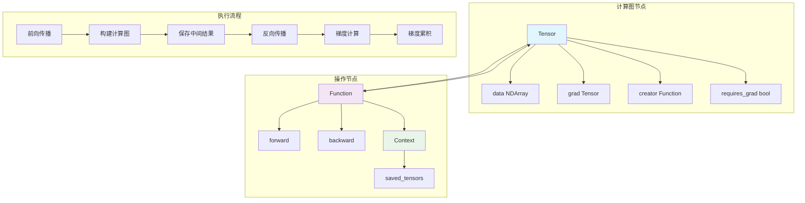

# Automatic Differentiation System

Genesis's automatic differentiation system is the core of the framework, responsible for building computation graphs, executing forward propagation and backpropagation. The system is designed to be simple yet efficient, supporting complex neural network training.

## 🎯 System Overview

The automatic differentiation system is based on dynamic computation graph implementation, mainly including three core components:

- **Tensor** - Tensors carrying gradient information
- **Function** - Abstract base class for differentiable operations
- **Context** - Context that saves intermediate results during forward propagation

## 🏗️ Core Architecture



## 🧮 Tensor类详解

### 核心属性

```python
class Tensor:
    grad: "Tensor"          # 梯度张量
    creator: Function       # 创建此张量的操作
    inputs: List["Tensor"]  # 输入张量列表
    data: NDArray          # 底层数据存储
    requires_grad: bool    # 是否需要计算梯度
    hooks: List[Callable]  # 梯度钩子函数
```

### 关键方法

#### 1. 张量创建

```python
# 从数组创建张量
def __init__(self, array, *, device=None, dtype=None, requires_grad=True):
    if dtype is not None:
        dtype = get_dtype(dtype)  # 转换为DType对象
    
    # 处理不同输入类型
    if isinstance(array, Tensor):
        # 从现有张量创建
        data = array.data if same_device_dtype else convert_data
    elif isinstance(array, NDArray):
        # 从NDArray创建
        data = Tensor._array_from_numpy(array, device=device, dtype=dtype)
    else:
        # 从Python对象创建
        device = device if device else default_device()
        data = Tensor._array_from_numpy(array, device=device, dtype=dtype)
    
    self.init([], data=data, requires_grad=requires_grad)
```

#### 2. 反向传播

```python
def backward(self, out_grad=None):
    # 设置输出梯度
    out_grad = out_grad if out_grad else init.ones(*self.shape, dtype=self.dtype, device=self.device)
    
    # 初始化梯度累积字典
    node_to_output_grads_list: Dict[Tensor, List[Tensor]] = {}
    node_to_output_grads_list[self] = [out_grad]
    
    # 拓扑排序获取计算顺序
    topo_order = topo_sort(self)
    
    # 逆拓扑序遍历计算梯度
    for node in reversed(topo_order):
        if not node.requires_grad:
            continue
            
        # 累积当前节点的梯度
        if node.grad is None:
            node.grad = reduce(operator.add, node_to_output_grads_list[node])
            # 确保梯度连续性（解决广播张量问题）
            if hasattr(node.grad, 'data') and hasattr(node.grad.data, 'data'):
                cuda_tensor = node.grad.data.data
                if hasattr(cuda_tensor, 'is_contiguous') and not cuda_tensor.is_contiguous():
                    node.grad.data.data = cuda_tensor.contiguous()
        else:
            node.grad += reduce(operator.add, node_to_output_grads_list[node])
        
        # 应用梯度钩子
        node.apply_hooks(node.grad)
        
        # 计算输入节点的梯度
        if node.creator is not None:
            # 处理混合精度
            grad = node.grad.half() if check_dtype(node.creator.ctx.saved_tensors, genesis.float16) else node.grad
            
            # 调用对应操作的反向传播
            if node.creator.is_tuple_result:
                backward_grad = node.creator.backward(node.creator.ctx, grad, node.idx)
            else:
                backward_grad = node.creator.backward(node.creator.ctx, grad)
            
            # 分发梯度到输入节点
            for i, input_node in enumerate(node.creator.inputs):
                if input_node.requires_grad:
                    if input_node not in node_to_output_grads_list:
                        node_to_output_grads_list[input_node] = []
                    node_to_output_grads_list[input_node].append(backward_grad[i].float())
```

#### 3. 拓扑排序

```python
def topo_sort(node):
    """深度优先搜索实现拓扑排序"""
    visited = set()
    topo_order = []

    def dfs(n):
        if n in visited:
            return
        visited.add(n)
        
        # 递归访问输入节点
        if n.creator is not None:
            for input_node in n.creator.inputs:
                if isinstance(input_node, Tensor):
                    dfs(input_node)
        
        topo_order.append(n)
    
    dfs(node)
    return topo_order
```

## ⚙️ Function基类

Function是所有可微分操作的基类，定义了前向和反向传播的接口。

### 基本结构

```python
class Function:
    @staticmethod
    def forward(ctx: Context, *args) -> Union[Tensor, Tuple[Tensor, ...]]:
        """前向传播实现"""
        raise NotImplementedError
    
    @staticmethod  
    def backward(ctx: Context, grad_output, out_idx=None) -> Tuple[Tensor, ...]:
        """反向传播实现"""
        raise NotImplementedError
    
    @classmethod
    def apply(cls, *args, **kwargs):
        """统一的调用接口"""
        # 处理混合精度
        instance = cls()
        instance.ctx = Context()
        
        # 执行前向传播
        if genesis.enable_autocast:
            result = cls.forward(instance.ctx, *_cast(args, genesis.float32), **_cast(kwargs, genesis.float32))
        else:
            result = cls.forward(instance.ctx, *args, **kwargs)
        
        # 设置计算图连接
        instance.is_tuple_result = isinstance(result, tuple)
        
        if instance.is_tuple_result:
            for idx, res in enumerate(result):
                if isinstance(res, Tensor) and res.requires_grad:
                    res.set_creator(instance, idx)
        elif isinstance(result, Tensor) and result.requires_grad:
            result.set_creator(instance)
        
        # 记录输入张量
        instance.inputs = []
        for t in args:
            if isinstance(t, Tensor):
                instance.inputs.append(t)
            elif isinstance(t, list) and all(isinstance(item, Tensor) for item in t):
                instance.inputs.extend(t)
        
        return result
```

### 实际操作示例

#### 矩阵乘法

```python
class MatMul(Function):
    @staticmethod
    def forward(ctx, a, b):
        # 保存输入用于反向传播
        ctx.save_for_backward(a, b)
        return a @ b  # 调用底层NDArray的矩阵乘法
    
    @staticmethod
    def backward(ctx, grad_output):
        a, b = ctx.saved_tensors
        # 计算输入梯度
        grad_a = grad_output @ b.T
        grad_b = a.T @ grad_output
        return grad_a, grad_b
```

#### 加法（支持广播）

```python
class Add(Function):
    @staticmethod
    def forward(ctx, a, b):
        ctx.a_shape = a.shape
        ctx.b_shape = b.shape
        return a + b
    
    @staticmethod
    def backward(ctx, grad_output):
        # 处理广播的梯度
        grad_a = grad_output
        grad_b = grad_output
        
        # 对被广播的维度求和
        for i, (da, db) in enumerate(zip(ctx.a_shape, ctx.b_shape)):
            if da == 1 and db > 1:
                grad_a = grad_a.sum(axis=i, keepdims=True)
            elif db == 1 and da > 1:
                grad_b = grad_b.sum(axis=i, keepdims=True)
        
        return grad_a, grad_b
```

## 📝 Context类

Context类用于在前向传播和反向传播之间传递信息。

```python
class Context:
    def __init__(self):
        self.saved_tensors = []
    
    def save_for_backward(self, *tensors):
        """保存张量用于反向传播"""
        self.saved_tensors.extend(tensors)
    
    @property
    def saved_tensors(self):
        return self._saved_tensors
    
    @saved_tensors.setter  
    def saved_tensors(self, tensors):
        self._saved_tensors = tensors
```

## 🔄 混合精度支持

自动微分系统内置混合精度训练支持：

```python
# 全局开关
genesis.enable_autocast = True

# 自动类型转换
def _cast(value, dtype):
    if isinstance(value, Tensor) and value.is_floating_point():
        if dtype == genesis.float16:
            return value.half()
        else:
            return value.float()
    return value

# 在Function.apply中应用
if genesis.enable_autocast:
    result = cls.forward(instance.ctx, *_cast(args, genesis.float32), **_cast(kwargs, genesis.float32))
```

## 🪝 梯度钩子系统

支持在梯度计算时执行自定义函数：

```python
class Tensor:
    def register_hook(self, hook):
        """注册梯度钩子"""
        self.hooks.append(hook)
    
    def apply_hooks(self, grad):
        """应用所有钩子"""
        for hook in self.hooks:
            hook(grad)

# 使用示例
def grad_clipping_hook(grad):
    """梯度裁剪钩子"""
    grad.clamp_(-1.0, 1.0)

tensor.register_hook(grad_clipping_hook)
```

## 🚀 性能优化

### 1. 内存管理优化

- **视图操作**：reshape、transpose等操作创建视图而非拷贝数据
- **就地操作**：支持`+=`、`*=`等就地更新操作
- **梯度累积优化**：智能的梯度累积策略

### 2. 计算图优化

- **惰性构建**：只有在需要梯度时才构建计算图
- **智能释放**：自动释放不再需要的中间结果
- **拓扑排序缓存**：缓存拓扑排序结果

### 3. 设备间优化

- **自动设备推断**：自动选择合适的计算设备
- **异步执行**：支持GPU异步计算
- **内存预分配**：减少动态内存分配

## 🎯 使用示例

### 基础用法

```python
import genesis

# 创建需要梯度的张量
x = genesis.randn(3, 4, requires_grad=True)
y = genesis.randn(4, 2, requires_grad=True)

# 前向传播（自动构建计算图）
z = x @ y
loss = z.sum()

# 反向传播（计算所有梯度）
loss.backward()

print(f"x的梯度: {x.grad}")  # 输出x的梯度
print(f"y的梯度: {y.grad}")  # 输出y的梯度
```

### 自定义操作

```python
class CustomFunction(genesis.autograd.Function):
    @staticmethod
    def forward(ctx, input_tensor):
        # 自定义前向计算
        ctx.save_for_backward(input_tensor)
        result = input_tensor ** 2 + 2 * input_tensor + 1
        return result
    
    @staticmethod
    def backward(ctx, grad_output):
        input_tensor, = ctx.saved_tensors
        # 自定义梯度计算：d/dx(x^2 + 2x + 1) = 2x + 2
        grad_input = grad_output * (2 * input_tensor + 2)
        return grad_input

# 使用自定义操作
x = genesis.randn(3, 4, requires_grad=True)
y = CustomFunction.apply(x)
y.sum().backward()
```

### 梯度钩子

```python
# 梯度监控钩子
def monitor_grad(grad):
    print(f"梯度统计: 均值={grad.mean():.4f}, 标准差={grad.std():.4f}")

# 梯度裁剪钩子
def clip_grad(grad):
    grad.data.clamp_(-1.0, 1.0)

x = genesis.randn(10, requires_grad=True)
x.register_hook(monitor_grad)
x.register_hook(clip_grad)

# 执行一些计算
y = (x ** 3).sum()
y.backward()  # 会触发钩子函数
```

Genesis的自动微分系统设计简洁而强大，为深度学习提供了可靠的梯度计算基础，同时保持了良好的性能和可扩展性。