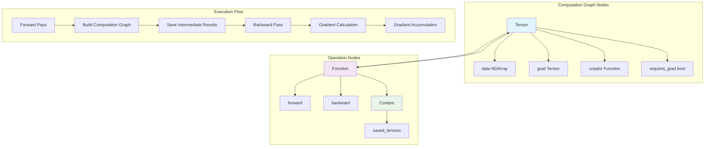

# Automatic Differentiation System

Genesis's automatic differentiation system is the core of the framework, responsible for building computation graphs, executing forward propagation and backpropagation. The system is designed to be simple yet efficient, supporting complex neural network training.

## 🎯 System Overview

The automatic differentiation system is based on dynamic computation graph implementation, mainly including three core components:

- **Tensor** - Tensors carrying gradient information
- **Function** - Abstract base class for differentiable operations
- **Context** - Context that saves intermediate results during forward propagation

## 🏗️ Core Architecture



## 🧮 Tensor Class Details

### Core Attributes

```python
class Tensor:
    grad: "Tensor"          # Gradient tensor
    creator: Function       # Operation that created this tensor
    inputs: List["Tensor"]  # Input tensor list
    data: NDArray          # Underlying data storage
    requires_grad: bool    # Whether gradients are required
    hooks: List[Callable]  # Gradient hook functions
```

### Key Methods

#### 1. Tensor Creation

```python
# Create tensor from array
def __init__(self, array, *, device=None, dtype=None, requires_grad=True):
    if dtype is not None:
        dtype = get_dtype(dtype)  # Convert to DType object
    
    # Handle different input types
    if isinstance(array, Tensor):
        # Create from existing tensor
        data = array.data if same_device_dtype else convert_data
    elif isinstance(array, NDArray):
        # Create from NDArray
        data = Tensor._array_from_numpy(array, device=device, dtype=dtype)
    else:
        # Create from Python object
        device = device if device else default_device()
        data = Tensor._array_from_numpy(array, device=device, dtype=dtype)
    
    self.init([], data=data, requires_grad=requires_grad)
```

#### 2. Backward Propagation

```python
def backward(self, out_grad=None):
    # Set output gradient
    out_grad = out_grad if out_grad else init.ones(*self.shape, dtype=self.dtype, device=self.device)
    
    # Initialize gradient accumulation dictionary
    node_to_output_grads_list: Dict[Tensor, List[Tensor]] = {}
    node_to_output_grads_list[self] = [out_grad]
    
    # Get computation order through topological sorting
    topo_order = topo_sort(self)
    
    # Traverse in reverse topological order to compute gradients
    for node in reversed(topo_order):
        if not node.requires_grad:
            continue
            
        # Accumulate gradients for current node
        if node.grad is None:
            node.grad = reduce(operator.add, node_to_output_grads_list[node])
            # Ensure gradient contiguity (solve broadcast tensor issues)
            if hasattr(node.grad, 'data') and hasattr(node.grad.data, 'data'):
                cuda_tensor = node.grad.data.data
                if hasattr(cuda_tensor, 'is_contiguous') and not cuda_tensor.is_contiguous():
                    node.grad.data.data = cuda_tensor.contiguous()
        else:
            node.grad += reduce(operator.add, node_to_output_grads_list[node])
        
        # Apply gradient hooks
        node.apply_hooks(node.grad)
        
        # Compute gradients for input nodes
        if node.creator is not None:
            # Handle mixed precision
            grad = node.grad.half() if check_dtype(node.creator.ctx.saved_tensors, genesis.float16) else node.grad
            
            # Call backward propagation of corresponding operation
            if node.creator.is_tuple_result:
                backward_grad = node.creator.backward(node.creator.ctx, grad, node.idx)
            else:
                backward_grad = node.creator.backward(node.creator.ctx, grad)
            
            # Distribute gradients to input nodes
            for i, input_node in enumerate(node.creator.inputs):
                if input_node.requires_grad:
                    if input_node not in node_to_output_grads_list:
                        node_to_output_grads_list[input_node] = []
                    node_to_output_grads_list[input_node].append(backward_grad[i].float())
```

#### 3. Topological Sort

```python
def topo_sort(node):
    """Depth-first search implementation for topological sorting"""
    visited = set()
    topo_order = []

    def dfs(n):
        if n in visited:
            return
        visited.add(n)
        
        # Recursively visit input nodes
        if n.creator is not None:
            for input_node in n.creator.inputs:
                if isinstance(input_node, Tensor):
                    dfs(input_node)
        
        topo_order.append(n)
    
    dfs(node)
    return topo_order
```

## ⚙️ Function Base Class

Function is the base class for all differentiable operations, defining the interface for forward and backward propagation.

### Basic Structure

```python
class Function:
    @staticmethod
    def forward(ctx: Context, *args) -> Union[Tensor, Tuple[Tensor, ...]]:
        """Forward propagation implementation"""
        raise NotImplementedError
    
    @staticmethod  
    def backward(ctx: Context, grad_output, out_idx=None) -> Tuple[Tensor, ...]:
        """Backward propagation implementation"""
        raise NotImplementedError
    
    @classmethod
    def apply(cls, *args, **kwargs):
        """Unified call interface"""
        # Handle mixed precision
        instance = cls()
        instance.ctx = Context()
        
        # Execute forward propagation
        if genesis.enable_autocast:
            result = cls.forward(instance.ctx, *_cast(args, genesis.float32), **_cast(kwargs, genesis.float32))
        else:
            result = cls.forward(instance.ctx, *args, **kwargs)
        
        # Set computation graph connections
        instance.is_tuple_result = isinstance(result, tuple)
        
        if instance.is_tuple_result:
            for idx, res in enumerate(result):
                if isinstance(res, Tensor) and res.requires_grad:
                    res.set_creator(instance, idx)
        elif isinstance(result, Tensor) and result.requires_grad:
            result.set_creator(instance)
        
        # Record input tensors
        instance.inputs = []
        for t in args:
            if isinstance(t, Tensor):
                instance.inputs.append(t)
            elif isinstance(t, list) and all(isinstance(item, Tensor) for item in t):
                instance.inputs.extend(t)
        
        return result
```

### Practical Operation Examples

#### Matrix Multiplication

```python
class MatMul(Function):
    @staticmethod
    def forward(ctx, a, b):
        # Save inputs for backward propagation
        ctx.save_for_backward(a, b)
        return a @ b  # Call underlying NDArray matrix multiplication
    
    @staticmethod
    def backward(ctx, grad_output):
        a, b = ctx.saved_tensors
        # Compute input gradients
        grad_a = grad_output @ b.T
        grad_b = a.T @ grad_output
        return grad_a, grad_b
```

#### Addition (with Broadcasting Support)

```python
class Add(Function):
    @staticmethod
    def forward(ctx, a, b):
        ctx.a_shape = a.shape
        ctx.b_shape = b.shape
        return a + b
    
    @staticmethod
    def backward(ctx, grad_output):
        # Handle broadcasting gradients
        grad_a = grad_output
        grad_b = grad_output
        
        # Sum over broadcasted dimensions
        for i, (da, db) in enumerate(zip(ctx.a_shape, ctx.b_shape)):
            if da == 1 and db > 1:
                grad_a = grad_a.sum(axis=i, keepdims=True)
            elif db == 1 and da > 1:
                grad_b = grad_b.sum(axis=i, keepdims=True)
        
        return grad_a, grad_b
```

## 📝 Context Class

Context class is used to pass information between forward and backward propagation.

```python
class Context:
    def __init__(self):
        self.saved_tensors = []
    
    def save_for_backward(self, *tensors):
        """Save tensors for backward propagation"""
        self.saved_tensors.extend(tensors)
    
    @property
    def saved_tensors(self):
        return self._saved_tensors
    
    @saved_tensors.setter  
    def saved_tensors(self, tensors):
        self._saved_tensors = tensors
```

## 🔄 Mixed Precision Support

The automatic differentiation system has built-in mixed precision training support:

```python
# Global switch
genesis.enable_autocast = True

# Automatic type conversion
def _cast(value, dtype):
    if isinstance(value, Tensor) and value.is_floating_point():
        if dtype == genesis.float16:
            return value.half()
        else:
            return value.float()
    return value

# Applied in Function.apply
if genesis.enable_autocast:
    result = cls.forward(instance.ctx, *_cast(args, genesis.float32), **_cast(kwargs, genesis.float32))
```

## 🪝 Gradient Hook System

Support for executing custom functions during gradient computation:

```python
class Tensor:
    def register_hook(self, hook):
        """Register gradient hook"""
        self.hooks.append(hook)
    
    def apply_hooks(self, grad):
        """Apply all hooks"""
        for hook in self.hooks:
            hook(grad)

# Usage example
def grad_clipping_hook(grad):
    """Gradient clipping hook"""
    grad.clamp_(-1.0, 1.0)

tensor.register_hook(grad_clipping_hook)
```

## 🚀 Performance Optimization

### 1. Memory Management Optimization

- **View Operations**: reshape, transpose and other operations create views instead of copying data
- **In-place Operations**: Support for in-place update operations like `+=`, `*=`
- **Gradient Accumulation Optimization**: Smart gradient accumulation strategy

### 2. Computation Graph Optimization

- **Lazy Construction**: Build computation graph only when gradients are needed
- **Smart Release**: Automatically release intermediate results that are no longer needed
- **Topological Sort Caching**: Cache topological sort results

### 3. Cross-device Optimization

- **Automatic Device Inference**: Automatically select appropriate computing device
- **Asynchronous Execution**: Support for GPU asynchronous computation
- **Memory Pre-allocation**: Reduce dynamic memory allocation

## 🎯 Usage Examples

### Basic Usage

```python
import genesis

# Create tensors that require gradients
x = genesis.randn(3, 4, requires_grad=True)
y = genesis.randn(4, 2, requires_grad=True)

# Forward propagation (automatically build computation graph)
z = x @ y
loss = z.sum()

# Backward propagation (compute all gradients)
loss.backward()

print(f"Gradient of x: {x.grad}")  # Output gradient of x
print(f"Gradient of y: {y.grad}")  # Output gradient of y
```

### Custom Operations

```python
class CustomFunction(genesis.autograd.Function):
    @staticmethod
    def forward(ctx, input_tensor):
        # Custom forward computation
        ctx.save_for_backward(input_tensor)
        result = input_tensor ** 2 + 2 * input_tensor + 1
        return result
    
    @staticmethod
    def backward(ctx, grad_output):
        input_tensor, = ctx.saved_tensors
        # Custom gradient computation: d/dx(x^2 + 2x + 1) = 2x + 2
        grad_input = grad_output * (2 * input_tensor + 2)
        return grad_input

# Use custom operation
x = genesis.randn(3, 4, requires_grad=True)
y = CustomFunction.apply(x)
y.sum().backward()
```

### Gradient Hooks

```python
# Gradient monitoring hook
def monitor_grad(grad):
    print(f"Gradient stats: mean={grad.mean():.4f}, std={grad.std():.4f}")

# Gradient clipping hook
def clip_grad(grad):
    grad.data.clamp_(-1.0, 1.0)

x = genesis.randn(10, requires_grad=True)
x.register_hook(monitor_grad)
x.register_hook(clip_grad)

# Perform some computation
y = (x ** 3).sum()
y.backward()  # Will trigger hook functions
```

Genesis's automatic differentiation system is designed to be simple yet powerful, providing a reliable foundation for gradient computation in deep learning while maintaining good performance and scalability.