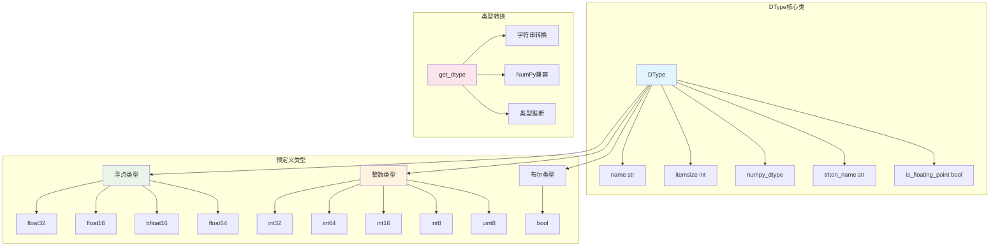

# Data Type System

Genesis implements a unified data type system that provides PyTorch-aligned type management, supporting mixed precision training and cross-device type conversion.

## 🎯 Design Goals

- **Unified Interface**: CPU and GPU backends use the same type definitions
- **PyTorch Compatibility**: Maintain consistency with PyTorch's dtype system
- **Mixed Precision**: Seamless support for FP16, BF16 and other mixed precision training
- **Type Safety**: Compile-time and runtime type checking

## 🏗️ Core Architecture



## 📊 DType类详解

### 类定义

```python
class DType:
    """Genesis数据类型，类似torch.dtype"""
    
    def __init__(self, name, itemsize, numpy_dtype, triton_name=None, is_floating_point=None):
        self.name = name                    # 类型名称，如"float32"
        self.itemsize = itemsize           # 字节大小
        self.numpy_dtype = numpy_dtype     # 对应的NumPy类型
        self.triton_name = triton_name or name  # Triton中的类型名
        
        # 自动检测是否为浮点类型
        if is_floating_point is None:
            self.is_floating_point = np.issubdtype(numpy_dtype, np.floating)
        else:
            self.is_floating_point = is_floating_point
```

### 核心方法

#### 字符串表示
```python
def __str__(self):
    return f"genesis.{self.name}"

def __repr__(self):
    return f"genesis.{self.name}"

# 使用示例
print(genesis.float32)  # 输出: genesis.float32
```

#### 相等性比较
```python
def __eq__(self, other):
    if isinstance(other, DType):
        return self.name == other.name
    elif isinstance(other, str):
        return self.name == other  # 向后兼容字符串比较
    return False

# 使用示例
genesis.float32 == genesis.float32  # True
genesis.float32 == "float32"        # True (向后兼容)
genesis.float32 == genesis.float16  # False
```

## 🔢 预定义数据类型

### 浮点类型

| 类型 | 字节数 | 精度 | 用途 |
|------|--------|------|------|
| `float32` | 4 | 单精度 | 默认浮点类型，平衡精度和性能 |
| `float16` | 2 | 半精度 | 混合精度训练，节省内存 |
| `float64` | 8 | 双精度 | 高精度计算需求 |
| `bfloat16` | 2 | 脑浮点 | Google TPU优化，动态范围大 |

```python
# 浮点类型定义
float32 = DType("float32", 4, np.float32)
float16 = DType("float16", 2, np.float16)
float64 = DType("float64", 8, np.float64)

# bfloat16特殊处理 - Triton支持但NumPy不原生支持
bfloat16 = DType("bfloat16", 2, np.float32, "bfloat16", is_floating_point=True)
```

### 整数类型

| 类型 | 字节数 | 范围 | 用途 |
|------|--------|------|------|
| `int64` | 8 | -2^63 ~ 2^63-1 | 默认整数类型 |
| `int32` | 4 | -2^31 ~ 2^31-1 | 内存优化的整数 |
| `int16` | 2 | -32,768 ~ 32,767 | 小整数存储 |
| `int8` | 1 | -128 ~ 127 | 量化计算 |
| `uint8` | 1 | 0 ~ 255 | 图像数据 |

```python
# 整数类型定义
int32 = DType("int32", 4, np.int32)
int64 = DType("int64", 8, np.int64)
int16 = DType("int16", 2, np.int16)
int8 = DType("int8", 1, np.int8)
uint8 = DType("uint8", 1, np.uint8)
```

### 布尔类型

```python
# 布尔类型
bool = DType("bool", 1, np.bool_, is_floating_point=False)
```

## 🔄 类型转换系统

### 核心转换函数

```python
def get_dtype(obj):
    """
    将各种类型表示转换为Genesis DType对象
    
    支持的输入类型:
    - DType对象: 直接返回
    - 字符串: "float32", "int64"等
    - NumPy dtype: np.float32, np.int64等
    - NumPy类型: np.float32, np.int64类等
    - None: 返回默认float32
    """
    if obj is None:
        return float32  # 默认类型
    elif isinstance(obj, DType):
        return obj
    elif isinstance(obj, str):
        return _name_to_dtype[obj]
    elif isinstance(obj, np.dtype):
        return _numpy_to_dtype[obj.type]
    elif isinstance(obj, type) and issubclass(obj, np.generic):
        return _numpy_to_dtype[obj]
    else:
        raise ValueError(f"Cannot convert {type(obj)} to Genesis DType: {obj}")
```

### 类型映射表

```python
# 名称到类型的映射
_name_to_dtype = {
    "float32": float32,
    "float16": float16,
    "float64": float64,
    "bfloat16": bfloat16,
    "int32": int32,
    "int64": int64,
    "int16": int16,
    "int8": int8,
    "uint8": uint8,
    "bool": bool,
}

# NumPy类型到Genesis类型的映射
_numpy_to_dtype = {
    np.float32: float32,
    np.float16: float16,
    np.float64: float64,
    np.int32: int32,
    np.int64: int64,
    np.int16: int16,
    np.int8: int8,
    np.uint8: uint8,
    np.bool_: bool,
}
```

## 🧮 类型检查工具

### 浮点类型检查

```python
def is_floating_point(dtype):
    """检查是否为浮点类型"""
    dtype = get_dtype(dtype)
    return dtype.is_floating_point

# 使用示例
is_floating_point(genesis.float32)  # True
is_floating_point(genesis.int32)    # False
is_floating_point("float16")        # True
```

### 整数类型检查

```python
def is_integer(dtype):
    """检查是否为整数类型"""
    dtype = get_dtype(dtype)
    return not dtype.is_floating_point and dtype != bool

# 使用示例
is_integer(genesis.int32)   # True
is_integer(genesis.float32) # False
is_integer(genesis.bool)    # False
```

### 类型分类

```python
# 所有支持的类型
all_dtypes = [float32, float16, float64, bfloat16, int32, int64, int16, int8, uint8, bool]

# 浮点类型列表
floating_dtypes = [dt for dt in all_dtypes if dt.is_floating_point]
# [float32, float16, float64, bfloat16]

# 整数类型列表
integer_dtypes = [dt for dt in all_dtypes if is_integer(dt)]
# [int32, int64, int16, int8, uint8]
```

## 🔀 混合精度支持

### 自动类型转换

```python
def _cast(value, dtype):
    """自动类型转换，用于混合精度训练"""
    if isinstance(value, Tensor) and value.is_floating_point():
        if dtype == genesis.float16:
            return value.half()
        else:
            return value.float()
    return value

# 在autograd中的应用
if genesis.enable_autocast:
    result = cls.forward(ctx, *_cast(args, genesis.float32), **_cast(kwargs, genesis.float32))
```

### 类型推断

```python
def check_dtype(value, dtype):
    """递归检查数据结构中是否包含指定类型"""
    if isinstance(value, Tensor):
        return value.dtype == dtype
    elif isinstance(value, dict):
        return any(check_dtype(k, dtype) or check_dtype(v, dtype) for k, v in value.items())
    elif isinstance(value, (list, tuple)):
        return any(check_dtype(v, dtype) for v in value)
    else:
        return False
```

## 🎯 使用示例

### 基础类型操作

```python
import genesis

# 创建不同类型的张量
x_f32 = genesis.randn(3, 4, dtype=genesis.float32)
x_f16 = genesis.randn(3, 4, dtype=genesis.float16)
x_int = genesis.randint(0, 10, (3, 4), dtype=genesis.int32)

# 检查类型
print(f"x_f32类型: {x_f32.dtype}")          # genesis.float32
print(f"是否浮点: {x_f32.dtype.is_floating_point}")  # True
print(f"字节大小: {x_f32.dtype.itemsize}")          # 4
```

### 类型转换

```python
# 字符串到类型
dtype1 = genesis.get_dtype("float16")    # genesis.float16
dtype2 = genesis.get_dtype(np.float32)   # genesis.float32
dtype3 = genesis.get_dtype(None)         # genesis.float32 (默认)

# 张量类型转换
x = genesis.randn(3, 4, dtype="float32")
x_half = x.half()      # 转换为float16
x_float = x.float()    # 转换为float32
```

### 混合精度训练

```python
# 启用混合精度
genesis.enable_autocast = True

# 模型会自动在fp16和fp32间转换
import genesis.nn as nn

model = nn.Linear(784, 128)
x = genesis.randn(32, 784, dtype=genesis.float16)

# 前向传播时自动处理类型转换
output = model(x)
```

### 设备间类型一致性

```python
# CPU和GPU使用相同的类型系统
cpu_tensor = genesis.randn(3, 4, device="cpu", dtype=genesis.float32)
gpu_tensor = genesis.randn(3, 4, device="cuda", dtype=genesis.float32)

print(cpu_tensor.dtype == gpu_tensor.dtype)  # True
print(cpu_tensor.dtype.name)                 # "float32"
print(gpu_tensor.dtype.name)                 # "float32"
```

### bfloat16特殊处理

```python
# bfloat16在不同后端的处理
x_bf16 = genesis.randn(3, 4, dtype=genesis.bfloat16)

# CPU后端: 使用float32存储但标记为bfloat16
# GPU后端: 原生bfloat16支持（如果硬件支持）
print(f"类型名: {x_bf16.dtype.name}")           # "bfloat16"
print(f"Triton名: {x_bf16.dtype.triton_name}")  # "bfloat16"
print(f"NumPy类型: {x_bf16.dtype.numpy_dtype}") # <class 'numpy.float32'>
```

## 🚀 性能优化

### 类型转换优化

- **惰性转换**：只有在真正需要时才进行类型转换
- **缓存机制**：常用的类型转换结果会被缓存
- **零拷贝**：同类型不同设备间的转换尽可能零拷贝

### 内存优化

- **紧凑存储**：使用合适的数据类型减少内存占用
- **对齐优化**：数据类型对齐以提高访问效率
- **批量转换**：批量处理类型转换以提高效率

Genesis的数据类型系统为整个框架提供了统一、高效、类型安全的数据表示，是实现混合精度训练和跨设备计算的基础。