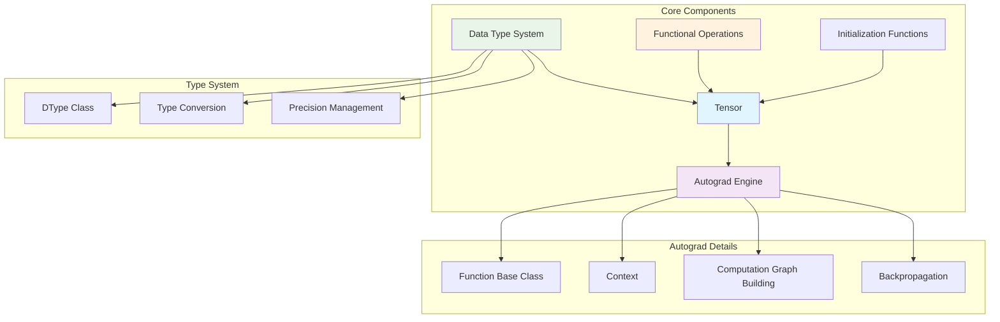

# Core Components Overview

Genesis framework's core components provide the infrastructure for deep learning computation, including tensor systems, automatic differentiation engine, data type system, and functional operation interfaces.

## 🧩 Component Architecture



## 🎯 核心组件清单

| 组件 | 文件 | 主要功能 | 
|------|------|----------|
| 张量系统 | `autograd.py` | 基础数据结构、自动微分 |
| 数据类型 | `dtypes.py` | 统一类型系统、精度管理 |
| 函数式操作 | `functional.py` | 张量操作的函数式接口 |
| 初始化 | `init.py` | 张量创建和初始化 |
| 后端抽象 | `backend.py` | 设备和后端管理 |

## 🚀 设计特色

### 1. 统一的张量接口
- **一致的API**：无论CPU还是GPU，用户使用相同的接口
- **透明的设备切换**：自动处理不同设备间的数据转换
- **类型安全**：编译时和运行时的类型检查

### 2. 高效的自动微分
- **惰性计算图**：按需构建计算图，节省内存
- **智能梯度传播**：优化的反向传播算法
- **内存优化**：自动释放不再需要的中间结果

### 3. 灵活的类型系统
- **混合精度支持**：自动在FP32和FP16间转换
- **设备无关**：类型定义独立于具体设备
- **NumPy兼容**：无缝对接NumPy生态

## 📊 性能特性

### 内存效率
- **视图操作零拷贝**：reshape、transpose等操作不复制数据
- **智能内存管理**：基于引用计数的自动内存释放
- **梯度累积优化**：减少临时张量创建

### 计算优化  
- **延迟执行**：操作在需要时才真正执行
- **融合优化**：相邻操作自动融合以减少内存访问
- **并行计算**：充分利用GPU并行能力

## 🔗 组件间协作

### 张量创建流程
```python
# 用户调用
x = genesis.randn(3, 4)

# 内部流程
init.randn() -> 
NDArray.randn() -> 
Device.randn() -> 
Tensor.__init__() ->
设置requires_grad等属性
```

### 自动微分流程
```python
# 前向传播
z = x * y + x.sum()

# 构建计算图
MulFunction.apply(x, y) -> 
SumFunction.apply(x) ->
AddFunction.apply(mul_result, sum_result) ->
设置creator关系

# 反向传播
z.backward()

# 计算梯度
topo_sort(z) ->
逆拓扑序遍历 ->
调用各Function的backward() ->
梯度累积到叶子节点
```

## 🎓 学习路径建议

### 初级用户
1. **张量基础** - 了解Tensor的创建和基本操作
2. **自动微分** - 理解requires_grad和backward()
3. **设备管理** - 学习CPU/GPU切换

### 中级用户  
1. **数据类型** - 掌握不同精度的使用场景
2. **函数式接口** - 使用functional模块
3. **内存优化** - 理解视图操作和内存管理

### 高级用户
1. **自定义Function** - 实现自定义的前向和反向传播
2. **性能调优** - 优化内存使用和计算效率
3. **源码理解** - 深入理解各组件的实现细节

各组件的详细文档请查看对应的专门页面：

- [自动微分系统](autograd.md) - 深入理解计算图和梯度计算
- [张量操作](tensor.md) - 全面的张量操作指南  
- [数据类型](dtypes.md) - 类型系统和精度管理
- [函数式接口](functional.md) - 函数式编程风格的操作