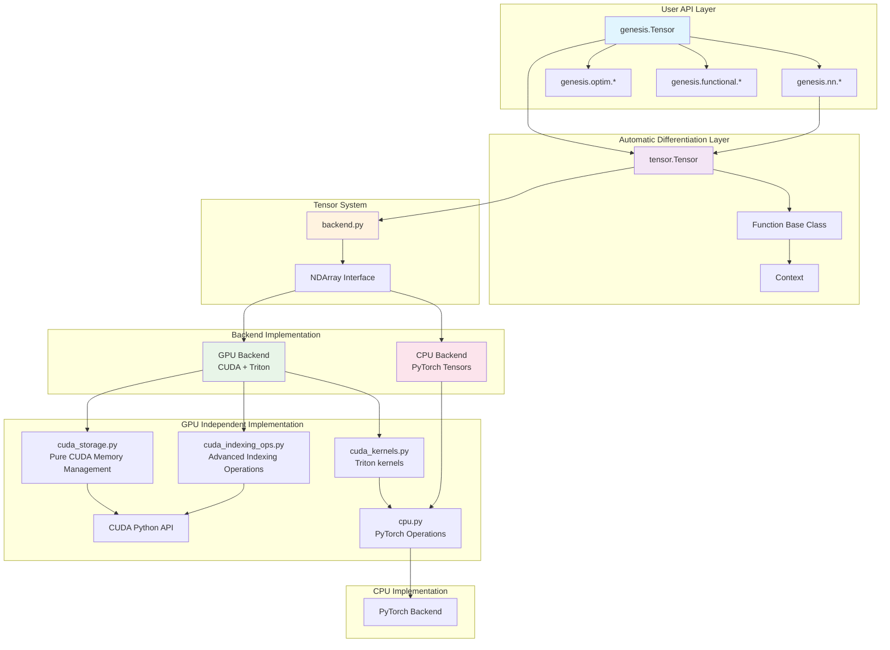

# Architecture Overview

The Genesis deep learning framework adopts a layered modular architecture design that maintains code clarity while achieving high-performance computational capabilities.

## 🏗️ Overall Architecture



## 🔑 Core Design Philosophy

### 1. Dual Backend Architecture

Genesis adopts an innovative dual backend design:

- **CPU Backend**: Leverages PyTorch's mature CPU tensor implementation to ensure stability and compatibility
- **GPU Backend**: Completely independent CUDA implementation that demonstrates the complete process of building a GPU compute stack from scratch

### 2. Balance Between Education and Performance

- **Code Readability**: Each module has clear responsibility separation and detailed documentation
- **Performance Optimization**: GPU backend uses Triton to implement high-performance kernels
- **Progressive Learning**: From simple CPU implementation to complex GPU optimization

### 3. Modular Design

Each component can be understood and extended independently:
- Automatic differentiation system is independent of specific tensor implementations
- Neural network modules are based on general tensor operations
- Backend abstraction allows easy switching between different implementations

## 🔄 Recent Architecture Improvements

### Enhanced Module Organization
- **Streamlined CUDA Operations**: Consolidated indexing operations into `cuda_indexing_ops.py` for better maintainability
- **Optimized Memory Management**: Improved CUDA memory allocation patterns and reduced overhead
- **Cleaner Code Structure**: Removed redundant modules and optimized component relationships

### Performance Enhancements
- **Faster Kernel Compilation**: Optimized Triton kernel initialization and compilation process
- **Reduced Startup Time**: Improved framework initialization and warmup procedures
- **Better Resource Utilization**: Enhanced GPU memory usage patterns and allocation strategies

## 📊 Main Component Details

### Automatic Differentiation System (`tensor.py` and `function.py`)

```python
# Core class structure
class Tensor:
    data: NDArray          # Underlying data storage
    requires_grad: bool    # Whether gradients are required
    creator: Function      # The operation that created this tensor
    grad: Tensor          # Gradient tensor
    
class Function:
    @staticmethod
    def forward(ctx, *args)    # Forward propagation
    @staticmethod 
    def backward(ctx, grad)    # Backward propagation
```

**Key Features**:
- Supports automatic type conversion for mixed precision training
- Flexible computation graph construction and traversal
- Built-in gradient accumulation and zeroing mechanisms

### Tensor Backend System

#### CPU Backend (`backends/cpu.py`)
```python
# Direct use of PyTorch operations
def add(x, y):
    return x + y

def matmul(x, y):
    return torch.matmul(x, y)
```

#### GPU Backend (`backends/cuda.py` and `backends/cuda_kernels.py`)
```python
# GPU kernels implemented with Triton
@triton.jit
def add_kernel(x_ptr, y_ptr, output_ptr, n_elements, BLOCK_SIZE: tl.constexpr):
    pid = tl.program_id(axis=0)
    block_start = pid * BLOCK_SIZE
    offsets = block_start + tl.arange(0, BLOCK_SIZE)
    mask = offsets < n_elements
    x = tl.load(x_ptr + offsets, mask=mask)
    y = tl.load(y_ptr + offsets, mask=mask)
    output = x + y
    tl.store(output_ptr + offsets, output, mask=mask)
```

#### CUDA Memory Management (`cuda_storage.py`)
```python
class CUDATensor:
    """Pure CUDA tensor implementation, independent of PyTorch"""
    def __init__(self, shape, dtype):
        self._cuda_device, self._cuda_context = _ensure_cuda_initialized()
        self._allocate_memory(shape, dtype)
        
    def _allocate_memory(self, shape, dtype):
        # Allocate GPU memory directly using CUDA Python API
        size_bytes = prod(shape) * dtype.itemsize
        result = cuda.cuMemAlloc(size_bytes)
        self._data_ptr = check_cuda_error(result)
```

### Neural Network Modules (`nn/modules/`)

Genesis adopts a modular architecture similar to PyTorch for better code organization:

```
nn/modules/
├── module.py          # Base Module and Parameter classes
├── linear.py          # Linear, Flatten layers
├── activation.py      # ReLU, Softmax, SiLU activation functions
├── normalization.py   # BatchNorm, LayerNorm, RMSNorm
├── loss.py           # CrossEntropyLoss, MSELoss, BCELoss
├── container.py      # Sequential, ModuleList containers
├── dropout.py        # Dropout regularization
├── sparse.py         # Embedding, RotaryEmbedding
└── transformer.py    # MultiheadAttention, FeedForwardSwiGLU
```

**Core Implementation**:

```python
# modules/module.py
class Module:
    """Base class for neural network modules"""
    def parameters(self) -> List[Tensor]:
        # Recursively collect all parameters
        return _unpack_params(self.__dict__)
    
    def forward(self, *args, **kwargs):
        # Subclasses implement specific forward propagation logic
        raise NotImplementedError

# modules/linear.py  
class Linear(Module):
    """Fully connected layer implementation"""
    def __init__(self, in_features, out_features):
        self.weight = Parameter(genesis.randn(out_features, in_features))
        self.bias = Parameter(genesis.zeros(out_features))

# modules/loss.py
class CrossEntropyLoss(Module):
    """Cross-entropy loss for classification"""
    def forward(self, input: Tensor, target: Tensor) -> Tensor:
        log_prob = F.log_softmax(input, dim=1)
        # ... implementation details
```

## 🔧 Key Technical Implementations

### 1. Memory Management Strategy

**CPU Memory Management**:
- Relies on PyTorch's memory pool and garbage collection
- Automatically handles memory alignment and cache optimization

**GPU Memory Management**:
```python
class CUDATensor:
    def __init__(self, shape, dtype, base=None):
        if base is not None:
            # View tensor: shares memory but maintains reference to original tensor
            self.base = base
            self._data_ptr = base._data_ptr + offset
        else:
            # New tensor: allocate independent memory
            self.base = None
            self._data_ptr = cuda.cuMemAlloc(size_bytes)
    
    def __del__(self):
        # Only base tensors free memory
        if self.base is None and self._data_ptr:
            cuda.cuMemFree(self._data_ptr)
```

### 2. Device Abstraction

```python
class Device:
    def __init__(self, name: str, mod: Any, device_id: Optional[int] = None):
        self.name = name        # "cpu" or "cuda"
        self.mod = mod          # Corresponding operation module
        self.device_id = device_id  # GPU device ID
        
    def randn(self, *shape, dtype=genesis.float32):
        if self.name == "cuda":
            return NDArray(CUDATensor(shape, dtype), device=self)
        else:
            return NDArray(torch.randn(*shape), device=self)
```

### 3. Type System

```python
# dtypes.py - Unified data type system
class DType:
    def __init__(self, name: str, torch_dtype, numpy_dtype, itemsize: int):
        self.name = name
        self.torch_dtype = torch_dtype
        self.numpy_dtype = numpy_dtype  
        self.itemsize = itemsize

# Supported data types
float32 = DType("float32", torch.float32, np.float32, 4)
float16 = DType("float16", torch.float16, np.float16, 2)
bfloat16 = DType("bfloat16", torch.bfloat16, np.dtype('uint16'), 2)
```

## 🚀 Performance Optimization Strategies

### 1. Triton Kernel Optimization

**Softmax Implementation**:
```python
@triton.jit
def softmax_kernel(input_ptr, output_ptr, input_row_stride, output_row_stride, 
                  n_cols, BLOCK_SIZE: tl.constexpr):
    # Efficient parallel softmax implementation
    row_idx = tl.program_id(0)
    row_start_ptr = input_ptr + row_idx * input_row_stride
    col_offsets = tl.arange(0, BLOCK_SIZE)
    input_ptrs = row_start_ptr + col_offsets
    row = tl.load(input_ptrs, mask=col_offsets < n_cols, other=-float('inf'))
    
    # Numerically stable softmax
    row_minus_max = row - tl.max(row, axis=0)
    numerator = tl.exp(row_minus_max)
    denominator = tl.sum(numerator, axis=0)
    softmax_output = numerator / denominator
    
    output_row_start_ptr = output_ptr + row_idx * output_row_stride
    output_ptrs = output_row_start_ptr + col_offsets
    tl.store(output_ptrs, softmax_output, mask=col_offsets < n_cols)
```

### 2. Mixed Precision Training

```python
# amp.py - Automatic mixed precision
enable_autocast = False

def _cast(value, dtype):
    """Automatic type conversion"""
    if isinstance(value, Tensor) and value.is_floating_point():
        if dtype == genesis.float16:
            return value.half()
        else:
            return value.float()
    return value
```

## 🔍 Architectural Advantages

### Educational Value
1. **Progressive Complexity**: From simple CPU implementation to complex GPU optimization
2. **Complete Implementation Showcase**: Demonstrates the complete construction process of a deep learning framework  
3. **Clear Module Boundaries**: Each component has clear responsibilities, making it easy to understand

### Engineering Practice
1. **Dual Backend Design**: CPU stability + GPU high performance
2. **Memory Safety**: RAII pattern memory management prevents memory leaks
3. **Type Safety**: Unified type system avoids type errors

### Performance Characteristics
1. **Triton Optimization**: Modern GPU kernel development approach
2. **Zero-Copy Views**: Efficient tensor view operations
3. **Parallel Computing**: Fully utilizes GPU parallel capabilities

## 🎯 Design Trade-offs

### CPU vs GPU Implementation Choice
- **CPU**: Uses PyTorch to ensure stability and compatibility
- **GPU**: Independent implementation showcases complete GPU programming stack

### Simplicity vs Performance
- Maintains simple APIs while implementing highly optimized underlying layers
- Isolates complexity in the lower layers through layered architecture

### Education vs Production
- Code emphasizes readability and educational value
- Performance still reaches production-level standards

This architectural design makes Genesis both an excellent learning resource and a fully functional deep learning framework.