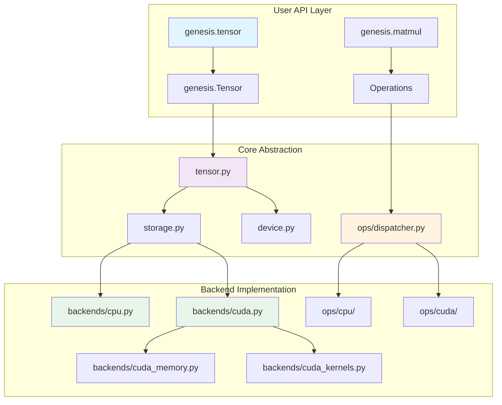

# Backend System Overview

Genesis v2.0 introduces a modular backend architecture that cleanly separates device-specific implementations while maintaining a unified interface.

## 🏗️ Architecture

The backend system follows a clear separation of concerns:



## 🎯 Key Components

### Device Abstraction
The `genesis.device` module provides a unified interface for device management:
- Automatic device selection
- Device-agnostic tensor creation
- Transparent memory management

### Storage Layer
The `genesis.storage` module handles the underlying data storage:
- Abstracts device-specific storage implementations
- Manages memory lifecycle
- Provides efficient data transfer between devices

### Backend Implementations

#### CPU Backend
- **File**: `backends/cpu.py`
- **Implementation**: Leverages PyTorch for CPU operations
- **Features**: Full compatibility, efficient CPU utilization

#### CUDA Backend
- **Files**: `backends/cuda.py`, `backends/cuda_memory.py`, `backends/cuda_kernels.py`
- **Implementation**: Pure CUDA/Triton implementation
- **Features**:
  - Custom memory management with pooling
  - Optimized CUDA kernels
  - Lazy initialization for reliability

## 🚀 Design Principles

### 1. Modularity
Each backend is completely self-contained, making it easy to:
- Add new device support
- Optimize specific operations
- Test backends independently

### 2. Performance
The backend system is designed for maximum performance:
- Zero-copy operations where possible
- Efficient memory pooling
- Kernel fusion opportunities

### 3. Reliability
Built-in safety features:
- Lazy CUDA initialization
- Automatic memory management
- Graceful fallbacks

## 💡 Usage Example

```python
import genesis

# Device abstraction handles backend selection
device = genesis.device("cuda")

# Tensors automatically use appropriate backend
x = genesis.tensor([1, 2, 3], device=device)
y = genesis.tensor([4, 5, 6], device=device)

# Operations dispatch to correct backend
z = genesis.matmul(x, y)  # Uses CUDA backend

# Seamless device transfer
cpu_tensor = z.to("cpu")  # Transfer to CPU backend
```

## 🔄 Adding New Backends

To add a new backend:

1. Create a new file in `backends/` directory
2. Implement the storage interface
3. Add operations in `ops/<backend>/`
4. Register with the dispatcher

See [Development Setup](../contributing/development.md) for detailed instructions on contributing to the backend system.