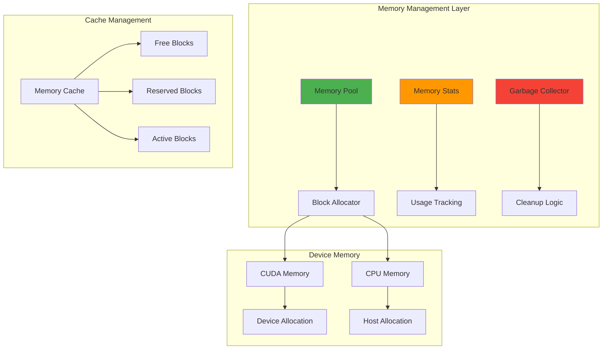

# Memory Management System

Genesis provides advanced memory management features for efficient GPU and CPU memory utilization.

## 📋 Overview

The memory management system is designed to:
- Minimize allocation overhead through pooling
- Reduce memory fragmentation
- Provide detailed memory statistics
- Enable efficient memory reuse

## 🏗️ Architecture



## 🎯 Key Components

### Memory Pool
The central component managing memory allocation and deallocation:

```python
class MemoryPool:
    """Unified memory pool for efficient allocation."""

    def __init__(self, device_type):
        self.device_type = device_type
        self.free_blocks = {}  # size -> list of blocks
        self.allocated_blocks = {}  # ptr -> block info
        self.total_allocated = 0
        self.peak_allocated = 0

    def allocate(self, size):
        """Allocate memory block of given size."""
        # Try to reuse existing block
        block = self._find_suitable_block(size)
        if block:
            return self._reuse_block(block, size)

        # Allocate new block
        return self._allocate_new_block(size)

    def deallocate(self, ptr):
        """Return memory block to pool."""
        block = self.allocated_blocks.pop(ptr)
        self._add_to_free_blocks(block)
```

### Memory Statistics
Comprehensive tracking of memory usage:

```python
class MemoryStats:
    """Detailed memory usage statistics."""

    def __init__(self):
        self.allocated_bytes = 0
        self.reserved_bytes = 0
        self.active_bytes = 0
        self.inactive_bytes = 0
        self.peak_allocated = 0
        self.num_allocs = 0
        self.num_frees = 0

    def update_allocation(self, size):
        """Update stats for new allocation."""
        self.allocated_bytes += size
        self.active_bytes += size
        self.peak_allocated = max(self.peak_allocated, self.allocated_bytes)
        self.num_allocs += 1

    def fragmentation_ratio(self):
        """Calculate memory fragmentation."""
        if self.reserved_bytes == 0:
            return 0.0
        return (self.reserved_bytes - self.allocated_bytes) / self.reserved_bytes
```

## 🚀 CUDA Memory Management

### Advanced Pooling Strategy
```python
class CUDAMemoryPool(MemoryPool):
    """CUDA-specific memory pool with advanced features."""

    def __init__(self, device_id=0):
        super().__init__("cuda")
        self.device_id = device_id
        self.memory_fraction = 0.8  # Use 80% of available memory
        self._initialize_pool()

    def _initialize_pool(self):
        """Initialize CUDA memory pool."""
        torch.cuda.set_device(self.device_id)

        # Get available memory
        total_memory = torch.cuda.get_device_properties(self.device_id).total_memory
        available_memory = int(total_memory * self.memory_fraction)

        # Pre-allocate large blocks
        self._preallocate_blocks(available_memory)

    def _preallocate_blocks(self, total_size):
        """Pre-allocate memory blocks of various sizes."""
        block_sizes = [1024, 4096, 16384, 65536, 262144, 1048576]  # Powers of 2

        for block_size in block_sizes:
            num_blocks = max(1, total_size // (block_size * len(block_sizes)))
            for _ in range(num_blocks):
                ptr = torch.cuda.caching_allocator_alloc(block_size)
                self._add_to_free_blocks(Block(ptr, block_size))
```

### Memory Optimization Features

#### Smart Caching
```python
def smart_cache_management(self):
    """Intelligent memory caching based on usage patterns."""
    # Analyze allocation patterns
    frequent_sizes = self._analyze_allocation_patterns()

    # Adjust cache sizes based on patterns
    for size in frequent_sizes:
        self._increase_cache_for_size(size)

    # Clean up rarely used blocks
    self._cleanup_unused_blocks()
```

#### Memory Compaction
```python
def compact_memory(self):
    """Reduce memory fragmentation through compaction."""
    # Find fragmented regions
    fragmented_blocks = self._find_fragmented_blocks()

    # Compact adjacent free blocks
    for block_group in fragmented_blocks:
        merged_block = self._merge_blocks(block_group)
        self._add_to_free_blocks(merged_block)
```

## 💻 CPU Memory Management

### Efficient Host Memory
```python
class CPUMemoryPool(MemoryPool):
    """CPU memory pool with pinned memory support."""

    def __init__(self):
        super().__init__("cpu")
        self.use_pinned_memory = False
        self.pinned_blocks = set()

    def allocate_pinned(self, size):
        """Allocate pinned memory for faster GPU transfers."""
        ptr = torch.cuda.cudaHostAlloc(size, torch.cuda.cudaHostAllocDefault)
        block = Block(ptr, size, pinned=True)
        self.pinned_blocks.add(ptr)
        return block

    def is_pinned(self, ptr):
        """Check if memory block is pinned."""
        return ptr in self.pinned_blocks
```

## 🔧 Configuration and Usage

### Basic Configuration
```python
import genesis

# Configure CUDA memory
genesis.cuda.set_memory_fraction(0.9)  # Use 90% of GPU memory
genesis.cuda.set_cache_size("2GB")     # Set cache size

# Configure CPU memory
genesis.cpu.enable_pinned_memory(True) # Enable pinned memory

# Get current memory stats
stats = genesis.memory_stats()
print(f"Allocated: {stats.allocated_bytes / 1e9:.2f} GB")
print(f"Cached: {stats.cached_bytes / 1e9:.2f} GB")
```

### Advanced Memory Control
```python
# Manual memory management
def optimize_memory_usage():
    # Clear unused cache
    genesis.empty_cache()

    # Trigger garbage collection
    genesis.memory_manager.collect_garbage()

    # Compact fragmented memory
    genesis.memory_manager.compact()

# Memory monitoring
def monitor_memory():
    stats = genesis.memory_stats()
    fragmentation = stats.fragmentation_ratio()

    if fragmentation > 0.3:  # 30% fragmentation threshold
        print("High fragmentation detected, compacting...")
        genesis.memory_manager.compact()
```

## 📊 Memory Profiling

### Built-in Profiler
```python
# Enable memory profiling
genesis.enable_memory_profiling(True)

# Memory operations will now be tracked
x = genesis.tensor([1, 2, 3], device="cuda")  # Allocation tracked
y = x + 1                                     # Temporary allocation tracked
del x                                         # Deallocation tracked

# Get profiling report
report = genesis.memory_profiler.get_report()
print(report.summary())
```

### Memory Timeline
```python
# Record memory timeline
with genesis.memory_profiler.record():
    # Your code here
    model = create_model()
    data = load_data()
    output = model(data)

# Analyze timeline
timeline = genesis.memory_profiler.get_timeline()
timeline.plot()  # Shows memory usage over time
```

## ⚡ Performance Tips

### Memory Optimization Best Practices

1. **Pre-allocate Large Tensors**
   ```python
   # Good: Pre-allocate
   buffer = genesis.empty((1000000,), device="cuda")

   # Avoid: Frequent small allocations
   for i in range(1000):
       x = genesis.tensor([i], device="cuda")
   ```

2. **Reuse Memory Buffers**
   ```python
   # Reuse buffer
   result_buffer = genesis.empty((batch_size, num_features))
   for batch in dataloader:
       genesis.matmul(batch.input, weights, out=result_buffer)
   ```

3. **Use In-Place Operations**
   ```python
   # In-place operations save memory
   x.add_(y)      # Instead of x = x + y
   x.mul_(0.5)    # Instead of x = x * 0.5
   ```

4. **Manual Memory Management**
   ```python
   # Clear cache when needed
   if memory_pressure_detected():
       genesis.empty_cache()
   ```

## 🔍 Debugging Memory Issues

### Memory Leak Detection
```python
# Enable leak detection
genesis.enable_memory_debugging(True)

# Run your code
train_model()

# Check for leaks
leaks = genesis.check_memory_leaks()
if leaks:
    print("Memory leaks detected:")
    for leak in leaks:
        print(f"  {leak.size} bytes at {leak.location}")
```

### Memory Usage Analysis
```python
def analyze_memory_usage():
    """Comprehensive memory analysis."""
    stats = genesis.detailed_memory_stats()

    print(f"Total allocated: {stats.total_allocated / 1e9:.2f} GB")
    print(f"Peak usage: {stats.peak_allocated / 1e9:.2f} GB")
    print(f"Fragmentation: {stats.fragmentation_ratio:.2%}")
    print(f"Cache hit rate: {stats.cache_hit_rate:.2%}")

    # Show largest allocations
    large_allocs = stats.get_large_allocations(min_size=100*1024*1024)  # 100MB+
    for alloc in large_allocs:
        print(f"Large alloc: {alloc.size / 1e6:.1f} MB at {alloc.location}")
```

## 🔗 See Also

- [CUDA Backend](cuda.md)
- [CPU Backend](cpu.md)
- [Performance Optimization](../performance/optimization-guide.md)
- [Development Setup](../contributing/development.md)