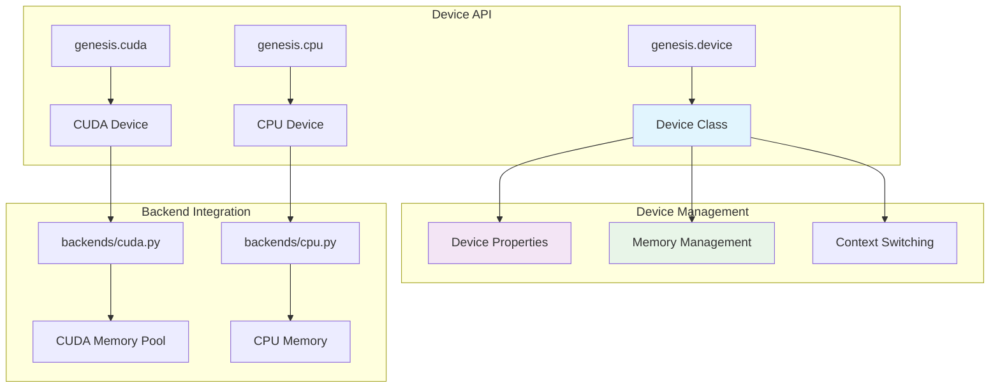

# Device Abstraction

Genesis provides a unified device abstraction that allows seamless operation across different hardware backends while maintaining optimal performance.

## 📋 Overview

The device system in Genesis v2.0 provides:
- Unified device interface across CPU and GPU
- Automatic device inference and management
- Transparent memory management
- Optimal performance for each device type

## 🏗️ Architecture



## 🎯 Core Components

### Device Class
The central Device class provides a uniform interface:

```python
class Device:
    """Unified device abstraction."""

    def __init__(self, device_type, device_id=None):
        self.type = device_type  # 'cpu' or 'cuda'
        self.id = device_id or 0
        self._properties = None

    @property
    def is_cuda(self):
        """Check if device is CUDA."""
        return self.type == 'cuda'

    @property
    def is_cpu(self):
        """Check if device is CPU."""
        return self.type == 'cpu'

    def __str__(self):
        if self.type == 'cuda':
            return f"cuda:{self.id}"
        return self.type
```

### Device Creation
Multiple ways to create device objects:

```python
# String specification
device = genesis.device("cuda:0")
device = genesis.device("cpu")

# From existing tensor
device = tensor.device

# Default device
device = genesis.get_default_device()

# Automatic device selection
device = genesis.device("auto")  # Selects CUDA if available, else CPU
```

## 💻 Device Operations

### Device Context Management
```python
# Temporary device context
with genesis.device("cuda:1"):
    x = genesis.randn(3, 4)  # Created on cuda:1
    y = genesis.zeros(3, 4)  # Also on cuda:1

# Device-specific operations
device = genesis.device("cuda:0")
with device:
    # All operations use this device
    model = MyModel()
    optimizer = genesis.optim.Adam(model.parameters())
```

### Cross-Device Operations
```python
# Automatic device handling
cpu_tensor = genesis.tensor([1, 2, 3], device="cpu")
gpu_tensor = genesis.tensor([4, 5, 6], device="cuda")

# Automatic device promotion (moves to GPU)
result = cpu_tensor + gpu_tensor  # Result on cuda device

# Explicit device transfer
gpu_result = cpu_tensor.to("cuda")
cpu_result = gpu_tensor.to("cpu")
```

### Device Properties
```python
device = genesis.device("cuda:0")

# Basic properties
print(f"Device type: {device.type}")
print(f"Device ID: {device.id}")
print(f"Is CUDA: {device.is_cuda}")

# CUDA-specific properties
if device.is_cuda:
    print(f"Device name: {device.name}")
    print(f"Compute capability: {device.compute_capability}")
    print(f"Total memory: {device.total_memory}")
    print(f"Multi-processor count: {device.multi_processor_count}")
```

## 🚀 CUDA Device Features

### Multi-GPU Support
```python
# Check available GPUs
num_gpus = genesis.cuda.device_count()
print(f"Available GPUs: {num_gpus}")

# Use specific GPU
device = genesis.device("cuda:1")
tensor = genesis.randn(1000, 1000, device=device)

# Multi-GPU computation
devices = [genesis.device(f"cuda:{i}") for i in range(num_gpus)]
tensors = [genesis.randn(100, 100, device=dev) for dev in devices]
```

### CUDA Memory Management
```python
device = genesis.device("cuda:0")

# Memory information
print(f"Free memory: {device.memory_free()}")
print(f"Used memory: {device.memory_used()}")
print(f"Total memory: {device.memory_total()}")

# Memory operations
genesis.cuda.empty_cache()  # Clear unused cache
genesis.cuda.synchronize()  # Wait for operations to complete

# Memory statistics
stats = genesis.cuda.memory_stats()
print(f"Peak allocated: {stats['peak_allocated']}")
```

### CUDA Streams and Events
```python
# CUDA stream management
stream = genesis.cuda.Stream()

with genesis.cuda.stream(stream):
    x = genesis.randn(1000, 1000, device="cuda")
    y = genesis.matmul(x, x)

# Synchronization
stream.synchronize()

# CUDA events for timing
start_event = genesis.cuda.Event(enable_timing=True)
end_event = genesis.cuda.Event(enable_timing=True)

start_event.record()
# ... operations ...
end_event.record()
genesis.cuda.synchronize()

elapsed_time = start_event.elapsed_time(end_event)
print(f"Elapsed time: {elapsed_time:.2f} ms")
```

## 💾 CPU Device Features

### CPU Configuration
```python
# CPU-specific settings
genesis.cpu.set_num_threads(8)
print(f"CPU threads: {genesis.cpu.get_num_threads()}")

# Enable/disable optimizations
genesis.cpu.set_optimization_level('O2')
genesis.cpu.enable_mkl(True)
```

### Memory Management
```python
# CPU memory operations
device = genesis.device("cpu")

# Pinned memory for faster GPU transfers
tensor = genesis.empty((1000, 1000), device=device, pin_memory=True)
print(f"Is pinned: {tensor.is_pinned()}")

# Memory mapping for large datasets
mapped_tensor = genesis.from_file("large_dataset.dat", device="cpu", mmap=True)
```

## 🔧 Device Configuration

### Default Device Management
```python
# Set global default device
genesis.set_default_device("cuda:0")

# Get current default
device = genesis.get_default_device()
print(f"Default device: {device}")

# Context-specific defaults
with genesis.default_device("cpu"):
    x = genesis.randn(3, 4)  # Created on CPU
    print(f"Device: {x.device}")  # cpu

# Reset to system default
genesis.reset_default_device()
```

### Environment Variables
```python
import os

# Set device via environment
os.environ['GENESIS_DEFAULT_DEVICE'] = 'cuda:1'
os.environ['CUDA_VISIBLE_DEVICES'] = '0,1,2,3'

# Device selection priority:
# 1. Explicit device parameter
# 2. Current device context
# 3. Environment variable
# 4. System default
```

## 📊 Performance Optimization

### Device-Specific Optimization
```python
def optimize_for_device(tensor):
    """Apply device-specific optimizations."""
    if tensor.device.is_cuda:
        # CUDA optimizations
        tensor = tensor.contiguous()  # Ensure memory layout
        if tensor.numel() > 10000:
            tensor = tensor.half()    # Use half precision for large tensors
    else:
        # CPU optimizations
        tensor = tensor.float()       # Use float32 for CPU

    return tensor

# Usage
optimized_tensor = optimize_for_device(my_tensor)
```

### Memory Transfer Optimization
```python
def efficient_transfer(tensor, target_device):
    """Efficiently transfer tensor to target device."""
    if tensor.device == target_device:
        return tensor  # No transfer needed

    # Use pinned memory for CPU->GPU transfer
    if tensor.device.is_cpu and target_device.is_cuda:
        if not tensor.is_pinned():
            tensor = tensor.pin_memory()

    # Async transfer with streams
    if target_device.is_cuda:
        with genesis.cuda.stream(genesis.cuda.Stream()):
            return tensor.to(target_device, non_blocking=True)

    return tensor.to(target_device)
```

## 🔍 Device Detection and Capability

### Hardware Detection
```python
def detect_hardware():
    """Detect available hardware and capabilities."""
    info = {
        'cpu_count': genesis.cpu.logical_cpu_count(),
        'cpu_features': genesis.cpu.supported_features(),
        'cuda_available': genesis.cuda.is_available(),
        'cuda_version': genesis.cuda.version() if genesis.cuda.is_available() else None,
        'gpu_count': genesis.cuda.device_count() if genesis.cuda.is_available() else 0,
    }

    if info['cuda_available']:
        info['gpus'] = []
        for i in range(info['gpu_count']):
            gpu_info = genesis.cuda.get_device_properties(i)
            info['gpus'].append({
                'name': gpu_info.name,
                'memory': gpu_info.total_memory,
                'compute_capability': gpu_info.compute_capability,
            })

    return info

# Usage
hw_info = detect_hardware()
print(f"Hardware info: {hw_info}")
```

### Capability-Based Selection
```python
def select_optimal_device(min_memory_gb=1.0, compute_capability=None):
    """Select optimal device based on requirements."""
    if not genesis.cuda.is_available():
        return genesis.device("cpu")

    for i in range(genesis.cuda.device_count()):
        device = genesis.device(f"cuda:{i}")
        props = genesis.cuda.get_device_properties(i)

        # Check memory requirement
        if props.total_memory < min_memory_gb * 1e9:
            continue

        # Check compute capability
        if compute_capability and props.compute_capability < compute_capability:
            continue

        return device

    # Fallback to CPU if no suitable GPU
    return genesis.device("cpu")

# Usage
device = select_optimal_device(min_memory_gb=4.0, compute_capability=7.0)
print(f"Selected device: {device}")
```

## 🔗 See Also

- [Backend System](../backends/index.md) - Backend implementation details
- [Memory Management](../backends/memory.md) - Advanced memory management
- [Performance Guide](../performance/optimization-guide.md) - Performance optimization
- [CUDA Backend](../backends/cuda.md) - CUDA-specific features