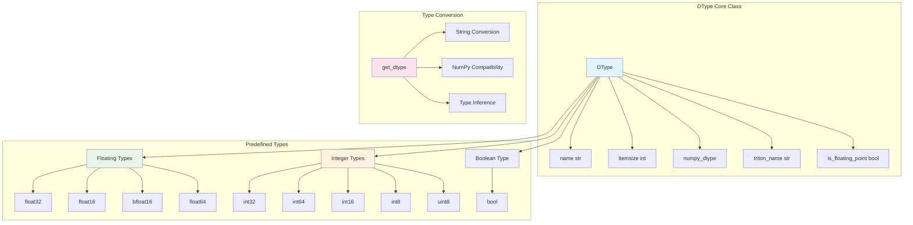

# Data Type System

Genesis implements a unified data type system that provides PyTorch-aligned type management, supporting mixed precision training and cross-device type conversion.

## 🎯 Design Goals

- **Unified Interface**: CPU and GPU backends use the same type definitions
- **PyTorch Compatibility**: Maintain consistency with PyTorch's dtype system
- **Mixed Precision**: Seamless support for FP16, BF16 and other mixed precision training
- **Type Safety**: Compile-time and runtime type checking

## 🏗️ Core Architecture



## 📊 DType Class Details

### Class Definition

```python
class DType:
    """Genesis data type, similar to torch.dtype"""
    
    def __init__(self, name, itemsize, numpy_dtype, triton_name=None, is_floating_point=None):
        self.name = name                    # Type name, e.g. "float32"
        self.itemsize = itemsize           # Size in bytes
        self.numpy_dtype = numpy_dtype     # Corresponding NumPy type
        self.triton_name = triton_name or name  # Type name in Triton
        
        # Auto-detect if floating point type
        if is_floating_point is None:
            self.is_floating_point = np.issubdtype(numpy_dtype, np.floating)
        else:
            self.is_floating_point = is_floating_point
```

### Core Methods

#### String Representation
```python
def __str__(self):
    return f"genesis.{self.name}"

def __repr__(self):
    return f"genesis.{self.name}"

# Usage example
print(genesis.float32)  # Output: genesis.float32
```

#### Equality Comparison
```python
def __eq__(self, other):
    if isinstance(other, DType):
        return self.name == other.name
    elif isinstance(other, str):
        return self.name == other  # Backward compatibility for string comparison
    return False

# Usage examples
genesis.float32 == genesis.float32  # True
genesis.float32 == "float32"        # True (backward compatibility)
genesis.float32 == genesis.float16  # False
```

## 🔢 Predefined Data Types

### Floating Point Types

| Type | Bytes | Precision | Usage |
|------|-------|-----------|-------|
| `float32` | 4 | Single | Default floating type, balanced precision and performance |
| `float16` | 2 | Half | Mixed precision training, memory saving |
| `float64` | 8 | Double | High precision computation requirements |
| `bfloat16` | 2 | Brain float | Google TPU optimized, large dynamic range |

```python
# Floating point type definitions
float32 = DType("float32", 4, np.float32)
float16 = DType("float16", 2, np.float16)
float64 = DType("float64", 8, np.float64)

# bfloat16 special handling - Triton supports but NumPy doesn't natively
bfloat16 = DType("bfloat16", 2, np.float32, "bfloat16", is_floating_point=True)
```

### Integer Types

| Type | Bytes | Range | Usage |
|------|-------|-------|-------|
| `int64` | 8 | -2^63 ~ 2^63-1 | Default integer type |
| `int32` | 4 | -2^31 ~ 2^31-1 | Memory-optimized integer |
| `int16` | 2 | -32,768 ~ 32,767 | Small integer storage |
| `int8` | 1 | -128 ~ 127 | Quantized computation |
| `uint8` | 1 | 0 ~ 255 | Image data |

```python
# Integer type definitions
int32 = DType("int32", 4, np.int32)
int64 = DType("int64", 8, np.int64)
int16 = DType("int16", 2, np.int16)
int8 = DType("int8", 1, np.int8)
uint8 = DType("uint8", 1, np.uint8)
```

### Boolean Type

```python
# Boolean type
bool = DType("bool", 1, np.bool_, is_floating_point=False)
```

## 🔄 Type Conversion System

### Core Conversion Function

```python
def get_dtype(obj):
    """
    Convert various type representations to Genesis DType objects
    
    Supported input types:
    - DType objects: Return directly
    - Strings: "float32", "int64", etc.
    - NumPy dtype: np.float32, np.int64, etc.
    - NumPy types: np.float32, np.int64 classes, etc.
    - None: Return default float32
    """
    if obj is None:
        return float32  # Default type
    elif isinstance(obj, DType):
        return obj
    elif isinstance(obj, str):
        return _name_to_dtype[obj]
    elif isinstance(obj, np.dtype):
        return _numpy_to_dtype[obj.type]
    elif isinstance(obj, type) and issubclass(obj, np.generic):
        return _numpy_to_dtype[obj]
    else:
        raise ValueError(f"Cannot convert {type(obj)} to Genesis DType: {obj}")
```

### Type Mapping Tables

```python
# Name to type mapping
_name_to_dtype = {
    "float32": float32,
    "float16": float16,
    "float64": float64,
    "bfloat16": bfloat16,
    "int32": int32,
    "int64": int64,
    "int16": int16,
    "int8": int8,
    "uint8": uint8,
    "bool": bool,
}

# NumPy type to Genesis type mapping
_numpy_to_dtype = {
    np.float32: float32,
    np.float16: float16,
    np.float64: float64,
    np.int32: int32,
    np.int64: int64,
    np.int16: int16,
    np.int8: int8,
    np.uint8: uint8,
    np.bool_: bool,
}
```

## 🧮 Type Checking Tools

### Floating Point Type Check

```python
def is_floating_point(dtype):
    """Check if it's a floating point type"""
    dtype = get_dtype(dtype)
    return dtype.is_floating_point

# Usage examples
is_floating_point(genesis.float32)  # True
is_floating_point(genesis.int32)    # False
is_floating_point("float16")        # True
```

### Integer Type Check

```python
def is_integer(dtype):
    """Check if it's an integer type"""
    dtype = get_dtype(dtype)
    return not dtype.is_floating_point and dtype != bool

# Usage examples
is_integer(genesis.int32)   # True
is_integer(genesis.float32) # False
is_integer(genesis.bool)    # False
```

### Type Classification

```python
# All supported types
all_dtypes = [float32, float16, float64, bfloat16, int32, int64, int16, int8, uint8, bool]

# Floating point type list
floating_dtypes = [dt for dt in all_dtypes if dt.is_floating_point]
# [float32, float16, float64, bfloat16]

# Integer type list
integer_dtypes = [dt for dt in all_dtypes if is_integer(dt)]
# [int32, int64, int16, int8, uint8]
```

## 🔍 Automatic Type Inference

Genesis provides intelligent dtype inference that follows PyTorch conventions:

### `infer_dtype_from_data(array)`

Automatically infers the appropriate Genesis dtype from input data:

```python
from genesis.dtypes import infer_dtype_from_data

# Python scalar inference
infer_dtype_from_data(42)        # → genesis.int64
infer_dtype_from_data(3.14)      # → genesis.float32
infer_dtype_from_data(True)      # → genesis.bool

# List and array inference
infer_dtype_from_data([1, 2, 3])           # → genesis.int64
infer_dtype_from_data([1.0, 2.0, 3.0])     # → genesis.float32
infer_dtype_from_data(np.array([1, 2]))    # → preserves numpy dtype

# Tensor inference  
existing_tensor = genesis.tensor([1, 2, 3])
infer_dtype_from_data(existing_tensor)     # → existing_tensor.dtype
```

### Inference Rules

| Input Type | Inferred Genesis DType | Notes |
|------------|----------------------|-------|
| Python `int` | `genesis.int64` | PyTorch default |
| Python `float` | `genesis.float32` | PyTorch default |
| Python `bool` | `genesis.bool` | Preserved |
| `np.int32`, `np.int64`, etc. | Corresponding int type | Preserved |
| `np.float16`, `np.float32` | Corresponding float type | Preserved |
| `np.float64` | `genesis.float32` | ⚠️ Converted for consistency |
| `np.bool_` | `genesis.bool` | Preserved |
| Genesis `Tensor` | `tensor.dtype` | Preserved |
| Lists/tuples | Inferred from first conversion to numpy | Depends on content |

**Key Features:**
- **PyTorch Compatibility**: Follows PyTorch's default type inference rules
- **Performance Optimization**: Automatically converts `float64` to `float32` to match PyTorch behavior
- **Type Preservation**: Preserves integer and boolean types from numpy arrays
- **Consistent Behavior**: Same inference logic used across the framework

## 🔀 Mixed Precision Support

### Automatic Type Conversion

```python
def _cast(value, dtype):
    """Automatic type conversion for mixed precision training"""
    if isinstance(value, Tensor) and value.is_floating_point():
        if dtype == genesis.float16:
            return value.half()
        else:
            return value.float()
    return value

# Application in autograd
if genesis.enable_autocast:
    result = cls.forward(ctx, *_cast(args, genesis.float32), **_cast(kwargs, genesis.float32))
```

### Type Inference

```python
def check_dtype(value, dtype):
    """Recursively check if data structure contains specified type"""
    if isinstance(value, Tensor):
        return value.dtype == dtype
    elif isinstance(value, dict):
        return any(check_dtype(k, dtype) or check_dtype(v, dtype) for k, v in value.items())
    elif isinstance(value, (list, tuple)):
        return any(check_dtype(v, dtype) for v in value)
    else:
        return False
```

## 🎯 Usage Examples

### Basic Type Operations

```python
import genesis

# Create tensors with different types
x_f32 = genesis.randn(3, 4, dtype=genesis.float32)
x_f16 = genesis.randn(3, 4, dtype=genesis.float16)
x_int = genesis.randint(0, 10, (3, 4), dtype=genesis.int32)

# Check types
print(f"x_f32 type: {x_f32.dtype}")          # genesis.float32
print(f"Is floating: {x_f32.dtype.is_floating_point}")  # True
print(f"Byte size: {x_f32.dtype.itemsize}")          # 4
```

### Type Conversion

```python
# String to type
dtype1 = genesis.get_dtype("float16")    # genesis.float16
dtype2 = genesis.get_dtype(np.float32)   # genesis.float32
dtype3 = genesis.get_dtype(None)         # genesis.float32 (default)

# Tensor type conversion
x = genesis.randn(3, 4, dtype="float32")
x_half = x.half()      # Convert to float16
x_float = x.float()    # Convert to float32
```

### Mixed Precision Training

```python
# Enable mixed precision
genesis.enable_autocast = True

# Model will automatically convert between fp16 and fp32
import genesis.nn as nn

model = nn.Linear(784, 128)
x = genesis.randn(32, 784, dtype=genesis.float16)

# Automatic type conversion handling during forward pass
output = model(x)
```

### Cross-Device Type Consistency

```python
# CPU and GPU use the same type system
cpu_tensor = genesis.randn(3, 4, device="cpu", dtype=genesis.float32)
gpu_tensor = genesis.randn(3, 4, device="cuda", dtype=genesis.float32)

print(cpu_tensor.dtype == gpu_tensor.dtype)  # True
print(cpu_tensor.dtype.name)                 # "float32"
print(gpu_tensor.dtype.name)                 # "float32"
```

### bfloat16 Special Handling

```python
# bfloat16 handling across different backends
x_bf16 = genesis.randn(3, 4, dtype=genesis.bfloat16)

# CPU backend: Uses float32 storage but marked as bfloat16
# GPU backend: Native bfloat16 support (if hardware supports)
print(f"Type name: {x_bf16.dtype.name}")           # "bfloat16"
print(f"Triton name: {x_bf16.dtype.triton_name}")  # "bfloat16"
print(f"NumPy type: {x_bf16.dtype.numpy_dtype}") # <class 'numpy.float32'>
```

## 🚀 Performance Optimization

### Type Conversion Optimization

- **Lazy Conversion**: Type conversion only occurs when truly needed
- **Caching Mechanism**: Common type conversion results are cached
- **Zero-Copy**: Cross-device conversions of the same type attempt zero-copy when possible

### Memory Optimization

- **Compact Storage**: Use appropriate data types to reduce memory usage
- **Alignment Optimization**: Data type alignment to improve access efficiency
- **Batch Conversion**: Batch processing of type conversions to improve efficiency

Genesis's data type system provides unified, efficient, type-safe data representation for the entire framework, serving as the foundation for mixed precision training and cross-device computation.