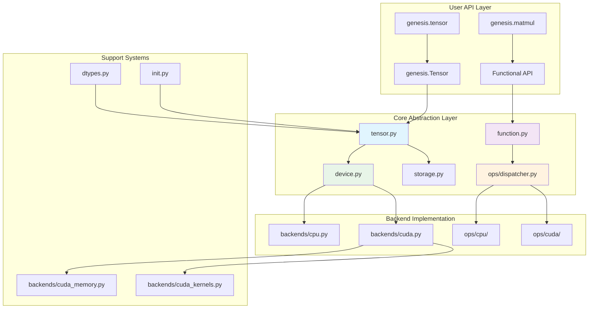

# Core Components Overview

Genesis v2.0's core components provide the infrastructure for deep learning computation with a clean, modular architecture that separates concerns and enables high performance.

## 🧩 Component Architecture



## 🎯 Core Component List

| Component | File | Main Functions |
|-----------|------|----------------|
| Tensor System | `tensor.py` | Tensor class, automatic differentiation integration |
| Function System | `function.py` | Function base class, autograd context |
| Device Abstraction | `device.py` | Unified device interface |
| Storage Layer | `storage.py` | Memory and storage abstraction |
| Operation Dispatch | `ops/dispatcher.py` | Operation routing and execution |
| Backend CPU | `backends/cpu.py` | CPU tensor storage and operations |
| Backend CUDA | `backends/cuda.py` | CUDA tensor storage and memory |
| Data Types | `dtypes.py` | Unified type system, precision management |
| Initialization | `init.py` | Tensor creation and initialization |

## 🚀 Design Features

### 1. Modular Backend Architecture
- **Clean Separation**: Backend implementations are completely isolated
- **Extensible**: Easy to add new device support (TPU, NPU, etc.)
- **Performance Optimized**: Each backend can be individually optimized
- **Reliable**: Lazy CUDA initialization prevents import-time failures

### 2. Unified Operation Dispatch
- **Single Entry Point**: All operations go through centralized dispatcher
- **Automatic Routing**: Operations automatically routed to correct backend
- **Type Preservation**: Consistent behavior across different devices
- **Performance**: Minimal dispatch overhead

### 3. Advanced Memory Management
- **Memory Pooling**: Reduces allocation overhead through intelligent pooling
- **Device Abstraction**: Unified memory interface across CPU and GPU
- **Garbage Collection**: Automatic cleanup of unused memory blocks
- **Statistics**: Detailed memory usage tracking and debugging

## 📊 Performance Characteristics

### Memory Efficiency
- **Zero-copy View Operations**: Operations like reshape, transpose don't copy data
- **Smart Memory Management**: Automatic memory release based on reference counting
- **Gradient Accumulation Optimization**: Reduce temporary tensor creation

### Compute Optimization  
- **Lazy Execution**: Operations execute only when needed
- **Fusion Optimization**: Adjacent operations automatically fused to reduce memory access
- **Parallel Computing**: Full utilization of GPU parallel capabilities

## 🔗 Component Collaboration

### Tensor Creation Process (v2.0)
```python
# User call
x = genesis.tensor([1, 2, 3], device="cuda")

# Internal flow
genesis.tensor() ->
tensor.py:Tensor.__init__() ->
device.py:parse_device("cuda") ->
storage.py:create_storage() ->
backends/cuda.py:CUDAStorage() ->
backends/cuda_memory.py:allocate() ->
Set tensor attributes (shape, dtype, device)
```

### Operation Dispatch Process
```python
# User operation
z = genesis.matmul(x, y)

# Dispatch flow
ops/dispatcher.py:dispatch("matmul", x, y) ->
Infer device from arguments ->
Select backend implementation ->
ops/cuda/matrix.py:cuda_matmul(x, y) ->
Execute Triton/CUDA kernel ->
Return new tensor with result
```

### Automatic Differentiation Integration
```python
# Forward with gradient tracking
x = genesis.tensor([1, 2, 3], requires_grad=True)
y = genesis.tensor([4, 5, 6], requires_grad=True)
z = x * y  # Element-wise multiplication

# Internal autograd setup
function.py:Function.apply() ->
Create computation graph node ->
Store backward function ->
Set gradient computation context

# Backward pass
z.backward()
# Traverse computation graph ->
# Call stored backward functions ->
# Accumulate gradients to x.grad, y.grad
```

## 🎓 Learning Path Recommendations

### Beginner Users
1. **Tensor Basics** - Understand Tensor creation and basic operations
2. **Automatic Differentiation** - Understand requires_grad and backward()
3. **Device Management** - Learn CPU/GPU switching

### Intermediate Users  
1. **Data Types** - Master usage scenarios for different precisions
2. **Functional Interface** - Use the functional module
3. **Memory Optimization** - Understand view operations and memory management

### Advanced Users
1. **Custom Functions** - Implement custom forward and backward propagation
2. **Performance Tuning** - Optimize memory usage and computational efficiency
3. **Source Code Understanding** - Deep understanding of component implementation details

For detailed documentation of each component, please check the corresponding dedicated pages:

- [Tensor System](tensor.md) - Tensor class and automatic differentiation
- [Function System](function.md) - Function base class and autograd context
- [Device Abstraction](device.md) - Unified device interface
- [Storage Layer](storage.md) - Memory and storage abstraction
- [Data Types](dtypes.md) - Type system and precision management
- [Backend System](../backends/index.md) - Modular backend architecture
- [Operation System](../ops/index.md) - Operation dispatch and execution