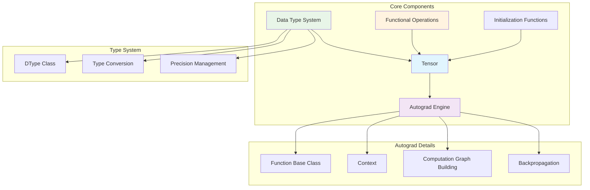

# Core Components Overview

Genesis framework's core components provide the infrastructure for deep learning computation, including tensor systems, automatic differentiation engine, data type system, and functional operation interfaces.

## 🧩 Component Architecture



## 🎯 Core Component List

| Component | File | Main Functions | 
|-----------|------|----------------|
| Tensor System | `autograd.py` | Basic data structures, automatic differentiation |
| Data Types | `dtypes.py` | Unified type system, precision management |
| Functional Operations | `functional.py` | Functional interface for tensor operations |
| Initialization | `init.py` | Tensor creation and initialization |
| Backend Abstraction | `backend.py` | Device and backend management |

## 🚀 Design Features

### 1. Unified Tensor Interface
- **Consistent API**: Users use the same interface whether on CPU or GPU
- **Transparent Device Switching**: Automatic handling of data conversion between different devices
- **Type Safety**: Compile-time and runtime type checking

### 2. Efficient Automatic Differentiation
- **Lazy Computation Graph**: Build computation graph on demand to save memory
- **Smart Gradient Propagation**: Optimized backpropagation algorithm
- **Memory Optimization**: Automatic release of intermediate results no longer needed

### 3. Flexible Type System
- **Mixed Precision Support**: Automatic conversion between FP32 and FP16
- **Device Agnostic**: Type definitions independent of specific devices
- **NumPy Compatible**: Seamless integration with NumPy ecosystem

## 📊 Performance Characteristics

### Memory Efficiency
- **Zero-copy View Operations**: Operations like reshape, transpose don't copy data
- **Smart Memory Management**: Automatic memory release based on reference counting
- **Gradient Accumulation Optimization**: Reduce temporary tensor creation

### Compute Optimization  
- **Lazy Execution**: Operations execute only when needed
- **Fusion Optimization**: Adjacent operations automatically fused to reduce memory access
- **Parallel Computing**: Full utilization of GPU parallel capabilities

## 🔗 Component Collaboration

### Tensor Creation Process
```python
# User call
x = genesis.randn(3, 4)

# Internal flow
init.randn() -> 
NDArray.randn() -> 
Device.randn() -> 
Tensor.__init__() ->
Set attributes like requires_grad
```

### Automatic Differentiation Process
```python
# Forward pass
z = x * y + x.sum()

# Build computation graph
MulFunction.apply(x, y) -> 
SumFunction.apply(x) ->
AddFunction.apply(mul_result, sum_result) ->
Set creator relationships

# Backward pass
z.backward()

# Compute gradients
topo_sort(z) ->
Reverse topological traversal ->
Call backward() of each Function ->
Gradient accumulation to leaf nodes
```

## 🎓 Learning Path Recommendations

### Beginner Users
1. **Tensor Basics** - Understand Tensor creation and basic operations
2. **Automatic Differentiation** - Understand requires_grad and backward()
3. **Device Management** - Learn CPU/GPU switching

### Intermediate Users  
1. **Data Types** - Master usage scenarios for different precisions
2. **Functional Interface** - Use the functional module
3. **Memory Optimization** - Understand view operations and memory management

### Advanced Users
1. **Custom Functions** - Implement custom forward and backward propagation
2. **Performance Tuning** - Optimize memory usage and computational efficiency
3. **Source Code Understanding** - Deep understanding of component implementation details

For detailed documentation of each component, please check the corresponding dedicated pages:

- [Automatic Differentiation System](autograd.md) - Deep understanding of computation graphs and gradient computation
- [Tensor Operations](tensor.md) - Comprehensive tensor operation guide  
- [Data Types](dtypes.md) - Type system and precision management
- [Functional Interface](functional.md) - Functional programming style operations