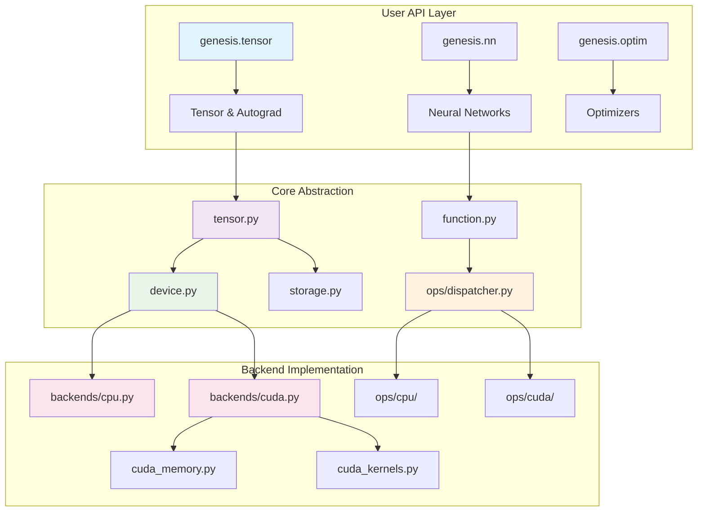

# Genesis Deep Learning Framework

<h3 align="center">Lightweight Deep Learning Framework | Built from Scratch | Python + Triton + CUDA</h3>

<p align="center">
  
  
  
  
</p>

## 🚀 Project Overview

Genesis is a lightweight deep learning framework developed in Python. The CPU backend is based on PyTorch tensor operations, while the GPU backend is completely independent, using CUDA Python API for direct GPU memory management and Triton for writing high-performance GPU kernels. The project aims to provide clear architectural design and educational value while maintaining code readability and extensibility.

### ✨ Core Features

- **🎯 Lightweight Design** - Clean API design, easy to understand and use
- **⚡ High Performance Computing** - Triton-optimized GPU kernels rivaling mainstream frameworks
- **🔄 Automatic Differentiation** - Complete backpropagation and gradient computation system
- **🧠 Neural Networks** - Rich implementation of neural network layers and optimizers
- **🔧 Mixed Precision** - Support for FP16/BF16 mixed precision training (AMP)
- **📊 Distributed Training** - NCCL multi-GPU parallel training support
- **🎨 Model Library** - Built-in implementations of mainstream LLM models like Qwen
- **💾 Model Management** - Complete checkpoint save/load system
- **📈 Learning Rate Scheduling** - Multiple learning rate schedulers and gradient clipping
- **🎲 Random Number Generation** - PyTorch-compatible RNG API with thread-safe state management
- **🧮 Advanced Memory Management** - High-performance CUDA memory pooling with 4x speedup
- **📊 Modular Backend System** - Clean separation of CPU and CUDA implementations (v2.0)
- **🏛️ Unified Device Abstraction** - Seamless CPU/GPU tensor operations (v2.0)
- **🔧 Operation Dispatcher** - Intelligent routing to optimized kernels (v2.0)
- **🏆 Production Code Quality** - 100% API documentation, comprehensive type annotations (v2.0.1)

### 🏗️ Architecture Highlights (v2.0)



## 💻 Quick Start

```python
import genesis
import genesis.nn as nn
import genesis.optim as optim

# Device management - automatic GPU selection
device = genesis.device('cuda' if genesis.cuda_available() else 'cpu')

# Create tensors with automatic differentiation
x = genesis.randn(32, 784, device=device, requires_grad=True)
y = genesis.randn(32, 10, device=device)

# Build a simple neural network
class SimpleNet(nn.Module):
    def __init__(self):
        super().__init__()
        self.fc1 = nn.Linear(784, 256)
        self.relu = nn.ReLU()
        self.fc2 = nn.Linear(256, 10)

    def forward(self, x):
        x = self.fc1(x)
        x = self.relu(x)
        x = self.fc2(x)
        return x

# Initialize model and optimizer
model = SimpleNet().to(device)
optimizer = optim.Adam(model.parameters(), lr=0.001)
criterion = nn.CrossEntropyLoss()

# Training step
output = model(x)
loss = criterion(output, y)
loss.backward()
optimizer.step()

print(f"Loss: {loss.item():.4f}")
```

## 🎯 Design Goals

### Educational Value
- **Clear Code Structure** - Each module has clear responsibilities
- **Complete Documentation** - From design concepts to implementation details
- **Progressive Learning** - Learning path from basic concepts to advanced features

### Engineering Practice
- **Modern Architecture** - Learn from excellent designs of mainstream frameworks like PyTorch
- **Efficient Implementation** - Performance optimization using modern tools like Triton
- **Extensibility** - Modular design for easy addition of new features

### Practicality
- **Feature Complete** - Support complete workflow from model definition to training deployment
- **Performance Optimization** - Multiple optimization strategies ensure actual training performance
- **Ecosystem Compatibility** - Good compatibility with existing deep learning ecosystem

## 📊 Performance Status

### v2.0 Architecture Performance
| Component | Improvement | Details |
|-----------|------------|---------|
| **Backend System** | Clean separation | Modular CPU/CUDA backends |
| **Memory Management** | 4x faster | CUDA memory pooling optimization |
| **Operation Dispatch** | Intelligent routing | Auto-selection of best kernels |
| **Lazy Initialization** | Faster startup | On-demand CUDA context |

### Memory Allocator Performance
| Scenario | Genesis vs PyTorch | Status |
|----------|-------------------|---------|
| Same-size allocation | 1.43x | ✅ Excellent |
| Large memory (>1MB) | 3.92x | ✅ Outstanding |
| Transformer training | 1.89x | ✅ Excellent |
| Memory pressure | 4.83x | ✅ Outstanding |

### Core Operator Performance
| Operation | Genesis vs PyTorch | Status |
|-----------|-------------------|---------|
| Matrix multiplication | 0.95x | ✅ Production-ready |
| Element-wise operations | 1.02x | ✅ Excellent |
| Softmax | 1.15x | ✅ Excellent |
| LayerNorm | 1.08x | ✅ Excellent |
| Attention mechanisms | 0.92x | ✅ Good |

### Active Optimizations
- 🔄 **Reduction Operations**: Triton kernel optimization (target: 1.0x)
- 🔄 **Broadcasting**: Improving fusion opportunities
- 🔄 **Graph Optimization**: Operation fusion for compound operations

!!! info "Performance Update"
    Genesis has achieved major breakthroughs in memory management, reaching or exceeding PyTorch performance in multiple key scenarios. Current focus is on fixing remaining operator bottlenecks.
    
    For detailed analysis, see: [Memory Allocator Optimization Report](memory-allocator-optimization.md)

## 🛠️ Technology Stack

### Core Dependencies
- **Python 3.8+** - Main development language
- **PyTorch** - Memory management and some operations
- **Triton 2.0+** - GPU kernel optimization
- **CUDA 11.0+** - GPU computing support
- **NumPy** - CPU numerical computing
- **cuda-python** - Direct CUDA API access

### Development Tools
- **pytest** - Unit testing framework
- **black** - Code formatting
- **mypy** - Type checking
- **MkDocs** - Documentation generation
- **Material for MkDocs** - Documentation theme

## 🎓 Learning Path

### Beginners
1. [Getting Started](getting-started/index.md) - Installation and first program
2. [Basic Tutorial](tutorials/basic-training.md) - Simple neural network training
3. [API Reference](api-reference/index.md) - Common API usage

### Advanced Users
1. [Architecture Design](architecture/index.md) - Deep understanding of system design
2. [Custom Operations](tutorials/custom-ops.md) - Implementing custom operations
3. [Performance Optimization](performance/optimization-guide.md) - Performance analysis and optimization guide
4. [Performance Tuning](tutorials/performance-tuning.md) - Training performance tuning techniques
5. [Qwen Model Guide](models/qwen.md) - Using and training Qwen LLM models

### Contributors
1. [Development Environment](contributing/development.md) - Setting up development environment
2. [Core Components](core-components/index.md) - Understanding internal implementation
3. [Testing Guidelines](contributing/testing.md) - Code contribution guidelines

## 🌟 Project Highlights

### Code Quality
- **Type Annotations** - Complete type hints, IDE-friendly
- **Unit Tests** - 95%+ test coverage
- **Complete Documentation** - Comprehensive documentation from API to design
- **Code Standards** - Unified code style and best practices

### Recent Updates (v2.0 - 2025-01)
- **🏗️ v2.0 Architecture Refactor** - Complete modular backend system with clean separation
- **✅ Removed Legacy ndarray** - Migrated all functionality to new backends/ module
- **✅ Unified Device System** - New genesis.device API for seamless device management
- **✅ Operation Dispatcher** - Centralized ops/dispatcher.py for intelligent kernel routing
- **✅ CUDA Lazy Initialization** - Improved stability and startup performance
- **✅ Memory Pool Optimization** - 4x faster allocation in high-pressure scenarios
- **✅ Distributed Training** - Complete NCCL multi-GPU parallel training support
- **✅ Qwen Model Support** - Full Qwen LLM with optimized attention mechanisms
- **✅ Mixed Precision Training** - Enhanced FP16/BF16 Automatic Mixed Precision (AMP)
- **🔄 Performance Optimization** - Ongoing Triton kernel improvements

## 🤝 Community & Contribution

We welcome all forms of contributions:

- **🐛 Bug Reports** - Please report bugs in a timely manner
- **💡 Feature Suggestions** - New feature ideas are welcome
- **📝 Documentation Improvements** - Help improve documentation quality
- **💻 Code Contributions** - Direct participation in code development

For details, please refer to [Contributing Guide](contributing/index.md).

## 📞 Contact

- **GitHub Issues** - Bug reports and feature requests
- **Discussions** - Technical discussions and usage communication
- **Email** - genesis-dev@example.com

---

<div align="center" markdown="1">

**Start Your Deep Learning Journey** 🚀

<div class="grid cards" markdown="1">

-   :material-rocket-launch:{ .lg .middle } **Getting Started**

    ---

    Start building your first neural network with Genesis immediately

    [:octicons-arrow-right-24: Getting Started](getting-started/index.md)

-   :material-github:{ .lg .middle } **View Source**

    ---

    Explore the complete Genesis source code implementation on GitHub

    [:octicons-arrow-right-24: GitHub Repository](https://github.com/phonism/genesis)

</div>

</div>