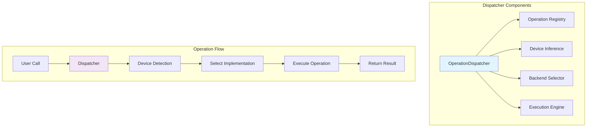

# Operation Dispatcher

The operation dispatcher is a core component of Genesis v2.0, responsible for routing tensor operations to appropriate backend implementations.

## 📋 Overview

The dispatcher provides:
- Centralized operation routing
- Automatic backend selection
- Operation registration and management
- Performance optimization opportunities

## 🏗️ Architecture



## 🎯 Core Features

### Operation Dispatcher Class
```python
class OperationDispatcher:
    """Central operation dispatch system."""

    def __init__(self):
        self._operations = {}
        self._metadata = {}
        self._cache = {}

    def register(self, name, implementations):
        """Register a new operation."""
        self._operations[name] = implementations

    def dispatch(self, op_name, *args, **kwargs):
        """Dispatch operation to backend."""
        # 1. Validate operation exists
        if op_name not in self._operations:
            raise ValueError(f"Unknown operation: {op_name}")

        # 2. Infer device
        device = self._infer_device(args)

        # 3. Select implementation
        impl = self._select_implementation(op_name, device)

        # 4. Execute operation
        return impl(*args, **kwargs)
```

## 🔗 See Also

- [Operation System Overview](index.md)
- [CPU Operations](cpu-ops.md)
- [CUDA Operations](cuda-ops.md)
- [Performance Optimization](../performance/optimization-guide.md)