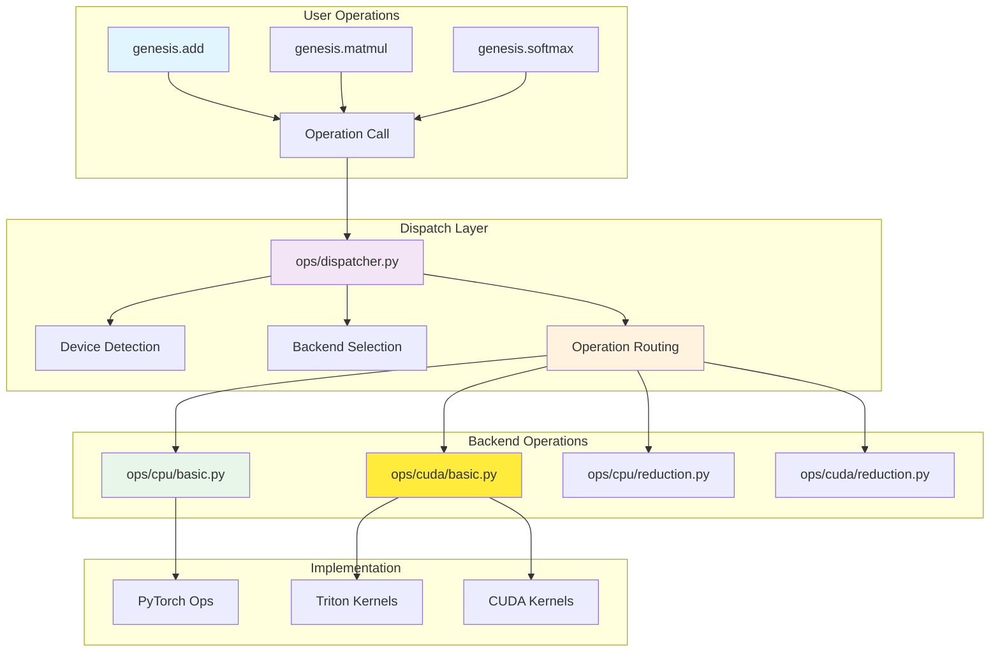

# Operation System Overview

Genesis v2.0 features a unified operation dispatch system that routes tensor operations to the appropriate backend implementations while maintaining a consistent API.

## 🏗️ Architecture

The operation system provides a clean abstraction layer between user-facing operations and backend-specific implementations:



## 🎯 Key Components

### Central Dispatcher
The `ops/dispatcher.py` module serves as the central routing hub:
- **Operation Registration**: Maps operation names to implementations
- **Device Detection**: Automatically determines target device
- **Backend Selection**: Routes to appropriate backend
- **Type Validation**: Ensures type compatibility

### Operation Categories

#### Basic Operations
- **Location**: `ops/{backend}/basic.py`
- **Operations**: add, subtract, multiply, divide, power, abs
- **Features**: Broadcast support, in-place variants

#### Reduction Operations
- **Location**: `ops/{backend}/reduction.py`
- **Operations**: sum, mean, max, min, argmax, argmin
- **Features**: Multi-dimensional reduction, keepdim support

#### Matrix Operations
- **Location**: `ops/{backend}/matrix.py`
- **Operations**: matmul, transpose, reshape, flatten
- **Features**: Batch operations, memory-efficient implementations

#### Activation Functions
- **Location**: `ops/{backend}/activation.py`
- **Operations**: relu, sigmoid, tanh, softmax, gelu
- **Features**: In-place computation, gradient-friendly implementations

## 🚀 Dispatch Mechanism

### Operation Registration
```python
# ops/dispatcher.py
class OperationDispatcher:
    """Central operation dispatcher."""

    def __init__(self):
        self._operations = {}
        self._register_default_operations()

    def register(self, name, cpu_impl, cuda_impl=None):
        """Register operation implementations."""
        self._operations[name] = {
            'cpu': cpu_impl,
            'cuda': cuda_impl or cpu_impl
        }

    def dispatch(self, op_name, *args, **kwargs):
        """Dispatch operation to appropriate backend."""
        # Determine device from arguments
        device = self._infer_device(*args)

        # Select implementation
        impl = self._operations[op_name][device.type]

        # Execute operation
        return impl(*args, **kwargs)
```

### Automatic Device Inference
```python
def _infer_device(*tensors):
    """Automatically infer target device from tensor arguments."""
    devices = set()

    for tensor in tensors:
        if hasattr(tensor, 'device'):
            devices.add(tensor.device)

    if len(devices) == 0:
        return genesis.device('cpu')  # Default
    elif len(devices) == 1:
        return devices.pop()
    else:
        raise RuntimeError(f"Mixed devices not supported: {devices}")
```

## 💻 Backend Implementations

### CPU Operations
CPU operations leverage PyTorch's optimized implementations:

```python
# ops/cpu/basic.py
def cpu_add(a, b, out=None):
    """CPU implementation of addition."""
    result = torch.add(a.data, b.data)

    if out is not None:
        out.data.copy_(result)
        return out
    else:
        return genesis.tensor(result, device=a.device)

def cpu_matmul(a, b):
    """CPU implementation of matrix multiplication."""
    result = torch.matmul(a.data, b.data)
    return genesis.tensor(result, device=a.device)
```

### CUDA Operations
CUDA operations use custom Triton kernels for optimal performance:

```python
# ops/cuda/basic.py
import triton
import triton.language as tl

@triton.jit
def add_kernel(x_ptr, y_ptr, output_ptr, n_elements, BLOCK_SIZE: tl.constexpr):
    """Triton kernel for element-wise addition."""
    pid = tl.program_id(0)
    block_start = pid * BLOCK_SIZE
    offsets = block_start + tl.arange(0, BLOCK_SIZE)
    mask = offsets < n_elements

    x = tl.load(x_ptr + offsets, mask=mask)
    y = tl.load(y_ptr + offsets, mask=mask)
    output = x + y
    tl.store(output_ptr + offsets, output, mask=mask)

def cuda_add(a, b):
    """CUDA implementation using Triton kernel."""
    output = genesis.empty_like(a)
    n_elements = a.numel()

    grid = lambda meta: (triton.cdiv(n_elements, meta['BLOCK_SIZE']),)
    add_kernel[grid](a.data_ptr(), b.data_ptr(), output.data_ptr(), n_elements)

    return output
```

## 🔧 Configuration and Extension

### Registering Custom Operations
```python
import genesis

# Define custom operation
def my_custom_op_cpu(x):
    """Custom CPU operation."""
    return x * 2 + 1

def my_custom_op_cuda(x):
    """Custom CUDA operation."""
    # Custom CUDA implementation
    pass

# Register with dispatcher
genesis.ops.register_operation(
    'my_custom_op',
    cpu_impl=my_custom_op_cpu,
    cuda_impl=my_custom_op_cuda
)

# Use the operation
result = genesis.ops.my_custom_op(tensor)
```

### Operation Metadata
```python
# Add metadata to operations
genesis.ops.set_operation_metadata('matmul', {
    'requires_grad': True,
    'supports_autograd': True,
    'memory_efficient': True,
    'fused_variants': ['matmul_add', 'matmul_relu']
})
```

## 📊 Performance Optimization

### Operation Fusion
The dispatcher supports operation fusion for improved performance:

```python
# Automatic fusion detection
def detect_fusion_opportunities(operations):
    """Detect operations that can be fused."""
    fusion_patterns = [
        ('matmul', 'add'),      # Matrix multiplication + bias
        ('conv2d', 'relu'),     # Convolution + activation
        ('add', 'relu'),        # Addition + activation
    ]

    for pattern in fusion_patterns:
        if matches_pattern(operations, pattern):
            return create_fused_operation(pattern)

    return None

# Fused operation implementation
@triton.jit
def fused_matmul_add_kernel(a_ptr, b_ptr, bias_ptr, output_ptr, ...):
    """Fused matrix multiplication and addition."""
    # Compute matmul and add bias in single kernel
    pass
```

### Kernel Caching
```python
# Kernel compilation caching
class KernelCache:
    """Cache compiled kernels for reuse."""

    def __init__(self):
        self._cache = {}

    def get_kernel(self, op_name, input_shapes, dtypes):
        """Get cached kernel or compile new one."""
        cache_key = (op_name, input_shapes, dtypes)

        if cache_key not in self._cache:
            kernel = self._compile_kernel(op_name, input_shapes, dtypes)
            self._cache[cache_key] = kernel

        return self._cache[cache_key]
```

## 🔍 Debugging and Profiling

### Operation Tracing
```python
# Enable operation tracing
genesis.ops.enable_tracing(True)

# Operations will now be traced
x = genesis.tensor([1, 2, 3])
y = genesis.tensor([4, 5, 6])
z = x + y  # Traced: "add: cpu, shapes=[(3,), (3,)], time=0.05ms"

# Get trace summary
trace = genesis.ops.get_trace()
print(trace.summary())
```

### Performance Profiling
```python
# Profile operations
with genesis.ops.profile() as prof:
    # Your operations here
    result = genesis.matmul(a, b)
    result = genesis.relu(result)

# Analyze results
prof.print_stats()  # Shows timing breakdown by operation
prof.export_chrome_trace("ops_profile.json")  # Chrome profiler format
```

## 🔗 See Also

- [Operation Dispatcher](dispatcher.md)
- [CPU Operations](cpu-ops.md)
- [CUDA Operations](cuda-ops.md)
- [Backend System](../backends/index.md)
- [Performance Guide](../performance/optimization-guide.md)