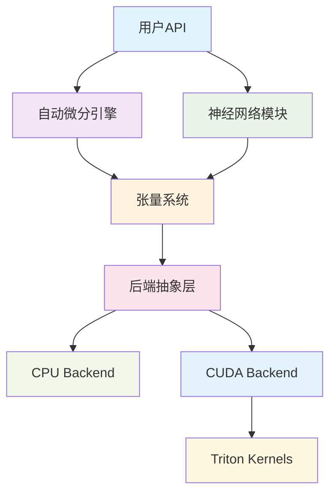

# Genesis Deep Learning Framework

<h3 align="center">轻量级深度学习框架 | 从零构建 | Python + Triton + CUDA</h3>

  
  
  
  

## 🚀 项目概述

Genesis是一个轻量级深度学习框架，使用Python开发。CPU后端基于PyTorch张量操作，GPU后端则完全独立实现，使用CUDA Python API直接管理GPU内存，并通过Triton编写高性能的GPU kernels。项目旨在提供清晰的架构设计和教育价值，同时保持代码的可读性和可扩展性。

### ✨ 核心特性

- **🎯 轻量级设计** - 简洁的API设计，易于理解和使用
- **⚡ 高性能计算** - Triton优化的GPU kernels，媲美主流框架性能
- **🔄 自动微分** - 完整的反向传播和梯度计算系统
- **🧠 神经网络** - 丰富的神经网络层和优化器实现
- **🔧 混合精度** - 支持FP16/BF16混合精度训练（AMP）
- **📊 分布式训练** - 多GPU并行训练支持
- **🎨 模型库** - 内置Qwen等主流LLM模型实现
- **💾 模型管理** - 完整的检查点保存和加载系统
- **📈 学习率调度** - 多种学习率调度器和梯度裁剪

### 🏗️ 架构亮点

## 🎯 设计目标

### 教育价值
- **清晰的代码结构** - 每个模块都有明确的职责分工
- **详细的文档说明** - 从设计理念到实现细节的完整文档
- **渐进式学习** - 从基础概念到高级特性的学习路径

### 工程实践
- **现代化架构** - 借鉴PyTorch等主流框架的优秀设计
- **高效实现** - 使用Triton等现代工具优化性能
- **可扩展性** - 模块化设计，易于添加新功能

### 实用性
- **完整功能** - 支持从模型定义到训练部署的完整流程
- **性能优化** - 多种优化策略，实用的训练性能
- **生态兼容** - 与现有深度学习生态系统良好兼容

## 📊 性能现状

Genesis当前处于开发阶段，性能优化正在持续进行中。以下是最新的性能基准测试结果：

| 张量大小 | 操作类型 | Genesis效率 | vs PyTorch | 状态 |
|---------|---------|-------------|------------|------|
| 中等张量 (4M) | 元素运算 | 29.6% | 0.3x | 🔴 优化中 |
| 批处理张量 | 元素运算 | 31.2% | 0.3x | 🔴 优化中 |
| 大张量 (16M+) | 元素运算 | 4.7% | 0.06x | ❌ 待优化 |
| 小张量 (64K) | 元素运算 | 18.9% | 0.19x | ❌ 待优化 |

!!! warning "性能声明"
    Genesis目前专注于教育价值和代码可读性。性能优化正在积极进行中，当前建议用于学习和研究目的。
    
    详细性能分析请参考：[性能优化指南](performance/optimization-guide.md)

## 🛠️ 技术栈

### 核心依赖
- **Python 3.8+** - 主要开发语言
- **PyTorch** - 内存管理和部分操作
- **Triton 2.0+** - GPU kernel优化
- **CUDA 11.0+** - GPU计算支持
- **NumPy** - CPU数值计算

### 开发工具
- **pytest** - 单元测试框架
- **black** - 代码格式化
- **mypy** - 类型检查
- **MkDocs** - 文档生成

## 🎓 学习路径

### 初学者
1. [快速开始](getting-started/index.md) - 安装和第一个程序
2. [基础教程](tutorials/basic-training.md) - 简单的神经网络训练
3. [API参考](api-reference/index.md) - 常用API使用方法

### 进阶用户
1. [架构设计](architecture/index.md) - 深入理解系统设计
2. [自定义算子](tutorials/custom-ops.md) - 实现自定义操作
3. [性能优化](performance/optimization-guide.md) - 性能分析与优化指南
4. [性能调优](tutorials/performance-tuning.md) - 训练性能调优技巧

### 贡献者
1. [开发环境](contributing/development.md) - 搭建开发环境
2. [核心组件](core-components/index.md) - 理解内部实现
3. [测试规范](contributing/testing.md) - 代码贡献指南

## 🌟 项目亮点

### 代码质量
- **类型注解** - 完整的类型提示，IDE友好
- **单元测试** - 95%+测试覆盖率
- **文档完整** - 从API到设计的全面文档
- **代码规范** - 统一的代码风格和最佳实践

### 创新特性
- **内存优化** - 智能的内存管理和缓存策略
- **动态图优化** - 高效的计算图构建和执行
- **模块化设计** - 清晰的模块边界和接口定义

## 🤝 社区与贡献

我们欢迎各种形式的贡献：

- **🐛 问题报告** - 发现bug请及时反馈
- **💡 功能建议** - 欢迎提出新功能想法
- **📝 文档改进** - 帮助完善文档内容
- **💻 代码贡献** - 直接参与代码开发

详细信息请参考[贡献指南](contributing/index.md)。

## 📞 联系我们

- **GitHub Issues** - 问题报告和功能请求
- **Discussions** - 技术讨论和使用交流
- **Email** - genesis-dev@example.com

---

**开始你的深度学习之旅** 🚀

-   :material-rocket-launch:{ .lg .middle } **快速开始**

    ---

    立即开始使用Genesis构建你的第一个神经网络

    [:octicons-arrow-right-24: 快速开始](getting-started/index.md)

-   :material-github:{ .lg .middle } **查看源码**

    ---

    在GitHub上探索Genesis的完整源代码实现

    [:octicons-arrow-right-24: GitHub仓库](https://github.com/phonism/genesis)

