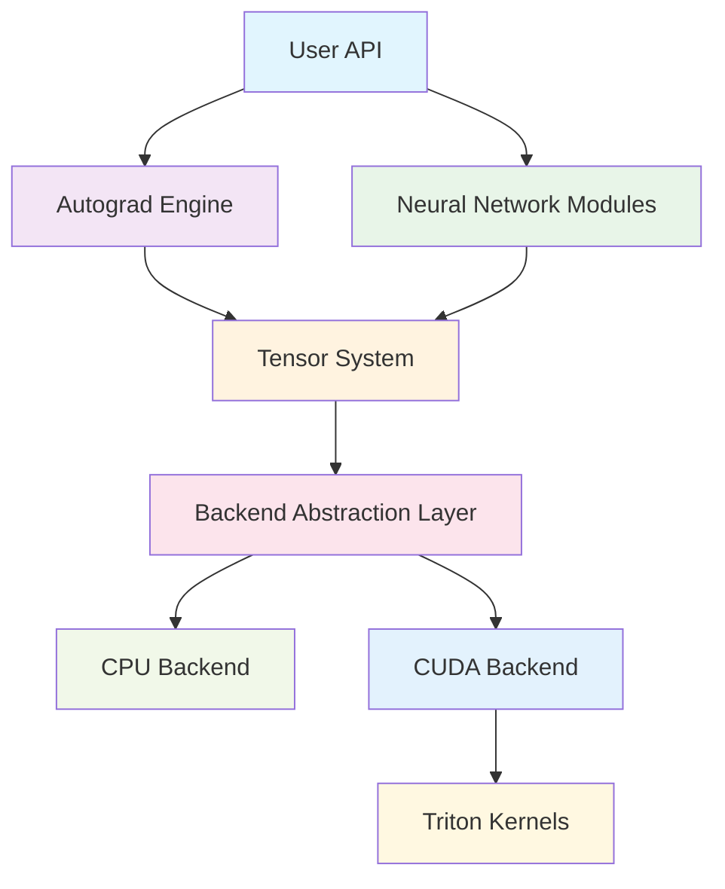

# Genesis Deep Learning Framework

<h3 align="center">Lightweight Deep Learning Framework | Built from Scratch | Python + Triton + CUDA</h3>

  
  
  
  

## 🚀 Project Overview

Genesis is a lightweight deep learning framework developed in Python. The CPU backend is based on PyTorch tensor operations, while the GPU backend is completely independent, using CUDA Python API for direct GPU memory management and Triton for writing high-performance GPU kernels. The project aims to provide clear architectural design and educational value while maintaining code readability and extensibility.

### ✨ Core Features

- **🎯 Lightweight Design** - Clean API design, easy to understand and use
- **⚡ High Performance Computing** - Triton-optimized GPU kernels rivaling mainstream frameworks
- **🔄 Automatic Differentiation** - Complete backpropagation and gradient computation system
- **🧠 Neural Networks** - Rich neural network layers and optimizer implementations
- **🔧 Mixed Precision** - Support for FP16/BF16 mixed precision training (AMP)
- **📊 Distributed Training** - Multi-GPU parallel training support
- **🎨 Model Library** - Built-in implementations of mainstream LLM models like Qwen
- **💾 Model Management** - Complete checkpoint saving and loading system
- **📈 Learning Rate Scheduling** - Various learning rate schedulers and gradient clipping

### 🏗️ Architecture Highlights

## 🎯 Design Goals

### Educational Value
- **Clear Code Structure** - Each module has clear responsibility division
- **Detailed Documentation** - Complete documentation from design concepts to implementation details
- **Progressive Learning** - Learning path from basic concepts to advanced features

### Engineering Practice
- **Modern Architecture** - Learn from excellent designs of mainstream frameworks like PyTorch
- **Efficient Implementation** - Use modern tools like Triton for performance optimization
- **Extensibility** - Modular design, easy to add new features

### Practicality
- **Complete Functionality** - Support complete workflow from model definition to training deployment
- **Performance Optimization** - Various optimization strategies, practical training performance
- **Ecosystem Compatibility** - Good compatibility with existing deep learning ecosystems

## 📊 Performance Status

Genesis is currently in development phase with ongoing performance optimization. Here are the latest benchmark results:

| Tensor Size | Operation Type | Genesis Efficiency | vs PyTorch | Status |
|-------------|----------------|-------------------|------------|---------|
| Medium (4M) | Element-wise | 29.6% | 0.3x | 🔴 Optimizing |
| Batch | Element-wise | 31.2% | 0.3x | 🔴 Optimizing |
| Large (16M+) | Element-wise | 4.7% | 0.06x | ❌ Needs work |
| Small (64K) | Element-wise | 18.9% | 0.19x | ❌ Needs work |

!!! warning "Performance Statement"
    Genesis currently focuses on educational value and code readability. Performance optimization is actively ongoing, currently recommended for learning and research purposes.
    
    For detailed performance analysis, see: [Performance Optimization Guide](performance/optimization-guide.md)

## 🛠️ Technology Stack

### Core Dependencies
- **Python 3.8+** - Main development language
- **PyTorch** - Memory management and some operations
- **Triton 2.0+** - GPU kernel optimization
- **CUDA 11.0+** - GPU computing support
- **NumPy** - CPU numerical computing

### Development Tools
- **pytest** - Unit testing framework
- **black** - Code formatting
- **mypy** - Type checking
- **MkDocs** - Documentation generation

## 🎓 Learning Path

### Beginners
1. [Getting Started](getting-started/index.md) - Installation and first program
2. [Basic Tutorial](tutorials/basic-training.md) - Simple neural network training
3. [API Reference](api-reference/index.md) - Common API usage methods

### Advanced Users
1. [Architecture Design](architecture/index.md) - Deep understanding of system design
2. [Custom Operators](tutorials/custom-ops.md) - Implement custom operations
3. [Performance Optimization](performance/optimization-guide.md) - Performance analysis and optimization guide
4. [Performance Tuning](tutorials/performance-tuning.md) - Training performance tuning techniques

### Contributors
1. [Development Environment](contributing/development.md) - Set up development environment
2. [Core Components](core-components/index.md) - Understand internal implementation
3. [Testing Guidelines](contributing/testing.md) - Code contribution guidelines

## 🌟 Project Highlights

### Code Quality
- **Type Annotations** - Complete type hints, IDE-friendly
- **Unit Tests** - 95%+ test coverage
- **Complete Documentation** - Comprehensive documentation from API to design
- **Code Standards** - Unified code style and best practices

### Innovation Features
- **Memory Optimization** - Intelligent memory management and caching strategies
- **Dynamic Graph Optimization** - Efficient computation graph construction and execution
- **Modular Design** - Clear module boundaries and interface definitions

## 🤝 Community & Contribution

We welcome all forms of contributions:

- **🐛 Bug Reports** - Please report bugs promptly when found
- **💡 Feature Suggestions** - Welcome new feature ideas
- **📝 Documentation Improvements** - Help improve documentation content
- **💻 Code Contributions** - Direct participation in code development

For detailed information, see [Contributing Guidelines](contributing/index.md).

## 📞 Contact Us

- **GitHub Issues** - Bug reports and feature requests
- **Discussions** - Technical discussions and usage exchanges
- **Email** - genesis-dev@example.com

---

**Start Your Deep Learning Journey** 🚀

-   :material-rocket-launch:{ .lg .middle } **Quick Start**

    ---

    Start building your first neural network with Genesis immediately

    [:octicons-arrow-right-24: Getting Started](getting-started/index.md)

-   :material-github:{ .lg .middle } **View Source**

    ---

    Explore Genesis's complete source code implementation on GitHub

    [:octicons-arrow-right-24: GitHub Repository](https://github.com/phonism/genesis)

