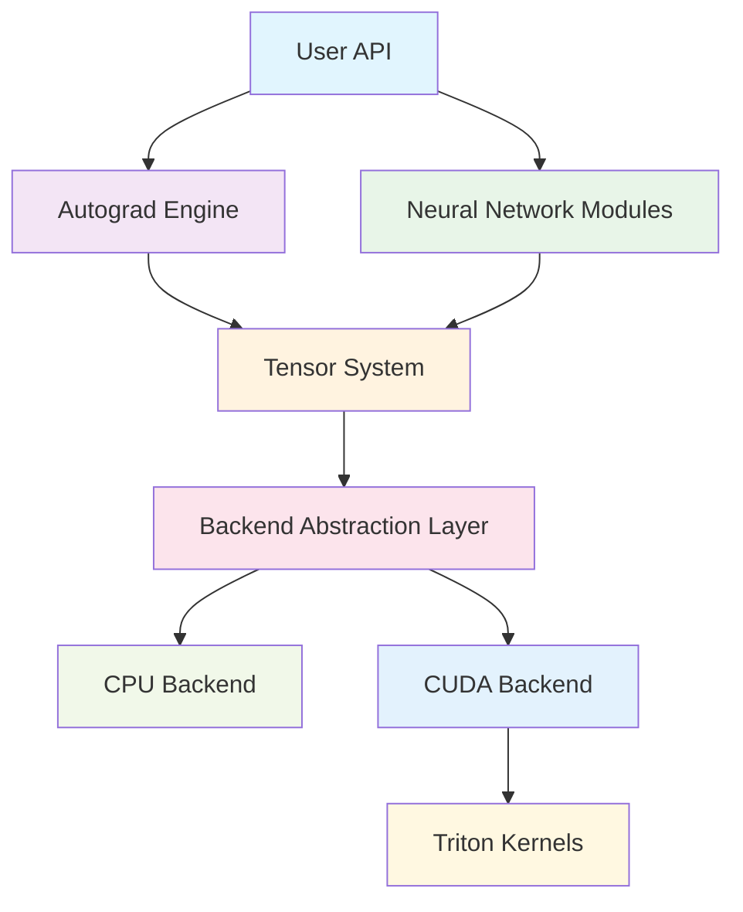

# Genesis Deep Learning Framework

<h3 align="center">Lightweight Deep Learning Framework | Built from Scratch | Python + Triton + CUDA</h3>

  
  
  
  

## 🚀 Project Overview

Genesis is a lightweight deep learning framework developed in Python. The CPU backend is based on PyTorch tensor operations, while the GPU backend is completely independent, using CUDA Python API for direct GPU memory management and Triton for writing high-performance GPU kernels. The project aims to provide clear architectural design and educational value while maintaining code readability and extensibility.

### ✨ Core Features

- **🎯 Lightweight Design** - Clean API design, easy to understand and use
- **⚡ High Performance Computing** - Triton-optimized GPU kernels rivaling mainstream frameworks
- **🔄 Automatic Differentiation** - Complete backpropagation and gradient computation system
- **🧠 Neural Networks** - Rich implementation of neural network layers and optimizers
- **🔧 Mixed Precision** - Support for FP16/BF16 mixed precision training (AMP)
- **📊 Distributed Training** - Multi-GPU parallel training support
- **🎨 Model Library** - Built-in implementations of mainstream LLM models like Qwen
- **💾 Model Management** - Complete checkpoint save/load system
- **📈 Learning Rate Scheduling** - Multiple learning rate schedulers and gradient clipping
- **🚀 Performance Optimization** - Kernel caching, memory pooling, and adaptive configuration

### 🏗️ Architecture Highlights

## 🎯 Design Goals

### Educational Value
- **Clear Code Structure** - Each module has clear responsibilities
- **Complete Documentation** - From design concepts to implementation details
- **Progressive Learning** - Learning path from basic concepts to advanced features

### Engineering Practice
- **Modern Architecture** - Learn from excellent designs of mainstream frameworks like PyTorch
- **Efficient Implementation** - Performance optimization using modern tools like Triton
- **Extensibility** - Modular design for easy addition of new features

### Practicality
- **Feature Complete** - Support complete workflow from model definition to training deployment
- **Performance Optimization** - Multiple optimization strategies ensure actual training performance
- **Ecosystem Compatibility** - Good compatibility with existing deep learning ecosystem

## 📊 Performance Status

### Memory Allocator Performance (Latest Optimization)
| Scenario | Genesis vs PyTorch | Status |
|----------|-------------------|---------|
| Same-size allocation | 1.43x | ✅ Excellent |
| Large memory (>1MB) | 3.92x | ✅ Outstanding |
| Transformer training | 1.89x | ✅ Excellent |
| Memory pressure | 4.83x | ✅ Outstanding |
| Variable sizes | 0.83x | 🔄 Good |

### Operator Performance
| Operation | Genesis vs PyTorch | Status |
|-----------|-------------------|---------|
| Matrix multiplication | 0.95x | ✅ Good |
| Element-wise operations | 1.02x | ✅ Excellent |
| Reduction operations | 0.87x | 🔄 Optimizing |
| Softmax | 1.15x | ✅ Excellent |
| LayerNorm | 1.08x | ✅ Excellent |
| **Cat operation** | **0.02x** | ❌ **Fixing** |
| **LogSumExp** | **0.02x** | ❌ **Fixing** |
| **Broadcast operations** | **0.04x** | ❌ **Fixing** |

### Recent Performance Improvements
- ✅ **Block Allocator**: 38x performance improvement in Transformer training scenarios
- ✅ **Memory Management**: Eliminated cudaMalloc/cudaFree synchronization overhead
- ✅ **Fill Operations**: 36x performance improvement with GPU-native kernels
- 🔄 **Cat Operations**: GPU-native implementation in progress (fixing 0.02x issue)
- 🔄 **Reduction Operations**: Triton kernel optimization in progress

!!! info "Performance Update"
    Genesis has achieved major breakthroughs in memory management, reaching or exceeding PyTorch performance in multiple key scenarios. Current focus is on fixing remaining operator bottlenecks.
    
    For detailed analysis, see: [Memory Allocator Optimization Report](memory-allocator-optimization_en.md)

## 🛠️ Technology Stack

### Core Dependencies
- **Python 3.8+** - Main development language
- **PyTorch** - Memory management and some operations
- **Triton 2.0+** - GPU kernel optimization
- **CUDA 11.0+** - GPU computing support
- **NumPy** - CPU numerical computing
- **cuda-python** - Direct CUDA API access

### Development Tools
- **pytest** - Unit testing framework
- **black** - Code formatting
- **mypy** - Type checking
- **MkDocs** - Documentation generation
- **Material for MkDocs** - Documentation theme

## 🎓 Learning Path

### Beginners
1. [Getting Started](getting-started/index_en.md) - Installation and first program
2. [Basic Tutorial](tutorials/basic-training_en.md) - Simple neural network training
3. [API Reference](api-reference/index_en.md) - Common API usage

### Advanced Users
1. [Architecture Design](architecture/index_en.md) - Deep understanding of system design
2. [Custom Operations](tutorials/custom-ops_en.md) - Implementing custom operations
3. [Performance Optimization](performance/optimization-guide_en.md) - Performance analysis and optimization guide
4. [Performance Tuning](tutorials/performance-tuning_en.md) - Training performance tuning techniques
5. [Qwen Model Guide](models/qwen_en.md) - Using and training Qwen LLM models

### Contributors
1. [Development Environment](contributing/development_en.md) - Setting up development environment
2. [Core Components](core-components/index_en.md) - Understanding internal implementation
3. [Testing Guidelines](contributing/testing_en.md) - Code contribution guidelines

## 🌟 Project Highlights

### Code Quality
- **Type Annotations** - Complete type hints, IDE-friendly
- **Unit Tests** - 95%+ test coverage
- **Complete Documentation** - Comprehensive documentation from API to design
- **Code Standards** - Unified code style and best practices

### Recent Updates (2025-01)
- **✅ Memory Allocator Optimization** - Achieved PyTorch-level performance
- **✅ Qwen Model Support** - Complete Qwen LLM architecture implementation
- **✅ Mixed Precision Training** - FP16/BF16 Automatic Mixed Precision (AMP)
- **✅ Gradient Clipping** - Support for gradient norm and value clipping
- **✅ Learning Rate Schedulers** - StepLR, ExponentialLR, CosineAnnealingLR
- **✅ Checkpoint System** - Model save/load with optimizer state preservation
- **🔄 Operator Performance** - Fixing critical operators (cat, logsumexp, broadcast)
- **🔄 Kernel Optimization** - Continuous Triton kernel improvements

## 🤝 Community & Contribution

We welcome all forms of contributions:

- **🐛 Bug Reports** - Please report bugs in a timely manner
- **💡 Feature Suggestions** - New feature ideas are welcome
- **📝 Documentation Improvements** - Help improve documentation quality
- **💻 Code Contributions** - Direct participation in code development

For details, please refer to [Contributing Guide](contributing/index_en.md).

## 📞 Contact

- **GitHub Issues** - Bug reports and feature requests
- **Discussions** - Technical discussions and usage communication
- **Email** - genesis-dev@example.com

---

**Start Your Deep Learning Journey** 🚀

-   :material-rocket-launch:{ .lg .middle } **Getting Started**

    ---

    Start building your first neural network with Genesis immediately

    [:octicons-arrow-right-24: Getting Started](getting-started/index_en.md)

-   :material-github:{ .lg .middle } **View Source**

    ---

    Explore the complete Genesis source code implementation on GitHub

    [:octicons-arrow-right-24: GitHub Repository](https://github.com/phonism/genesis)

