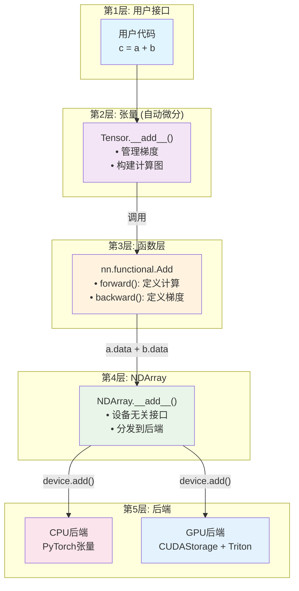
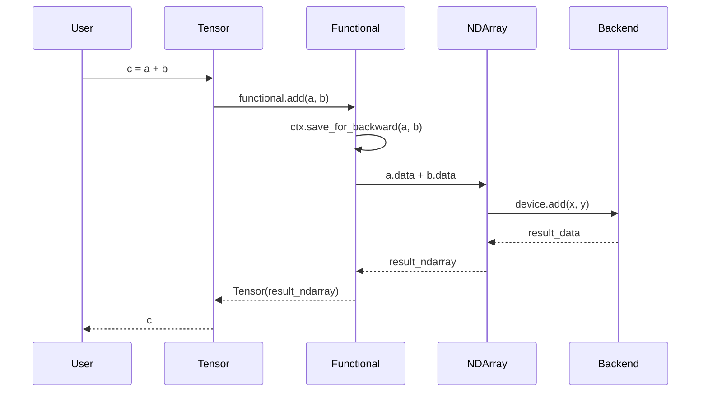
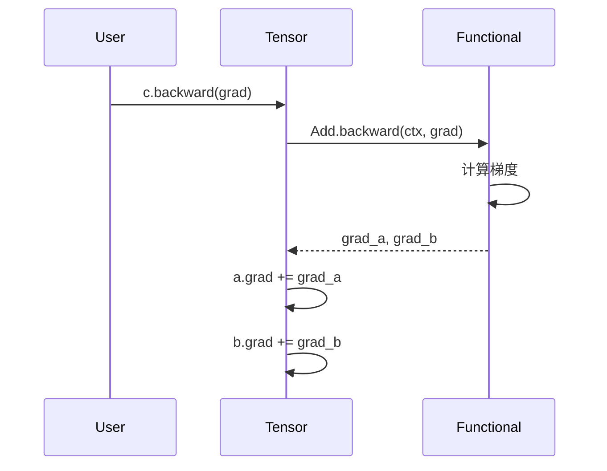

# 架构概览

Genesis深度学习框架采用了分层模块化架构设计，在保持代码清晰性的同时实现高性能计算能力。

## 🎯 设计原则

1. **清晰的层次分离**: 每一层都有单一、明确的职责
2. **无泄漏的抽象**: 上层不了解下层实现细节
3. **设备无关**: 计算逻辑与设备特定实现分离
4. **可扩展性**: 易于添加新操作或后端实现

## 🔄 最新架构改进

### 模块化优化
- **CUDA操作整合**: 将索引操作合并至`cuda_indexing_ops.py`以提高可维护性
- **内存管理优化**: 改进CUDA内存分配模式，降低开销
- **代码结构精简**: 移除冗余模块，优化组件关系

### 性能增强
- **内核编译优化**: 改进Triton内核初始化和编译流程
- **启动时间改进**: 优化框架初始化和预热过程
- **资源利用优化**: 增强GPU内存使用模式和分配策略

## 🏗️ 分层架构

### 四层设计

1. **张量层** (用户接口 + 自动微分)
   - 面向用户的API
   - 自动微分
   - 计算图管理

2. **函数层** (梯度定义)
   - 前向计算逻辑
   - 反向梯度规则
   - 连接张量层和NDArray层

3. **NDArray层** (设备抽象)
   - 设备无关的计算接口
   - CPU/GPU统一操作
   - 设备管理和切换

4. **后端层** (实际计算)
   - CPU: PyTorch张量
   - GPU: CUDAStorage与Triton内核

## 🔄 计算流程



### 示例: 加法操作

```python
# 用户代码
c = a + b  # a, b 是张量

# 第1层: 张量
def __add__(self, other):
    return genesis.nn.functional.add(self, other)

# 第2层: 函数层
class Add(Function):
    @staticmethod
    def forward(ctx, a, b):
        ctx.save_for_backward(a, b)
        # 只使用NDArray接口，不涉及后端细节
        return Tensor(a.data + b.data)
    
    @staticmethod
    def backward(ctx, grad_output):
        # 梯度规则
        return grad_output, grad_output

# 第3层: NDArray
def __add__(self, other):
    # 分发到设备特定实现
    return self.device.add(self, other)

# 第4层: 后端 (GPU示例)
def add(x, y):
    # 实际的Triton内核执行
    output = empty(x.shape)
    add_kernel[grid](x.ptr, y.ptr, output.ptr, n_elements)
    return output
```

## 🔑 关键设计原则

### 1. 清晰的抽象层次

**原则**: 每一层只了解直接下层的信息。

- **张量** → 了解 **nn.functional** (用于操作)
- **nn.functional** → 了解 **NDArray** (用于计算)
- **NDArray** → 了解 **后端** (用于设备特定操作)
- **后端** → 实现实际计算

**反模式** (我们正在修复的):
```python
# 错误: nn.functional不应该了解CUDAStorage
if hasattr(tensor.data.data, 'to_numpy'):  # 触及过深层次!
    # CUDAStorage特定代码
```

**正确模式**:
```python
# 正确: nn.functional只使用NDArray接口
result = a.data + b.data  # 清晰的抽象
```

### 2. 单一职责

- **张量**: 自动微分和梯度管理
- **nn.functional**: 定义前向/后向计算规则
- **NDArray**: 设备抽象和统一操作
- **后端**: 实际计算实现

### 3. 双后端架构

- **CPU后端**: 利用PyTorch成熟的CPU张量实现
- **GPU后端**: 完全独立的CUDA实现，使用CUDAStorage

## 📊 组件职责

### 第1层: 张量 (`autograd.py`)

```python
class Tensor:
    data: NDArray          # 底层数据 (委托计算)
    requires_grad: bool    # 是否需要梯度
    grad: Tensor          # 累积梯度
    creator: Function     # 创建此张量的操作
    
    # 面向用户的操作
    def __add__(self, other):
        return nn.functional.add(self, other)  # 委托给函数层
```

**职责**:
- 管理计算图
- 存储和累积梯度
- 提供用户友好的API
- 委托实际计算给nn.functional

### 第2层: nn.functional (`nn/functional.py`)

```python
class Add(Function):
    @staticmethod
    def forward(ctx, a, b):
        ctx.save_for_backward(a, b)
        # 只使用NDArray接口
        return Tensor(a.data + b.data)
    
    @staticmethod
    def backward(ctx, grad_output):
        # 定义梯度规则
        return grad_output, grad_output
```

**职责**:
- 定义前向计算逻辑
- 定义后向梯度规则
- 保存后向传播所需信息
- **不**负责实际计算实现

### 第3层: NDArray (`ndarray/ndarray.py`)

```python
class NDArray:
    device: Device        # CPU或CUDA
    data: Union[torch.Tensor, CUDAStorage]  # 实际数据
    
    def __add__(self, other):
        # 分发到设备特定实现
        return self.device.add(self, other)
```

**职责**:
- 提供设备无关的计算接口
- 处理设备切换 (CPU ↔ GPU)
- 分发操作到正确的后端
- 数据格式转换 (numpy等)

### 第4层: 后端 (`ndarray_ops_cpu.py`, `ndarray_ops_gpu.py`)

```python
# GPU后端示例
def add(x, y):
    output = empty(x.shape)
    add_kernel[grid](x.ptr, y.ptr, output.ptr, n_elements)
    return output
```

**职责**:
- 实际计算实现
- 内存管理
- 设备特定优化
- 内核执行

## 🔄 梯度流示例

让我们追踪一次完整的前向和后向传播：

```python
# 用户代码
a = Tensor([1, 2, 3], requires_grad=True)
b = Tensor([4, 5, 6], requires_grad=True)
c = a + b
c.backward(Tensor([1, 1, 1]))
```

### 前向传播



### 后向传播



## ⚠️ 当前正在修复的问题

### 问题: nn.functional中的抽象泄漏

当前，`nn.functional`有如下代码:
```python
# 错误: 触及实现细节
if hasattr(t.data.data, 'to_numpy'):  # 检查CUDAStorage
    # 特殊GPU处理
```

### 解决方案: 清晰抽象

我们正在重构为:
```python
# 正确: 只使用NDArray接口
result = a.data + b.data  # NDArray处理设备细节
```

这确保:
1. nn.functional不了解CUDAStorage
2. 每一层只了解其直接邻居
3. 易于添加新后端而不更改上层

**关键特性**：
- 支持混合精度训练的自动类型转换
- 灵活的计算图构建和遍历
- 内置的梯度累积和清零机制

### 张量后端系统

#### CPU后端 (`ndarray_ops_cpu.py`)
```python
# 直接使用PyTorch操作
def add(x, y):
    return x + y

def matmul(x, y):
    return torch.matmul(x, y)
```

#### GPU后端 (`ndarray_ops_gpu.py`)
```python
# 使用Triton实现的GPU内核
@triton.jit
def add_kernel(x_ptr, y_ptr, output_ptr, n_elements, BLOCK_SIZE: tl.constexpr):
    pid = tl.program_id(axis=0)
    block_start = pid * BLOCK_SIZE
    offsets = block_start + tl.arange(0, BLOCK_SIZE)
    mask = offsets < n_elements
    x = tl.load(x_ptr + offsets, mask=mask)
    y = tl.load(y_ptr + offsets, mask=mask)
    output = x + y
    tl.store(output_ptr + offsets, output, mask=mask)
```

#### CUDA内存管理 (`cuda_storage.py`)
```python
class CUDAStorage:
    """纯CUDA实现的存储，不依赖PyTorch"""
    def __init__(self, shape, dtype):
        self._cuda_device, self._cuda_context = _ensure_cuda_initialized()
        self._allocate_memory(shape, dtype)
        
    def _allocate_memory(self, shape, dtype):
        # 使用CUDA Python API直接分配GPU内存
        size_bytes = prod(shape) * dtype.itemsize
        result = cuda.cuMemAlloc(size_bytes)
        self._data_ptr = check_cuda_error(result)
```

### 神经网络模块 (`nn/modules/`)

Genesis采用与PyTorch类似的模块化架构，便于代码组织：

```
nn/modules/
├── module.py          # Module基类和Parameter类
├── linear.py          # Linear、Flatten层
├── activation.py      # ReLU、Softmax、SiLU激活函数
├── normalization.py   # BatchNorm、LayerNorm、RMSNorm
├── loss.py           # CrossEntropyLoss、MSELoss、BCELoss
├── container.py      # Sequential、ModuleList容器
├── dropout.py        # Dropout正则化
├── sparse.py         # Embedding、RotaryEmbedding
└── transformer.py    # MultiheadAttention、FeedForwardSwiGLU
```

**核心实现**：

```python
# modules/module.py
class Module:
    """神经网络模块基类"""
    def parameters(self) -> List[Tensor]:
        # 递归收集所有参数
        return _unpack_params(self.__dict__)
    
    def forward(self, *args, **kwargs):
        # 子类实现具体的前向传播逻辑
        raise NotImplementedError

# modules/linear.py  
class Linear(Module):
    """全连接层实现"""
    def __init__(self, in_features, out_features):
        self.weight = Parameter(genesis.randn(out_features, in_features))
        self.bias = Parameter(genesis.zeros(out_features))

# modules/loss.py
class CrossEntropyLoss(Module):
    """分类任务的交叉熵损失"""
    def forward(self, input: Tensor, target: Tensor) -> Tensor:
        log_prob = F.log_softmax(input, dim=1)
        # ... 实现细节
```

## 🔧 关键技术实现

### 1. 内存管理策略

**CPU内存管理**：
- 依赖PyTorch的内存池和垃圾回收
- 自动处理内存对齐和缓存优化

**GPU内存管理**：
```python
class CUDAStorage:
    def __init__(self, shape, dtype, base=None):
        if base is not None:
            # 视图存储：共享内存但保持对原存储的引用
            self.base = base
            self._data_ptr = base._data_ptr + offset
        else:
            # 新存储：分配独立内存
            self.base = None
            self._data_ptr = cuda.cuMemAlloc(size_bytes)
    
    def __del__(self):
        # 只有基础存储才释放内存
        if self.base is None and self._data_ptr:
            cuda.cuMemFree(self._data_ptr)
```

### 2. 设备抽象

```python
class Device:
    def __init__(self, name: str, mod: Any, device_id: Optional[int] = None):
        self.name = name        # "cpu" 或 "cuda"
        self.mod = mod          # 对应的操作模块
        self.device_id = device_id  # GPU设备ID
        
    def randn(self, *shape, dtype=genesis.float32):
        if self.name == "cuda":
            return NDArray(CUDAStorage(shape, dtype), device=self)
        else:
            return NDArray(torch.randn(*shape), device=self)
```

### 3. 类型系统

```python
# dtypes.py - 统一的数据类型系统
class DType:
    def __init__(self, name: str, torch_dtype, numpy_dtype, itemsize: int):
        self.name = name
        self.torch_dtype = torch_dtype
        self.numpy_dtype = numpy_dtype  
        self.itemsize = itemsize

# 支持的数据类型
float32 = DType("float32", torch.float32, np.float32, 4)
float16 = DType("float16", torch.float16, np.float16, 2)
bfloat16 = DType("bfloat16", torch.bfloat16, np.dtype('uint16'), 2)
```

## 🚀 性能优化策略

### 1. Triton内核优化

**Softmax实现**：
```python
@triton.jit
def softmax_kernel(input_ptr, output_ptr, input_row_stride, output_row_stride, 
                  n_cols, BLOCK_SIZE: tl.constexpr):
    # 高效的并行softmax实现
    row_idx = tl.program_id(0)
    row_start_ptr = input_ptr + row_idx * input_row_stride
    col_offsets = tl.arange(0, BLOCK_SIZE)
    input_ptrs = row_start_ptr + col_offsets
    row = tl.load(input_ptrs, mask=col_offsets < n_cols, other=-float('inf'))
    
    # 数值稳定的softmax
    row_minus_max = row - tl.max(row, axis=0)
    numerator = tl.exp(row_minus_max)
    denominator = tl.sum(numerator, axis=0)
    softmax_output = numerator / denominator
    
    output_row_start_ptr = output_ptr + row_idx * output_row_stride
    output_ptrs = output_row_start_ptr + col_offsets
    tl.store(output_ptrs, softmax_output, mask=col_offsets < n_cols)
```

### 2. 混合精度训练

```python
# amp.py - 自动混合精度
enable_autocast = False

def _cast(value, dtype):
    """自动类型转换"""
    if isinstance(value, Tensor) and value.is_floating_point():
        if dtype == genesis.float16:
            return value.half()
        else:
            return value.float()
    return value
```

## 🔍 架构优势

### 教育价值
1. **渐进式复杂度**：从简单的CPU实现到复杂的GPU优化
2. **完整实现展示**：展示了深度学习框架的完整构建过程  
3. **清晰的模块边界**：每个组件职责明确，便于理解

### 工程实践
1. **双后端设计**：CPU稳定性 + GPU高性能
2. **内存安全**：RAII模式的内存管理，防止内存泄漏
3. **类型安全**：统一的类型系统，避免类型错误

### 性能特性
1. **Triton优化**：现代GPU内核编写方式
2. **零拷贝视图**：高效的张量视图操作
3. **并行计算**：充分利用GPU并行能力

## 🎯 设计权衡

### CPU vs GPU 实现选择
- **CPU**：使用PyTorch确保稳定性和兼容性
- **GPU**：独立实现展示完整的GPU编程栈

### 简洁性 vs 性能
- 保持API简洁的同时，底层实现高度优化
- 通过分层架构将复杂性隔离在底层

### 教育 vs 生产
- 代码注重可读性和教育价值
- 性能仍然达到实用级别

这种架构设计使得Genesis既是一个优秀的学习资源，也是一个功能完整的深度学习框架。