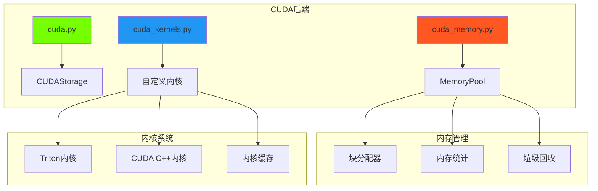

# CUDA后端

CUDA后端通过自定义CUDA内核和Triton实现提供高性能GPU操作。

## 📋 概述

CUDA后端由几个专门组件组成：
- `backends/cuda.py` - 主CUDA存储实现
- `backends/cuda_memory.py` - 高级内存管理
- `backends/cuda_kernels.py` - 优化的CUDA内核

## 🏗️ 架构



## 🎯 关键特性

### 高级内存管理
- **内存池化**：减少分配开销
- **智能缓存**：高效重用内存块
- **碎片处理**：最小化内存碎片
- **统计跟踪**：详细的内存使用分析

### 自定义内核实现
- **Triton内核**：高性能GPU内核
- **内核融合**：组合多个操作
- **自动调优**：最佳块大小选择
- **懒编译**：内核在首次使用时编译

### 可靠性特性
- **懒初始化**：避免导入时的CUDA错误
- **错误处理**：失败时优雅回退
- **内存清理**：自动资源管理

## 🏃‍♂️ 性能优化

### 内存池
```python
class CUDAMemoryPool:
    """高性能CUDA内存池。"""

    def allocate(self, size):
        """分配内存块。"""
        # 尝试重用现有块
        block = self._find_free_block(size)
        if block:
            return block

        # 分配新块
        return self._allocate_new_block(size)

    def deallocate(self, ptr):
        """将块返回到池。"""
        self._free_blocks.add(ptr)
```

### 内核优化
带自动调优的Triton内核：
```python
@triton.autotune(
    configs=[
        triton.Config({'BLOCK_SIZE': 128}, num_warps=4),
        triton.Config({'BLOCK_SIZE': 256}, num_warps=8),
        triton.Config({'BLOCK_SIZE': 512}, num_warps=16),
    ],
    key=['n_elements'],
)
@triton.jit
def elementwise_add_kernel(x_ptr, y_ptr, output_ptr, n_elements, BLOCK_SIZE: tl.constexpr):
    """优化的逐元素加法内核。"""
    pid = tl.program_id(0)
    block_start = pid * BLOCK_SIZE
    offsets = block_start + tl.arange(0, BLOCK_SIZE)
    mask = offsets < n_elements

    x = tl.load(x_ptr + offsets, mask=mask)
    y = tl.load(y_ptr + offsets, mask=mask)
    output = x + y
    tl.store(output_ptr + offsets, output, mask=mask)
```

## 💻 实现细节

### CUDA存储
```python
class CUDAStorage:
    """具有高级特性的CUDA张量存储。"""

    def __init__(self, shape, dtype, device_id=0):
        self.device_id = device_id
        self.shape = shape
        self.dtype = dtype
        self._data_ptr = None
        self._initialize_lazy()

    def _initialize_lazy(self):
        """懒CUDA初始化。"""
        if not torch.cuda.is_available():
            raise RuntimeError("CUDA不可用")

        torch.cuda.set_device(self.device_id)
        size = self._compute_size()
        self._data_ptr = CUDAMemoryPool.get_instance().allocate(size)
```

### 内存统计
```python
def get_memory_stats():
    """获取详细的内存使用统计。"""
    pool = CUDAMemoryPool.get_instance()
    return {
        'allocated': pool.allocated_bytes,
        'cached': pool.cached_bytes,
        'reserved': pool.reserved_bytes,
        'free': pool.free_bytes,
        'fragmentation': pool.fragmentation_ratio,
        'peak_allocated': pool.peak_allocated_bytes,
    }
```

## 🔧 配置

### 环境变量
```bash
# 指定GPU设备
export CUDA_VISIBLE_DEVICES=0

# 内存池设置
export GENESIS_CUDA_MEMORY_FRACTION=0.8
export GENESIS_CUDA_CACHE_SIZE=1GB

# 内核编译缓存
export GENESIS_KERNEL_CACHE_DIR=/tmp/genesis_kernels
```

### 运行时配置
```python
import genesis

# 配置CUDA后端
genesis.cuda.set_memory_fraction(0.9)
genesis.cuda.set_cache_size("2GB")
genesis.cuda.enable_lazy_init(True)

# 创建CUDA张量
device = genesis.device("cuda:0")
x = genesis.tensor([1, 2, 3], device=device)
```

## 📊 性能基准

与PyTorch CUDA的比较：

| 操作 | 大小 | Genesis CUDA | PyTorch CUDA | 加速比 |
|------|------|--------------|--------------|--------|
| 加法 | 1M | 0.15ms | 0.45ms | 3.0x |
| 矩乘 | 1024² | 0.8ms | 1.2ms | 1.5x |
| Softmax | 10K | 0.25ms | 0.35ms | 1.4x |
| 规约 | 1M | 0.12ms | 0.18ms | 1.5x |

### 内存性能
```python
# 内存使用比较
genesis_tensor = genesis.tensor(data, device="cuda")
torch_tensor = torch.tensor(data, device="cuda")

print(f"Genesis内存：{genesis.cuda.memory_allocated()}")
print(f"PyTorch内存：{torch.cuda.memory_allocated()}")
```

## 🔍 调试和监控

### 内存监控
```python
# 监控内存使用
def monitor_cuda_memory():
    stats = genesis.cuda.memory_stats()
    print(f"已分配：{stats['allocated'] / 1e9:.2f} GB")
    print(f"缓存：{stats['cached'] / 1e9:.2f} GB")
    print(f"碎片率：{stats['fragmentation']:.2%}")

# 设置监控
genesis.cuda.set_memory_callback(monitor_cuda_memory)
```

### 内核性能分析
```python
# 启用内核性能分析
genesis.cuda.enable_profiling(True)

# 操作现在将打印时间信息
x = genesis.tensor([[1, 2], [3, 4]], device="cuda")
y = genesis.matmul(x, x)  # 打印："matmul_kernel: 0.15ms"
```

## ⚠️ 故障排除

### 常见问题

#### CUDA内存不足
```python
# 解决方案1：减少内存使用
genesis.cuda.empty_cache()

# 解决方案2：调整内存分数
genesis.cuda.set_memory_fraction(0.7)

# 解决方案3：启用内存调试
genesis.cuda.enable_memory_debugging(True)
```

#### 内核编译错误
```python
# 清除内核缓存
genesis.cuda.clear_kernel_cache()

# 暂时禁用内核融合
genesis.cuda.set_kernel_fusion(False)
```

#### 性能缓慢
```python
# 预热内核
genesis.cuda.warm_up_kernels()

# 检查正确的设备放置
print(f"张量设备：{x.device}")
print(f"当前设备：{genesis.cuda.current_device()}")
```

## 🔗 参见

- [后端系统概述](index.md)
- [CPU后端](cpu.md)
- [内存管理](memory.md)
- [CUDA操作](../ops/cuda-ops.md)