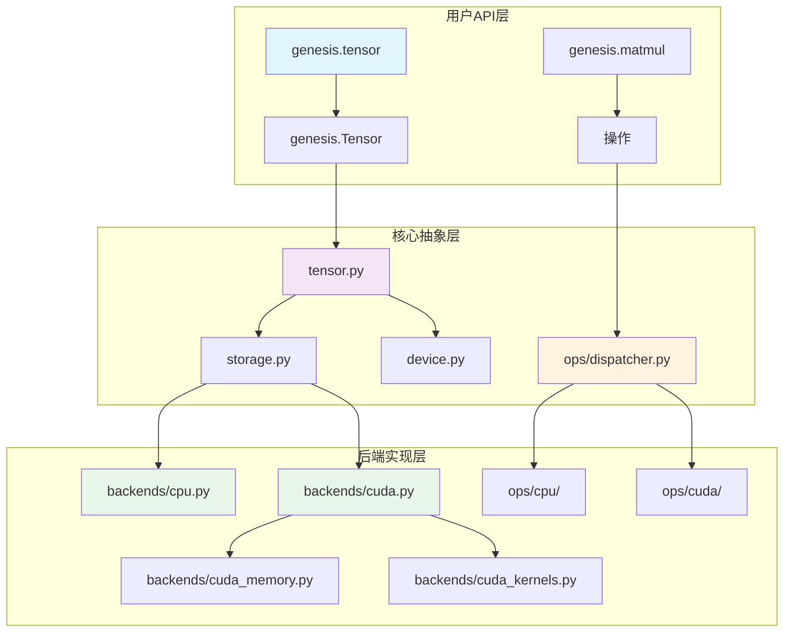

# 后端系统概述

Genesis v2.0 引入了模块化后端架构，在保持统一接口的同时，清晰地分离了特定设备的实现。

## 🏗️ 架构

后端系统遵循清晰的关注点分离原则：



## 🎯 核心组件

### 设备抽象
`genesis.device` 模块提供统一的设备管理接口：
- 自动设备选择
- 设备无关的张量创建
- 透明的内存管理

### 存储层
`genesis.storage` 模块处理底层数据存储：
- 抽象特定设备的存储实现
- 管理内存生命周期
- 提供设备间高效数据传输

### 后端实现

#### CPU后端
- **文件**: `backends/cpu.py`
- **实现**: 利用PyTorch进行CPU操作
- **特性**: 完全兼容性，高效CPU利用率

#### CUDA后端
- **文件**: `backends/cuda.py`, `backends/cuda_memory.py`, `backends/cuda_kernels.py`
- **实现**: 纯CUDA/Triton实现
- **特性**:
  - 带池化的自定义内存管理
  - 优化的CUDA内核
  - 懒初始化提高可靠性

## 🚀 设计原则

### 1. 模块化
每个后端都是完全自包含的，便于：
- 添加新设备支持
- 优化特定操作
- 独立测试后端

### 2. 性能
后端系统为最佳性能而设计：
- 尽可能的零拷贝操作
- 高效内存池
- 内核融合机会

### 3. 可靠性
内置安全特性：
- 懒CUDA初始化
- 自动内存管理
- 优雅回退

## 💡 使用示例

```python
import genesis

# 设备抽象处理后端选择
device = genesis.device("cuda")

# 张量自动使用适当的后端
x = genesis.tensor([1, 2, 3], device=device)
y = genesis.tensor([4, 5, 6], device=device)

# 操作分发到正确的后端
z = genesis.matmul(x, y)  # 使用CUDA后端

# 无缝设备传输
cpu_tensor = z.to("cpu")  # 传输到CPU后端
```

## 🔄 添加新后端

要添加新后端：

1. 在 `backends/` 目录创建新文件
2. 实现存储接口
3. 在 `ops/<backend>/` 添加操作
4. 向调度器注册

详细说明请参见[后端开发指南](../contributing/backend-development.md)。