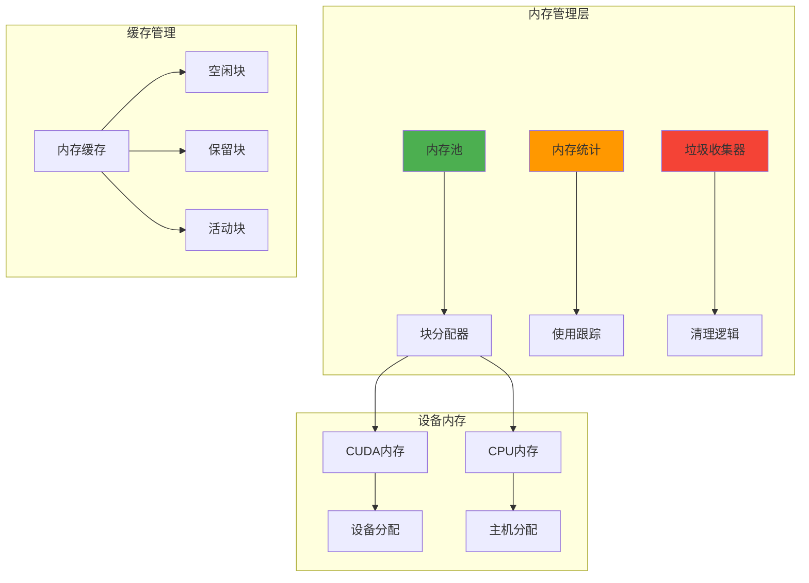

# 内存管理系统

Genesis提供高级内存管理功能，实现高效的GPU和CPU内存利用。

## 📋 概述

内存管理系统旨在：
- 通过池化最小化分配开销
- 减少内存碎片
- 提供详细的内存统计
- 启用高效的内存重用

## 🏗️ 架构



## 🎯 关键组件

### 内存池
管理内存分配和释放的中央组件：

```python
class MemoryPool:
    """用于高效分配的统一内存池。"""

    def __init__(self, device_type):
        self.device_type = device_type
        self.free_blocks = {}  # 大小 -> 块列表
        self.allocated_blocks = {}  # 指针 -> 块信息
        self.total_allocated = 0
        self.peak_allocated = 0

    def allocate(self, size):
        """分配给定大小的内存块。"""
        # 尝试重用现有块
        block = self._find_suitable_block(size)
        if block:
            return self._reuse_block(block, size)

        # 分配新块
        return self._allocate_new_block(size)

    def deallocate(self, ptr):
        """将内存块返回到池。"""
        block = self.allocated_blocks.pop(ptr)
        self._add_to_free_blocks(block)
```

### 内存统计
全面跟踪内存使用：

```python
class MemoryStats:
    """详细的内存使用统计。"""

    def __init__(self):
        self.allocated_bytes = 0
        self.reserved_bytes = 0
        self.active_bytes = 0
        self.inactive_bytes = 0
        self.peak_allocated = 0
        self.num_allocs = 0
        self.num_frees = 0

    def update_allocation(self, size):
        """更新新分配的统计。"""
        self.allocated_bytes += size
        self.active_bytes += size
        self.peak_allocated = max(self.peak_allocated, self.allocated_bytes)
        self.num_allocs += 1

    def fragmentation_ratio(self):
        """计算内存碎片。"""
        if self.reserved_bytes == 0:
            return 0.0
        return (self.reserved_bytes - self.allocated_bytes) / self.reserved_bytes
```

## 🚀 CUDA内存管理

### 高级池化策略
```python
class CUDAMemoryPool(MemoryPool):
    """具有高级特性的CUDA特定内存池。"""

    def __init__(self, device_id=0):
        super().__init__("cuda")
        self.device_id = device_id
        self.memory_fraction = 0.8  # 使用80%的可用内存
        self._initialize_pool()

    def _initialize_pool(self):
        """初始化CUDA内存池。"""
        torch.cuda.set_device(self.device_id)

        # 获取可用内存
        total_memory = torch.cuda.get_device_properties(self.device_id).total_memory
        available_memory = int(total_memory * self.memory_fraction)

        # 预分配大块
        self._preallocate_blocks(available_memory)

    def _preallocate_blocks(self, total_size):
        """预分配各种大小的内存块。"""
        block_sizes = [1024, 4096, 16384, 65536, 262144, 1048576]  # 2的幂

        for block_size in block_sizes:
            num_blocks = max(1, total_size // (block_size * len(block_sizes)))
            for _ in range(num_blocks):
                ptr = torch.cuda.caching_allocator_alloc(block_size)
                self._add_to_free_blocks(Block(ptr, block_size))
```

### 内存优化特性

#### 智能缓存
```python
def smart_cache_management(self):
    """基于使用模式的智能内存缓存。"""
    # 分析分配模式
    frequent_sizes = self._analyze_allocation_patterns()

    # 基于模式调整缓存大小
    for size in frequent_sizes:
        self._increase_cache_for_size(size)

    # 清理很少使用的块
    self._cleanup_unused_blocks()
```

#### 内存压实
```python
def compact_memory(self):
    """通过压实减少内存碎片。"""
    # 查找碎片区域
    fragmented_blocks = self._find_fragmented_blocks()

    # 压实相邻的空闲块
    for block_group in fragmented_blocks:
        merged_block = self._merge_blocks(block_group)
        self._add_to_free_blocks(merged_block)
```

## 💻 CPU内存管理

### 高效主机内存
```python
class CPUMemoryPool(MemoryPool):
    """支持钉住内存的CPU内存池。"""

    def __init__(self):
        super().__init__("cpu")
        self.use_pinned_memory = False
        self.pinned_blocks = set()

    def allocate_pinned(self, size):
        """分配钉住内存以加快GPU传输。"""
        ptr = torch.cuda.cudaHostAlloc(size, torch.cuda.cudaHostAllocDefault)
        block = Block(ptr, size, pinned=True)
        self.pinned_blocks.add(ptr)
        return block

    def is_pinned(self, ptr):
        """检查内存块是否被钉住。"""
        return ptr in self.pinned_blocks
```

## 🔧 配置和使用

### 基本配置
```python
import genesis

# 配置CUDA内存
genesis.cuda.set_memory_fraction(0.9)  # 使用90%的GPU内存
genesis.cuda.set_cache_size("2GB")     # 设置缓存大小

# 配置CPU内存
genesis.cpu.enable_pinned_memory(True) # 启用钉住内存

# 获取当前内存统计
stats = genesis.memory_stats()
print(f"已分配：{stats.allocated_bytes / 1e9:.2f} GB")
print(f"缓存：{stats.cached_bytes / 1e9:.2f} GB")
```

### 高级内存控制
```python
# 手动内存管理
def optimize_memory_usage():
    # 清除未使用的缓存
    genesis.empty_cache()

    # 触发垃圾收集
    genesis.memory_manager.collect_garbage()

    # 压实碎片内存
    genesis.memory_manager.compact()

# 内存监控
def monitor_memory():
    stats = genesis.memory_stats()
    fragmentation = stats.fragmentation_ratio()

    if fragmentation > 0.3:  # 30%碎片阈值
        print("检测到高碎片，正在压实...")
        genesis.memory_manager.compact()
```

## 📊 内存分析

### 内置分析器
```python
# 启用内存分析
genesis.enable_memory_profiling(True)

# 内存操作现在将被跟踪
x = genesis.tensor([1, 2, 3], device="cuda")  # 分配被跟踪
y = x + 1                                     # 临时分配被跟踪
del x                                         # 释放被跟踪

# 获取分析报告
report = genesis.memory_profiler.get_report()
print(report.summary())
```

### 内存时间线
```python
# 记录内存时间线
with genesis.memory_profiler.record():
    # 这里是你的代码
    model = create_model()
    data = load_data()
    output = model(data)

# 分析时间线
timeline = genesis.memory_profiler.get_timeline()
timeline.plot()  # 显示内存使用随时间变化
```

## ⚡ 性能技巧

### 内存优化最佳实践

1. **预分配大张量**
   ```python
   # 好：预分配
   buffer = genesis.empty((1000000,), device="cuda")

   # 避免：频繁的小分配
   for i in range(1000):
       x = genesis.tensor([i], device="cuda")
   ```

2. **重用内存缓冲区**
   ```python
   # 重用缓冲区
   result_buffer = genesis.empty((batch_size, num_features))
   for batch in dataloader:
       genesis.matmul(batch.input, weights, out=result_buffer)
   ```

3. **使用原地操作**
   ```python
   # 原地操作节省内存
   x.add_(y)      # 而不是 x = x + y
   x.mul_(0.5)    # 而不是 x = x * 0.5
   ```

4. **手动内存管理**
   ```python
   # 在需要时清除缓存
   if memory_pressure_detected():
       genesis.empty_cache()
   ```

## 🔍 调试内存问题

### 内存泄漏检测
```python
# 启用泄漏检测
genesis.enable_memory_debugging(True)

# 运行你的代码
train_model()

# 检查泄漏
leaks = genesis.check_memory_leaks()
if leaks:
    print("检测到内存泄漏：")
    for leak in leaks:
        print(f"  {leak.location}处的{leak.size}字节")
```

### 内存使用分析
```python
def analyze_memory_usage():
    """全面的内存分析。"""
    stats = genesis.detailed_memory_stats()

    print(f"总分配：{stats.total_allocated / 1e9:.2f} GB")
    print(f"峰值使用：{stats.peak_allocated / 1e9:.2f} GB")
    print(f"碎片率：{stats.fragmentation_ratio:.2%}")
    print(f"缓存命中率：{stats.cache_hit_rate:.2%}")

    # 显示最大的分配
    large_allocs = stats.get_large_allocations(min_size=100*1024*1024)  # 100MB+
    for alloc in large_allocs:
        print(f"大分配：{alloc.location}处的{alloc.size / 1e6:.1f} MB")
```

## 🔗 参见

- [CUDA后端](cuda.md)
- [CPU后端](cpu.md)
- [性能优化](../performance/optimization-guide.md)
- [调试指南](../contributing/debugging.md)