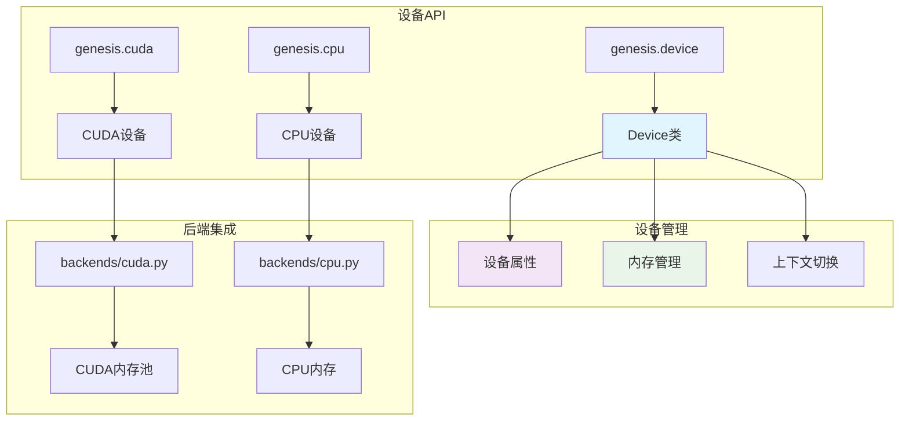

# 设备抽象

Genesis提供了统一的设备抽象，允许在不同硬件后端间无缝操作，同时保持最佳性能。

## 📋 概述

Genesis v2.0的设备系统提供：
- 跨CPU和GPU的统一设备接口
- 自动设备推断和管理
- 透明的内存管理
- 每种设备类型的最佳性能

## 🏗️ 架构



## 🎯 核心组件

### Device类
中央Device类提供统一接口：

```python
class Device:
    """统一设备抽象。"""

    def __init__(self, device_type, device_id=None):
        self.type = device_type  # 'cpu' 或 'cuda'
        self.id = device_id or 0
        self._properties = None

    @property
    def is_cuda(self):
        """检查设备是否为CUDA。"""
        return self.type == 'cuda'

    @property
    def is_cpu(self):
        """检查设备是否为CPU。"""
        return self.type == 'cpu'

    def __str__(self):
        if self.type == 'cuda':
            return f"cuda:{self.id}"
        return self.type
```

### 设备创建
创建设备对象的多种方式：

```python
# 字符串规范
device = genesis.device("cuda:0")
device = genesis.device("cpu")

# 从现有张量
device = tensor.device

# 默认设备
device = genesis.get_default_device()

# 自动设备选择
device = genesis.device("auto")  # 如果可用选择CUDA，否则CPU
```

## 💻 设备操作

### 设备上下文管理
```python
# 临时设备上下文
with genesis.device("cuda:1"):
    x = genesis.randn(3, 4)  # 在cuda:1上创建
    y = genesis.zeros(3, 4)  # 也在cuda:1上

# 设备特定操作
device = genesis.device("cuda:0")
with device:
    # 所有操作使用此设备
    model = MyModel()
    optimizer = genesis.optim.Adam(model.parameters())
```

### 跨设备操作
```python
# 自动设备处理
cpu_tensor = genesis.tensor([1, 2, 3], device="cpu")
gpu_tensor = genesis.tensor([4, 5, 6], device="cuda")

# 自动设备提升（移动到GPU）
result = cpu_tensor + gpu_tensor  # 结果在cuda设备上

# 显式设备传输
gpu_result = cpu_tensor.to("cuda")
cpu_result = gpu_tensor.to("cpu")
```

### 设备属性
```python
device = genesis.device("cuda:0")

# 基本属性
print(f"设备类型：{device.type}")
print(f"设备ID：{device.id}")
print(f"是否CUDA：{device.is_cuda}")

# CUDA特定属性
if device.is_cuda:
    print(f"设备名称：{device.name}")
    print(f"计算能力：{device.compute_capability}")
    print(f"总内存：{device.total_memory}")
    print(f"多处理器数量：{device.multi_processor_count}")
```

## 🚀 CUDA设备特性

### 多GPU支持
```python
# 检查可用GPU
num_gpus = genesis.cuda.device_count()
print(f"可用GPU：{num_gpus}")

# 使用特定GPU
device = genesis.device("cuda:1")
tensor = genesis.randn(1000, 1000, device=device)

# 多GPU计算
devices = [genesis.device(f"cuda:{i}") for i in range(num_gpus)]
tensors = [genesis.randn(100, 100, device=dev) for dev in devices]
```

### CUDA内存管理
```python
device = genesis.device("cuda:0")

# 内存信息
print(f"空闲内存：{device.memory_free()}")
print(f"已用内存：{device.memory_used()}")
print(f"总内存：{device.memory_total()}")

# 内存操作
genesis.cuda.empty_cache()  # 清除未使用的缓存
genesis.cuda.synchronize()  # 等待操作完成

# 内存统计
stats = genesis.cuda.memory_stats()
print(f"峰值分配：{stats['peak_allocated']}")
```

### CUDA流和事件
```python
# CUDA流管理
stream = genesis.cuda.Stream()

with genesis.cuda.stream(stream):
    x = genesis.randn(1000, 1000, device="cuda")
    y = genesis.matmul(x, x)

# 同步
stream.synchronize()

# CUDA事件用于计时
start_event = genesis.cuda.Event(enable_timing=True)
end_event = genesis.cuda.Event(enable_timing=True)

start_event.record()
# ... 操作 ...
end_event.record()
genesis.cuda.synchronize()

elapsed_time = start_event.elapsed_time(end_event)
print(f"耗时：{elapsed_time:.2f} ms")
```

## 💾 CPU设备特性

### CPU配置
```python
# CPU特定设置
genesis.cpu.set_num_threads(8)
print(f"CPU线程：{genesis.cpu.get_num_threads()}")

# 启用/禁用优化
genesis.cpu.set_optimization_level('O2')
genesis.cpu.enable_mkl(True)
```

### 内存管理
```python
# CPU内存操作
device = genesis.device("cpu")

# 钉住内存以加快GPU传输
tensor = genesis.empty((1000, 1000), device=device, pin_memory=True)
print(f"是否钉住：{tensor.is_pinned()}")

# 内存映射用于大型数据集
mapped_tensor = genesis.from_file("large_dataset.dat", device="cpu", mmap=True)
```

## 🔧 设备配置

### 默认设备管理
```python
# 设置全局默认设备
genesis.set_default_device("cuda:0")

# 获取当前默认值
device = genesis.get_default_device()
print(f"默认设备：{device}")

# 特定上下文的默认值
with genesis.default_device("cpu"):
    x = genesis.randn(3, 4)  # 在CPU上创建
    print(f"设备：{x.device}")  # cpu

# 重置为系统默认值
genesis.reset_default_device()
```

### 环境变量
```python
import os

# 通过环境设置设备
os.environ['GENESIS_DEFAULT_DEVICE'] = 'cuda:1'
os.environ['CUDA_VISIBLE_DEVICES'] = '0,1,2,3'

# 设备选择优先级：
# 1. 显式设备参数
# 2. 当前设备上下文
# 3. 环境变量
# 4. 系统默认值
```

## 📊 性能优化

### 设备特定优化
```python
def optimize_for_device(tensor):
    """应用设备特定优化。"""
    if tensor.device.is_cuda:
        # CUDA优化
        tensor = tensor.contiguous()  # 确保内存布局
        if tensor.numel() > 10000:
            tensor = tensor.half()    # 大张量使用半精度
    else:
        # CPU优化
        tensor = tensor.float()       # CPU使用float32

    return tensor

# 使用
optimized_tensor = optimize_for_device(my_tensor)
```

### 内存传输优化
```python
def efficient_transfer(tensor, target_device):
    """高效传输张量到目标设备。"""
    if tensor.device == target_device:
        return tensor  # 无需传输

    # CPU->GPU传输使用钉住内存
    if tensor.device.is_cpu and target_device.is_cuda:
        if not tensor.is_pinned():
            tensor = tensor.pin_memory()

    # 使用流进行异步传输
    if target_device.is_cuda:
        with genesis.cuda.stream(genesis.cuda.Stream()):
            return tensor.to(target_device, non_blocking=True)

    return tensor.to(target_device)
```

## 🔍 设备检测和能力

### 硬件检测
```python
def detect_hardware():
    """检测可用硬件和能力。"""
    info = {
        'cpu_count': genesis.cpu.logical_cpu_count(),
        'cpu_features': genesis.cpu.supported_features(),
        'cuda_available': genesis.cuda.is_available(),
        'cuda_version': genesis.cuda.version() if genesis.cuda.is_available() else None,
        'gpu_count': genesis.cuda.device_count() if genesis.cuda.is_available() else 0,
    }

    if info['cuda_available']:
        info['gpus'] = []
        for i in range(info['gpu_count']):
            gpu_info = genesis.cuda.get_device_properties(i)
            info['gpus'].append({
                'name': gpu_info.name,
                'memory': gpu_info.total_memory,
                'compute_capability': gpu_info.compute_capability,
            })

    return info

# 使用
hw_info = detect_hardware()
print(f"硬件信息：{hw_info}")
```

### 基于能力的选择
```python
def select_optimal_device(min_memory_gb=1.0, compute_capability=None):
    """根据需求选择最佳设备。"""
    if not genesis.cuda.is_available():
        return genesis.device("cpu")

    for i in range(genesis.cuda.device_count()):
        device = genesis.device(f"cuda:{i}")
        props = genesis.cuda.get_device_properties(i)

        # 检查内存需求
        if props.total_memory < min_memory_gb * 1e9:
            continue

        # 检查计算能力
        if compute_capability and props.compute_capability < compute_capability:
            continue

        return device

    # 如果没有合适的GPU则回退到CPU
    return genesis.device("cpu")

# 使用
device = select_optimal_device(min_memory_gb=4.0, compute_capability=7.0)
print(f"选择的设备：{device}")
```

## 🔗 参见

- [后端系统](../backends/index.md) - 后端实现细节
- [内存管理](../backends/memory.md) - 高级内存管理
- [性能指南](../performance/optimization-guide.md) - 性能优化
- [CUDA后端](../backends/cuda.md) - CUDA特定功能