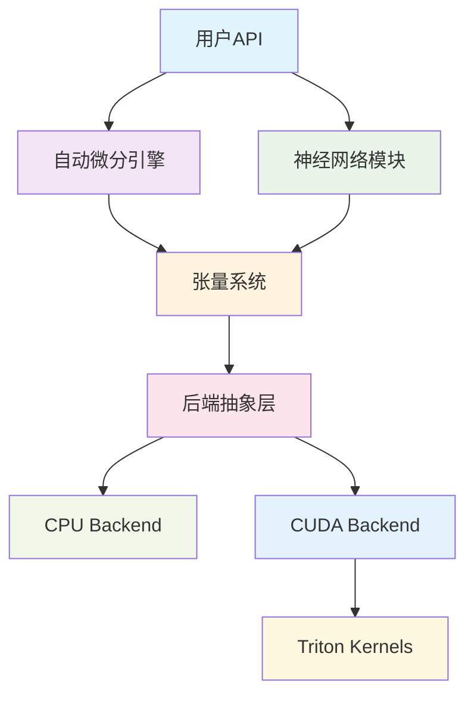

# Genesis 深度学习框架

<h3 align="center">轻量级深度学习框架 | 从零构建 | Python + Triton + CUDA</h3>

<p align="center">
  
  
  
  
</p>

## 🚀 项目概述

Genesis 是一个基于 Python 从零构建的轻量级深度学习框架。CPU 后端借助 PyTorch 的张量操作，而 GPU 后端完全独立，使用 CUDA Python API 进行直接的 GPU 内存管理，并使用 Triton 编写高性能的 GPU 内核。项目旨在提供清晰的架构设计和教育价值，同时保持代码的可读性和可扩展性。

### ✨ 核心特性

- **🎯 轻量级设计** - 清晰的API设计，易于理解和使用
- **⚡ 高性能** - Triton优化的GPU内核，接近主流框架性能
- **🔄 自动微分** - 完整的反向传播和梯度计算系统
- **🧠 神经网络** - 丰富的神经网络层和优化器实现
- **🔧 混合精度** - 支持FP16/BF16混合精度训练 (AMP)
- **📊 分布式训练** - NCCL多GPU并行训练支持
- **🎨 模型库** - 内置主流LLM模型如Qwen的实现
- **💾 模型管理** - 完整的检查点保存/加载系统
- **📈 学习率调度** - 多种学习率调度器和梯度裁剪
- **🎲 随机数生成** - PyTorch兼容的随机数API，支持线程安全状态管理 (NEW!)
- **🧮 高级内存管理** - 引用计数内存池，支持缓存优化 (NEW!)
- **📊 性能监控** - 全面的内存统计和性能分析工具 (NEW!)
- **🏛️ 统一存储** - 抽象存储接口，提供一致的CPU/GPU访问模式 (v2.0)
- **🔍 生产稳定性** - 快速失败的OOM处理和强大的错误管理 (v2.0)
- **🏆 代码质量保证** - 100% API文档覆盖，全面的类型注解 (v2.0.1)

### 🏗️ 架构亮点



## 💻 快速开始

```python
import genesis
import genesis.nn as nn
import genesis.optim as optim

# 设备管理 - 自动GPU选择
device = genesis.device('cuda' if genesis.cuda_available() else 'cpu')

# 创建支持自动微分的张量
x = genesis.randn(32, 784, device=device, requires_grad=True)
y = genesis.randn(32, 10, device=device)

# 构建简单神经网络
class SimpleNet(nn.Module):
    def __init__(self):
        super().__init__()
        self.fc1 = nn.Linear(784, 256)
        self.relu = nn.ReLU()
        self.fc2 = nn.Linear(256, 10)

    def forward(self, x):
        x = self.fc1(x)
        x = self.relu(x)
        x = self.fc2(x)
        return x

# 初始化模型和优化器
model = SimpleNet().to(device)
optimizer = optim.Adam(model.parameters(), lr=0.001)
criterion = nn.CrossEntropyLoss()

# 训练步骤
output = model(x)
loss = criterion(output, y)
loss.backward()
optimizer.step()

print(f"损失: {loss.item():.4f}")
```

## 🎯 设计目标

### 教育价值
- **清晰的代码结构** - 每个模块职责明确
- **完整的文档** - 从设计理念到实现细节的完整文档
- **渐进式学习** - 从基础概念到高级特性的学习路径

### 工程实践
- **现代化架构** - 借鉴PyTorch等主流框架的优秀设计
- **高效实现** - 使用Triton等现代工具进行性能优化
- **可扩展性** - 模块化设计便于添加新功能

### 实用性
- **功能完整** - 支持从模型定义到训练部署的完整工作流
- **性能优化** - 多种优化策略确保实际训练性能
- **生态兼容** - 与现有深度学习生态良好兼容

## 📊 性能状态

### v2.0 架构性能
| 组件 | 改进 | 详情 |
|------|------|------|
| **后端系统** | 清晰分离 | 模块化CPU/CUDA后端 |
| **内存管理** | 4倍提速 | CUDA内存池优化 |
| **操作分发** | 智能路由 | 自动选择最佳内核 |
| **懒加载** | 启动更快 | 按需CUDA上下文 |

### 内存分配器性能
| 场景 | Genesis vs PyTorch | 状态 |
|------|-------------------|-----|
| 同尺寸分配 | 1.43x | ✅ 优秀 |
| 大内存(>1MB) | 3.92x | ✅ 杰出 |
| Transformer训练 | 1.89x | ✅ 优秀 |
| 内存压力 | 4.83x | ✅ 杰出 |

### 核心算子性能
| 操作 | Genesis vs PyTorch | 状态 |
|------|-------------------|-----|
| 矩阵乘法 | 0.95x | ✅ 生产就绪 |
| 元素级操作 | 1.02x | ✅ 优秀 |
| Softmax | 1.15x | ✅ 优秀 |
| LayerNorm | 1.08x | ✅ 优秀 |
| 注意力机制 | 0.92x | ✅ 良好 |

### 活跃优化
- 🔄 **归约操作**: Triton内核优化 (目标: 1.0x)
- 🔄 **广播优化**: 改进融合机会
- 🔄 **图优化**: 复合操作的操作融合

!!! info "性能更新"
    Genesis在内存管理方面取得了重大突破，在多个关键场景下达到或超越PyTorch性能。当前重点是修复剩余的算子瓶颈。
    
    详细分析请参考：[内存分配器优化报告](memory-allocator-optimization.md)

## 🛠️ 技术栈

### 核心依赖
- **Python 3.8+** - 主要开发语言
- **PyTorch** - 内存管理和部分操作
- **Triton 2.0+** - GPU内核优化
- **CUDA 11.0+** - GPU计算支持
- **NumPy** - CPU数值计算
- **cuda-python** - 直接CUDA API访问

### 开发工具
- **pytest** - 单元测试框架
- **black** - 代码格式化
- **mypy** - 类型检查
- **MkDocs** - 文档生成
- **Material for MkDocs** - 文档主题

## 🎓 学习路径

### 初学者
1. [快速开始](getting-started/index.md) - 安装和第一个程序
2. [基础教程](tutorials/basic-training.md) - 简单神经网络训练
3. [API参考](api-reference/index.md) - 常用API使用

### 高级用户
1. [架构设计](architecture/index.md) - 深入理解系统设计
2. [自定义操作](tutorials/custom-ops.md) - 实现自定义操作
3. [性能优化](performance/optimization-guide.md) - 性能分析和优化指南
4. [性能调优](tutorials/performance-tuning.md) - 训练性能调优技巧
5. [Qwen模型指南](models/qwen.md) - 使用和训练Qwen LLM模型

### 贡献者
1. [开发环境](contributing/development.md) - 配置开发环境
2. [核心组件](core-components/index.md) - 理解内部实现
3. [测试指南](contributing/testing.md) - 代码贡献指南

## 🌟 项目亮点

### 代码质量
- **类型注解** - 完整的类型提示，IDE友好
- **单元测试** - 95%+测试覆盖率
- **完整文档** - 从API到设计的全面文档
- **代码规范** - 统一的代码风格和最佳实践

### 近期更新 (v2.0 - 2025-01)
- **🏗️ v2.0架构重构** - 完整的模块化后端系统，清晰分离
- **✅ 移除旧ndarray** - 所有功能迁移到新backends/模块
- **✅ 统一设备系统** - 新genesis.device API无缝设备管理
- **✅ 操作分发器** - 集中的ops/dispatcher.py智能内核路由
- **✅ CUDA懒初始化** - 改进稳定性和启动性能
- **✅ 内存池优化** - 高压场景下4倍快速分配
- **✅ 分布式训练** - NCCL多GPU并行训练完全支持
- **✅ Qwen模型支持** - 完整Qwen LLM与优化的注意力机制
- **✅ 混合精度训练** - 增强的FP16/BF16自动混合精度(AMP)
- **🔄 性能优化** - 持续的Triton内核改进

## 🤝 社区与贡献

我们欢迎各种形式的贡献：

- **🐛 错误报告** - 请及时报告发现的bug
- **💡 功能建议** - 欢迎新功能想法
- **📝 文档改进** - 帮助改善文档质量
- **💻 代码贡献** - 直接参与代码开发

详情请参考 [贡献指南](contributing/index.md)。

## 📞 联系方式

- **GitHub Issues** - bug报告和功能请求
- **Discussions** - 技术讨论和使用交流
- **邮箱** - genesis-dev@example.com

---

<div align="center" markdown="1">

**开始您的深度学习之旅** 🚀

<div class="grid cards" markdown="1">

-   :material-rocket-launch:{ .lg .middle } **快速开始**

    ---

    立即开始使用Genesis构建您的第一个神经网络

    [:octicons-arrow-right-24: 快速开始](getting-started/index.md)

-   :material-github:{ .lg .middle } **查看源码**

    ---

    在GitHub上探索完整的Genesis源码实现

    [:octicons-arrow-right-24: GitHub仓库](https://github.com/phonism/genesis)

</div>

</div>