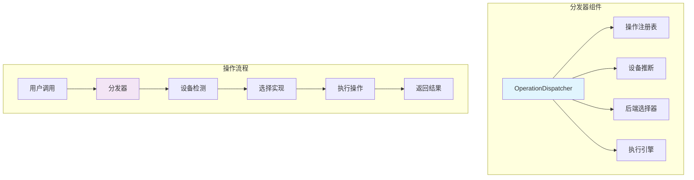

# 操作分发器

操作分发器是Genesis v2.0的核心组件，负责将张量操作路由到适当的后端实现。

## 📋 概述

分发器提供：
- 集中的操作路由
- 自动后端选择
- 操作注册和管理
- 性能优化机会

## 🏗️ 架构



## 🎯 核心功能

### 操作分发器类
```python
class OperationDispatcher:
    """中央操作分发系统。"""

    def __init__(self):
        self._operations = {}
        self._metadata = {}
        self._cache = {}

    def register(self, name, implementations):
        """注册新操作。"""
        self._operations[name] = implementations

    def dispatch(self, op_name, *args, **kwargs):
        """分发操作到后端。"""
        # 1. 验证操作存在
        if op_name not in self._operations:
            raise ValueError(f"未知操作：{op_name}")

        # 2. 推断设备
        device = self._infer_device(args)

        # 3. 选择实现
        impl = self._select_implementation(op_name, device)

        # 4. 执行操作
        return impl(*args, **kwargs)
```

### 设备推断
```python
def _infer_device(self, args):
    """从参数推断目标设备。"""
    devices = []

    for arg in args:
        if hasattr(arg, 'device'):
            devices.append(arg.device)

    if not devices:
        # 使用默认设备
        return genesis.get_default_device()

    # 检查设备一致性
    unique_devices = set(str(d) for d in devices)
    if len(unique_devices) > 1:
        # 设备提升规则
        if 'cuda' in str(unique_devices):
            return genesis.device('cuda')
        else:
            raise RuntimeError(f"设备冲突：{unique_devices}")

    return devices[0]
```

## 💡 操作注册

### 基本注册
```python
# 注册简单操作
dispatcher = OperationDispatcher()

dispatcher.register('add', {
    'cpu': cpu_add_impl,
    'cuda': cuda_add_impl
})

# 使用注册的操作
result = dispatcher.dispatch('add', x, y)
```

### 带元数据的注册
```python
# 注册带额外信息的操作
dispatcher.register_with_metadata('matmul', {
    'implementations': {
        'cpu': cpu_matmul,
        'cuda': cuda_matmul
    },
    'supports_autograd': True,
    'memory_intensive': True,
    'fusion_candidates': ['add', 'relu']
})
```

### 动态注册
```python
def register_dynamic_operation(name, generator):
    """动态生成操作实现。"""

    def dynamic_dispatcher(*args, **kwargs):
        # 基于输入动态生成实现
        impl = generator(args, kwargs)
        return impl(*args, **kwargs)

    dispatcher.register(name, {
        'cpu': dynamic_dispatcher,
        'cuda': dynamic_dispatcher
    })
```

## 🚀 优化策略

### 操作缓存
```python
class CachedDispatcher(OperationDispatcher):
    """带结果缓存的分发器。"""

    def dispatch(self, op_name, *args, **kwargs):
        # 生成缓存键
        cache_key = self._generate_cache_key(op_name, args)

        # 检查缓存
        if cache_key in self._cache:
            return self._cache[cache_key]

        # 执行并缓存
        result = super().dispatch(op_name, *args, **kwargs)
        self._cache[cache_key] = result

        return result

    def _generate_cache_key(self, op_name, args):
        """为操作生成唯一缓存键。"""
        # 基于操作和输入形状/类型的键
        shapes = tuple(arg.shape for arg in args if hasattr(arg, 'shape'))
        dtypes = tuple(arg.dtype for arg in args if hasattr(arg, 'dtype'))
        return (op_name, shapes, dtypes)
```

### 操作融合
```python
class FusionDispatcher(OperationDispatcher):
    """支持操作融合的分发器。"""

    def __init__(self):
        super().__init__()
        self._fusion_patterns = []

    def register_fusion_pattern(self, pattern, fused_impl):
        """注册融合模式。"""
        self._fusion_patterns.append({
            'pattern': pattern,
            'implementation': fused_impl
        })

    def dispatch_sequence(self, operations):
        """分发操作序列，可能进行融合。"""
        # 检查融合机会
        for fusion in self._fusion_patterns:
            if self._matches_pattern(operations, fusion['pattern']):
                return fusion['implementation'](*operations)

        # 无融合，顺序执行
        results = []
        for op in operations:
            results.append(self.dispatch(op.name, *op.args))
        return results
```

### 批量分发
```python
def batch_dispatch(self, operations):
    """批量分发多个操作。"""
    # 按设备分组操作
    device_groups = {}
    for op in operations:
        device = self._infer_device(op.args)
        if device not in device_groups:
            device_groups[device] = []
        device_groups[device].append(op)

    # 并行执行每个设备组
    results = {}
    for device, ops in device_groups.items():
        if device.is_cuda:
            # GPU操作可以异步执行
            stream = genesis.cuda.Stream()
            with genesis.cuda.stream(stream):
                for op in ops:
                    results[op] = self.dispatch(op.name, *op.args)
        else:
            # CPU操作顺序执行
            for op in ops:
                results[op] = self.dispatch(op.name, *op.args)

    return results
```

## 🔧 配置选项

### 全局配置
```python
# 配置分发器行为
genesis.ops.dispatcher.set_config({
    'enable_fusion': True,
    'cache_size': 1000,
    'profile_operations': False,
    'strict_device_checking': True
})
```

### 操作特定配置
```python
# 为特定操作设置配置
genesis.ops.dispatcher.configure_operation('matmul', {
    'use_cublas': True,
    'transpose_threshold': 1024,
    'block_size': 256
})
```

## 📊 性能监控

### 操作统计
```python
class ProfilingDispatcher(OperationDispatcher):
    """带性能分析的分发器。"""

    def __init__(self):
        super().__init__()
        self._stats = {}

    def dispatch(self, op_name, *args, **kwargs):
        # 记录开始时间
        start_time = time.perf_counter()

        # 执行操作
        result = super().dispatch(op_name, *args, **kwargs)

        # 记录统计
        elapsed = time.perf_counter() - start_time
        if op_name not in self._stats:
            self._stats[op_name] = {
                'count': 0,
                'total_time': 0,
                'max_time': 0,
                'min_time': float('inf')
            }

        stats = self._stats[op_name]
        stats['count'] += 1
        stats['total_time'] += elapsed
        stats['max_time'] = max(stats['max_time'], elapsed)
        stats['min_time'] = min(stats['min_time'], elapsed)

        return result

    def print_stats(self):
        """打印操作统计。"""
        for op_name, stats in self._stats.items():
            avg_time = stats['total_time'] / stats['count']
            print(f"{op_name}:")
            print(f"  调用次数：{stats['count']}")
            print(f"  平均时间：{avg_time*1000:.3f} ms")
            print(f"  最大时间：{stats['max_time']*1000:.3f} ms")
            print(f"  最小时间：{stats['min_time']*1000:.3f} ms")
```

### 瓶颈检测
```python
def detect_bottlenecks(self):
    """检测性能瓶颈。"""
    bottlenecks = []

    for op_name, stats in self._stats.items():
        avg_time = stats['total_time'] / stats['count']

        # 检查慢操作
        if avg_time > 0.1:  # 100ms阈值
            bottlenecks.append({
                'operation': op_name,
                'avg_time': avg_time,
                'suggestion': '考虑优化或融合'
            })

        # 检查频繁操作
        if stats['count'] > 1000:
            bottlenecks.append({
                'operation': op_name,
                'count': stats['count'],
                'suggestion': '考虑缓存结果'
            })

    return bottlenecks
```

## 🔍 调试功能

### 操作日志
```python
class DebugDispatcher(OperationDispatcher):
    """带调试日志的分发器。"""

    def dispatch(self, op_name, *args, **kwargs):
        # 记录输入
        print(f"[DISPATCH] 操作：{op_name}")
        for i, arg in enumerate(args):
            if hasattr(arg, 'shape'):
                print(f"  参数{i}：shape={arg.shape}, dtype={arg.dtype}")

        # 执行操作
        result = super().dispatch(op_name, *args, **kwargs)

        # 记录输出
        if hasattr(result, 'shape'):
            print(f"  结果：shape={result.shape}, dtype={result.dtype}")

        return result
```

### 验证模式
```python
def enable_validation_mode(self):
    """启用操作验证。"""
    self._validation_enabled = True

    def validated_dispatch(op_name, *args, **kwargs):
        # 验证输入
        self._validate_inputs(op_name, args)

        # 执行操作
        result = self._original_dispatch(op_name, *args, **kwargs)

        # 验证输出
        self._validate_output(op_name, result)

        return result

    self._original_dispatch = self.dispatch
    self.dispatch = validated_dispatch
```

## 🔗 参见

- [操作系统概述](index.md)
- [CPU操作](cpu-ops.md)
- [CUDA操作](cuda-ops.md)
- [性能优化](../performance/optimization-guide.md)