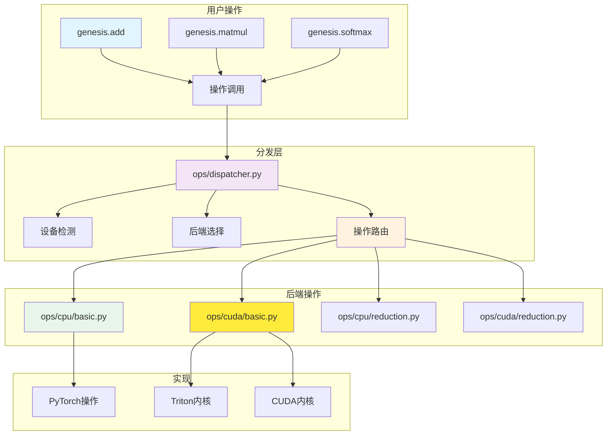

# 操作系统概述

Genesis v2.0具有统一的操作分发系统，在保持一致API的同时将张量操作路由到适当的后端实现。

## 🏗️ 架构

操作系统在面向用户的操作和特定后端实现之间提供清晰的抽象层：



## 🎯 关键组件

### 中央分发器
`ops/dispatcher.py`模块作为中央路由中心：
- **操作注册**：将操作名称映射到实现
- **设备检测**：自动确定目标设备
- **后端选择**：路由到适当的后端
- **类型验证**：确保类型兼容性

### 操作类别

#### 基础操作
- **位置**：`ops/{backend}/basic.py`
- **操作**：add、subtract、multiply、divide、power、abs
- **特性**：广播支持、原地变体

#### 规约操作
- **位置**：`ops/{backend}/reduction.py`
- **操作**：sum、mean、max、min、argmax、argmin
- **特性**：多维规约、keepdim支持

#### 矩阵操作
- **位置**：`ops/{backend}/matrix.py`
- **操作**：matmul、transpose、reshape、flatten
- **特性**：批处理操作、内存高效实现

#### 激活函数
- **位置**：`ops/{backend}/activation.py`
- **操作**：relu、sigmoid、tanh、softmax、gelu
- **特性**：原地计算、梯度友好实现

## 🚀 分发机制

### 操作注册
```python
# ops/dispatcher.py
class OperationDispatcher:
    """中央操作分发器。"""

    def __init__(self):
        self._operations = {}
        self._register_default_operations()

    def register(self, name, cpu_impl, cuda_impl=None):
        """注册操作实现。"""
        self._operations[name] = {
            'cpu': cpu_impl,
            'cuda': cuda_impl or cpu_impl
        }

    def dispatch(self, op_name, *args, **kwargs):
        """将操作分发到适当的后端。"""
        # 从参数确定设备
        device = self._infer_device(*args)

        # 选择实现
        impl = self._operations[op_name][device.type]

        # 执行操作
        return impl(*args, **kwargs)
```

### 自动设备推断
```python
def _infer_device(*tensors):
    """从张量参数自动推断目标设备。"""
    devices = set()

    for tensor in tensors:
        if hasattr(tensor, 'device'):
            devices.add(tensor.device)

    if len(devices) == 0:
        return genesis.device('cpu')  # 默认
    elif len(devices) == 1:
        return devices.pop()
    else:
        raise RuntimeError(f"不支持混合设备：{devices}")
```

## 💻 后端实现

### CPU操作
CPU操作利用PyTorch的优化实现：

```python
# ops/cpu/basic.py
def cpu_add(a, b, out=None):
    """加法的CPU实现。"""
    result = torch.add(a.data, b.data)

    if out is not None:
        out.data.copy_(result)
        return out
    else:
        return genesis.tensor(result, device=a.device)

def cpu_matmul(a, b):
    """矩阵乘法的CPU实现。"""
    result = torch.matmul(a.data, b.data)
    return genesis.tensor(result, device=a.device)
```

### CUDA操作
CUDA操作使用自定义Triton内核以获得最佳性能：

```python
# ops/cuda/basic.py
import triton
import triton.language as tl

@triton.jit
def add_kernel(x_ptr, y_ptr, output_ptr, n_elements, BLOCK_SIZE: tl.constexpr):
    """用于逐元素加法的Triton内核。"""
    pid = tl.program_id(0)
    block_start = pid * BLOCK_SIZE
    offsets = block_start + tl.arange(0, BLOCK_SIZE)
    mask = offsets < n_elements

    x = tl.load(x_ptr + offsets, mask=mask)
    y = tl.load(y_ptr + offsets, mask=mask)
    output = x + y
    tl.store(output_ptr + offsets, output, mask=mask)

def cuda_add(a, b):
    """使用Triton内核的CUDA实现。"""
    output = genesis.empty_like(a)
    n_elements = a.numel()

    grid = lambda meta: (triton.cdiv(n_elements, meta['BLOCK_SIZE']),)
    add_kernel[grid](a.data_ptr(), b.data_ptr(), output.data_ptr(), n_elements)

    return output
```

## 🔧 配置和扩展

### 注册自定义操作
```python
import genesis

# 定义自定义操作
def my_custom_op_cpu(x):
    """自定义CPU操作。"""
    return x * 2 + 1

def my_custom_op_cuda(x):
    """自定义CUDA操作。"""
    # 自定义CUDA实现
    pass

# 向分发器注册
genesis.ops.register_operation(
    'my_custom_op',
    cpu_impl=my_custom_op_cpu,
    cuda_impl=my_custom_op_cuda
)

# 使用操作
result = genesis.ops.my_custom_op(tensor)
```

### 操作元数据
```python
# 向操作添加元数据
genesis.ops.set_operation_metadata('matmul', {
    'requires_grad': True,
    'supports_autograd': True,
    'memory_efficient': True,
    'fused_variants': ['matmul_add', 'matmul_relu']
})
```

## 📊 性能优化

### 操作融合
分发器支持操作融合以提高性能：

```python
# 自动融合检测
def detect_fusion_opportunities(operations):
    """检测可以融合的操作。"""
    fusion_patterns = [
        ('matmul', 'add'),      # 矩阵乘法 + 偏置
        ('conv2d', 'relu'),     # 卷积 + 激活
        ('add', 'relu'),        # 加法 + 激活
    ]

    for pattern in fusion_patterns:
        if matches_pattern(operations, pattern):
            return create_fused_operation(pattern)

    return None

# 融合操作实现
@triton.jit
def fused_matmul_add_kernel(a_ptr, b_ptr, bias_ptr, output_ptr, ...):
    """融合的矩阵乘法和加法。"""
    # 在单个内核中计算matmul和添加偏置
    pass
```

### 内核缓存
```python
# 内核编译缓存
class KernelCache:
    """缓存编译的内核以供重用。"""

    def __init__(self):
        self._cache = {}

    def get_kernel(self, op_name, input_shapes, dtypes):
        """获取缓存的内核或编译新内核。"""
        cache_key = (op_name, input_shapes, dtypes)

        if cache_key not in self._cache:
            kernel = self._compile_kernel(op_name, input_shapes, dtypes)
            self._cache[cache_key] = kernel

        return self._cache[cache_key]
```

## 🔍 调试和分析

### 操作跟踪
```python
# 启用操作跟踪
genesis.ops.enable_tracing(True)

# 操作现在将被跟踪
x = genesis.tensor([1, 2, 3])
y = genesis.tensor([4, 5, 6])
z = x + y  # 跟踪："add: cpu, shapes=[(3,), (3,)], time=0.05ms"

# 获取跟踪摘要
trace = genesis.ops.get_trace()
print(trace.summary())
```

### 性能分析
```python
# 分析操作
with genesis.ops.profile() as prof:
    # 这里是你的操作
    result = genesis.matmul(a, b)
    result = genesis.relu(result)

# 分析结果
prof.print_stats()  # 显示按操作的时间分解
prof.export_chrome_trace("ops_profile.json")  # Chrome分析器格式
```

## 🔗 参见

- [操作分发器](dispatcher.md)
- [CPU操作](cpu-ops.md)
- [CUDA操作](cuda-ops.md)
- [后端系统](../backends/index.md)
- [性能指南](../performance/optimization-guide.md)